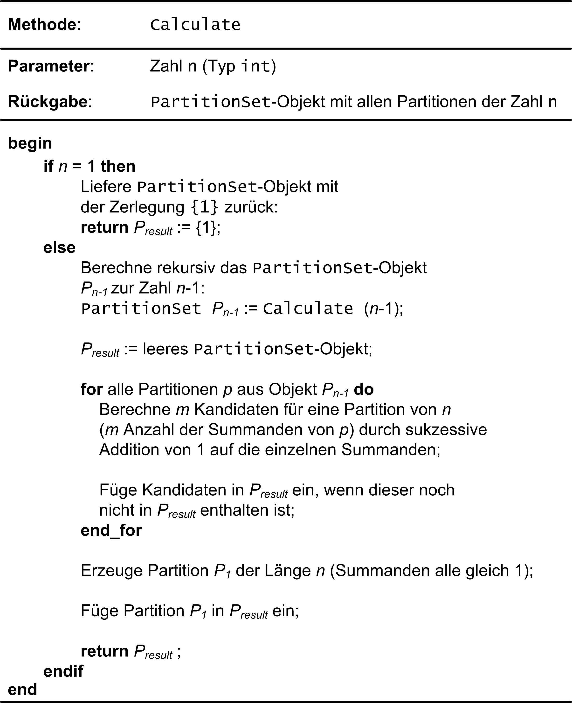

:xrefstyle: short
:listing-caption: Listing
:table-caption: Tabelle
:source-language: c++
:icons: font
:source-highlighter: highlightjs

:cpp: C++
:cpp11: C++&ndash;11

= Partitionen einer natürlichen Zahl

== Lernziele

* STL-Klassen `std::set<T>` und `std::multiset<T>`
* Einheitliche Initialisierung
* Initialisierungsliste (`std::initializer_list<T>`)
* Container-Methoden `cbegin()` und `cend()`
* Konstruktor-Erzeugung mit `delete` unterdrücken
* In-Place Konstruktion von Objekten mit `emplace`
* Schlüsselwort `auto`
* Datentyp `size_t`

== Einführung

Wir beschäftigen uns in dieser Fallstudie mit der Fragestellung, auf wie viele Arten sich eine natürliche Zahl
als Summe von natürlichen Zahlen &ndash; auch _Partition_ oder _Zerlegung_ genannt &ndash; schreiben lässt?
Wir präzisieren die Fragestellung noch mit folgender Ergänzung: Zwei Zerlegungen, die sich nur in der Reihenfolge ihrer Summanden unterscheiden, gelten als gleich. Konkret: Die Zerlegungen der ersten fünf natürlichen Zahlen sehen so aus:

....
1 = 1

2 = 2
2 = 1 + 1

3 = 3
3 = 2 + 1
3 = 1 + 1 + 1

4 = 4
4 = 3 + 1
4 = 2 + 2
4 = 2 + 1 + 1

4 = 1 + 1 + 1 + 1
5 = 5
5 = 4 + 1
5 = 3 + 2
5 = 3 + 1 + 1
5 = 2 + 2 + 1
5 = 2 + 1 + 1 + 1
5 = 1 + 1 + 1 + 1 + 1
....

== Partitionen vergleichen

Unterschiedliche Zerlegungen derselben natürlichen Zahl lassen sich vergleichen. Welche Operatoren sollten Sie zu diesem Zweck
in der Klasse `Partition` implementieren? Erkennen Sie am folgenden Beispiel aller Zerlegungen der Zahl 7, wie der Vergleich zweier Partitionen definiert sein könnte?

....
7 = 7
7 = 6 + 1
7 = 5 + 2
7 = 5 + 1 + 1
7 = 4 + 3
7 = 4 + 2 + 1
7 = 4 + 1 + 1 + 1
7 = 3 + 3 + 1
7 = 3 + 2 + 2
7 = 3 + 2 + 1 + 1
7 = 3 + 1 + 1 + 1 + 1
7 = 2 + 2 + 2 + 1
7 = 2 + 2 + 1 + 1 + 1
7 = 2 + 1 + 1 + 1 + 1 + 1
7 = 1 + 1 + 1 + 1 + 1 + 1 + 1
....

Nach diesen Vorüberlegungen wollen wir nun drei Klassen `Partition`, `PartitionSet` und `PartitionCalculator`
betrachten, um mit ihrer Hilfe die Zerlegungen einer natürlichen Zahl zu berechnen.

== Die Klasse `Partition`

Die algorithmische Bestimmung aller Partitionen einer natürlichen Zahl ist keineswegs trivial,
wie man bei anfänglicher Betrachtung vielleicht glauben mag. Mithilfe des rekursiven Methodenaufrufs
lässt sich das Problem am ehesten vergleichsweise einfach lösen. Zu diesem Zweck entwerfen wir zunächst
eine Klasse `Partition`. Objekte dieser Klasse beschreiben eine einzelne Zerlegung einer natürlichen Zahl, also zum Beispiel

....
3 + 1 + 1
....

als eine mögliche Zerlegung der Zahl 5. Implementieren Sie die Klasse `Partition` anhand der Spezifikation aus <<id_table_partition>>.
Überlegen Sie, welcher STL-Container sich anbietet, um die einzelnen Summanden einer Partition zu verwalten.
Bedenken Sie dabei, dass man `Partition`-Objekte miteinander vergleichen können muss und aus diesem Grund
die Summanden eines solchen Objekts stets sortiert (z.B. in absteigender Reihenfolge) vorliegen sollten, um das Vergleichen zu vereinfachen.

.Wesentliche Elemente der Klasse `Partition`.
[[id_table_partition]]
[%autowidth]
|===
|Element |Beschreibung

| Konstruktor
a| Der Standardkonstruktor initialisiert ein leeres `Partition`-Objekt.

[source,c++]
----
Partition() = default;
----

| Benutzerdefinierter Konstruktor
a| Erzeugt ein `Partition`-Objekt auf Basis der Summanden der Initialisierungsliste `list`.

[source,c++]
----
Partition(const std::initializer_list<size_t>& list);
----

| Benutzerdefinierter Konstruktor
a| Erzeugt ein `Partition`-Objekt auf Basis der Summanden eines `std::vector<size_t>`-Objekts. Dieser
Konstruktor spielt vor allem im Algorithmus zur Erzeugung von Partitionen eine Rolle.

[source,c++]
----
Partition(const std::vector<size_t>& vec);
----

| _getter_ `number()`
a| Liefert die zur Partition gehörende natürliche Zahl zurück.

[source,c++]
----
size_t number() const;
----

| _getter_ `size()`
a| Liefert die Anzahl der Summanden der Partition zurück.

[source,c++]
----
size_t size() const;
----

| _getter_ `numbers()`
a| Liefert die einzelnen Summanden der Partition in einem `std::vector<size_t>`-Objekt zurück.

[source,c++]
----
std::vector<size_t> numbers();
----

| Operator `==`
a| Vergleicht zwei `Partition`-Objekte auf Gleichheit. Siehe dazu die Definition der Gleichheit zweier Zerlegungen in der Einführung.

[source,c++]
----
friend bool operator==(const Partition&, const Partition&);
----

| Operatoren `<` und `>`
a| Vergleicht zwei `Partition`-Objekte auf &ldquo;kleiner&rdquo; oder &ldquo;größer&rdquo;.
Die Art und Weise, wie Partitionen verglichen werden, wurde eingangs erläutert.

[source,c++]
----
friend bool operator<(const Partition&, const Partition&);
friend bool operator>(const Partition&, const Partition&);
----

| Operator `<<`
a| Gibt ein `Partition`-Objekt auf der Konsole aus. Die Darstellung einer Partition sollte folgendes Aussehen haben:

....
7 = 3 + 2 + 1 + 1
....

[source,c++]
----
friend std::ostream& operator<< (std::ostream&, const Partition&);
----
|===

Zur Überprüfung Ihrer Implementierung sollten die folgenden Codefragmente wie beschrieben ausführbar sein:

[source,c++]
----
Partition p1 { 2 };
std::cout << p1 << std::endl;
Partition p2{ 1, 1 };
std::cout << p2 << std::endl;
std::cout << std::boolalpha << (p1 == p2) << std::endl;
std::cout << std::boolalpha << (p1 < p2) << std::endl;
std::cout << std::boolalpha << (p1 > p2) << std::endl;
----

_Ausgabe_:

....
2 = 2
2 = 1 + 1
false
false
true
....

Oder zum Beispiel:

[source,c++]
----
Partition p3{ 1, 2, 3 };
std::cout << p3 << std::endl;
Partition p4{ 3, 2, 1 };
std::cout << p4 << std::endl;
std::cout << std::boolalpha << (p3 == p4) << std::endl;
std::cout << std::boolalpha << (p3 < p4) << std::endl;
std::cout << std::boolalpha << (p3 > p4) << std::endl;
----

_Ausgabe_:

....
6 = 3 + 2 + 1
6 = 3 + 2 + 1
true
true
false
....

Möchte man die einzelnen Zahlen einer Partition einzeln durchlaufen, zum Beispiel mit einer bereichs-basierten `for`-Schleife, dann muss die Klasse `Partition` noch um zwei Methoden `begin()` und `end()` erweitert werden,
die geeignete Iteratorobjekte zurückliefern. _Hinweis_: In der Realisierung dieser beiden Methoden
können diese auf gleichnamige Methoden des unterlagerten STL-Containers verschaltet werden:

[source,c++]
----
Partition p{ 1, 2, 3, 4, 5 };
for (const auto elem : p) {
    std::cout << elem << ' ';
}
----

_Ausgabe_:

....
5 4 3 2 1
....

== Die Klasse `PartitionSet`

Die Menge aller Partitionen einer natürlichen Zahl wird in einem Objekt der Klasse `PartitionSet` zusammengefasst.
Es ergibt keinen Sinn, eine bestimmte Partition mehrfach in einem `PartitionSet`-Objekt abzulegen.
Mit welchem STL-Container lässt sich diese Anforderung leicht realisieren? Weitere Details zur Klasse `PartitionSet` siehe <<id_table_partitionset>>:

.Wesentliche Elemente der Klasse `PartitionSet`.
[[id_table_partitionset]]
[%autowidth]
|===
|Element |Beschreibung

| Benutzerdefinierter Konstruktor
a| Erzeugt ein `PartitionSet`-Objekt zur natürlichen Zahl `number`. Die einzelnen `Partition`-Objekte, deren Berechnung noch aussteht,
sind mit der `insert`-Methode in die Partitionenliste des aktuellen Objekts aufzunehmen, siehe dazu weiter unten.

[source,c++]
----
PartitionSet(size_t number);
----

| _getter_ `number()`
a| Liefert die natürliche Zahl zurück, deren Partitionen betrachtet werden.

[source,c++]
----
size_t number() const;
----

| _getter_ `size()`
a| Liefert die Anzahl der `Partition`-Objekte in der Partitionenmenge zurück.

[source,c++]
----
size_t size() const;
----

| Methode `insert`
a| Fügt die Partition `p` in die aktuelle Partitionenmenge ein. Zu beachten: Eine Partition darf in der Menge nicht mehrfach enthalten sein.
`insert` liefert `false` zurück, wenn die Partition `p` bereits in der Partitionenliste des Objekts enthalten ist, andernfalls `true`.

[source,c++]
----
bool insert(const Partition& p);
----

| Methode `emplace`
a| Fügt eine Partition in die aktuelle Partitionenmenge mit einer so genannten _In-Place_ Konstruktion ein.
Die `emplace`-Methode muss auf Grund dessen mit einer variablen Anzahl von `size_t`-Werten aufrufbar sein,
für die der unterlagerte STL-Container mit einem geeigneten Konstruktor der `Partition`-Klasse ein entsprechendes Objekt _in-place_ konstruiert.
Dies setzt voraus, dass der gewählte STL-Container für die Partitionenmenge eine `emplace`-Methode besitzt.
Der Rückgabewert spezifiziert, ob die Partition in der Partitionenmenge bereits enthalten war oder nicht.

_Hinweis_: Konstante Literale wie 1, 2, 3 usw. sind per Sprachdefinition {cpp} Literale des Datentyps `int`. Wenn die Klasse `Partition`
intern mit `size_t`-Werten arbeitet, müssen derartige `int`-Literale in der Realisierung von `emplace` nach `size_t` konvertiert werden.

[source,c++]
----
template <typename ... Args>
bool emplace(Args&& ... args);
----

| Operator `<<`
a| Gibt ein `PartitionSet`-Objekt auf der Konsole aus. Die Ausgabe sollte – am Beispiel der Zahl 3 gezeigt – folgendes Aussehen haben:

....
1: 3 = 3
2: 3 = 2 + 1
3: 3 = 1 + 1 + 1
....

[source,c++]
----
friend std::ostream& operator<< (std::ostream&, const PartitionSet&);
----
|===

Die Klasse `PartitionSet` aus <<id_table_partitionset>> ist noch nicht in der Lage, die Partitionen zu einer beliebigen natürlichen Zahl zu berechnen.
Darauf kommen wir im folgenden Abschnitt zu sprechen. Die prinzipielle Funktionsweise der Klasse `PartitionSet` lässt sich aber schon mal &ldquo;manuell&rdquo; testen:

[source,c++]
----
PartitionSet set{ 3 };
set.insert({ 3 });
set.insert({ 1, 2 });
set.insert({ 1, 1, 1 });
std::cout << "Partitions of " << set.number() << ": " << std::endl;
std::cout << set << std::endl;
----

_Ausgabe_:

....
Partitions of 3:
1: 3 = 3
2: 3 = 2 + 1
3: 3 = 1 + 1 + 1
[3 partitions]
....

Wenn Sie in diesem Beispiel die Anzahl der Konstruktorenaufrufe der `Partition`-Objekte zählen,
werden Sie feststellen, dass pro `insert`-Methodenaufruf an einem `PartitionSet`-Objekt zwei `Partition`-Objekte erzeugt werden:

* Ein erstes als Parameter des `insert`-Methodenaufruf.
* Ein zweites beim Einfügen in den STL-Container der `PartitionSet`-Klasse.

Unter Verwendung der `emplace`-Methode, die von den meisten STL-Containerklassen bereitgestellt wird,
erreicht man, dass in so einer Situation ein `Partition`-Objekt nur ein einziges Mal angelegt wird. 
Das heißt zunächst einmal, dass die `insert`-Methode in ihrer betrachteten Form so nicht zum Zuge kommen kann.
Genau die Erzeugung dieses `Partition`-Objekts, dass als Parameter an `insert` übergeben wird,
gilt es ja gerade zu vermeiden.
Dies wiederum hat zur Folge, dass alle Parameter, die man zur Erzeugung eines `Partition`-Objekts benötigt,
an eine entsprechende Methoden an der `PartitionSet`-Klasse zu übergeben sind.
Wir nennen diese Methode sinnigerweise ebenfalls `emplace`.

Damit sind wir bei variadischen Templates angekommen, um mit ihrer Hilfe beliebig viele `size_t`-Werte (die Zahlen, aus denen eine Partition besteht) 
geeignet an eine Methode der `PartitionSet`-Klasse übergeben zu können:

[source,c++]
----
PartitionSet set{ 4 };
set.emplace(4);
set.emplace(3, 1);
set.emplace(2, 2);
set.emplace(2, 1, 1);
set.emplace(1, 1, 1, 1);

std::cout << "Partitions of " << set.number() << ": " << std::endl;
std::cout << set << std::endl;
----

_Ausgabe_:

....
Partitions of 4:
1: 4 = 4
2: 4 = 3 + 1
3: 4 = 2 + 2
4: 4 = 2 + 1 + 1
5: 4 = 1 + 1 + 1 + 1
[5 partitions]
....

Erkennen Sie zwischen den Aufrufen der `emplace`- und der `insert`-Methode einen Unterschied?
Richtig erkannt: Die `insert`-Aufrufe nehmen ein `std::initializer_list<size_t>`-Objekt entgegen, deshalb müssen zwischen den runden Klammern
noch geschweifte Klammern da sein. Die `emplace`-Aufrufe sind als Methoden mit einer variablen Anzahl von Parametern konzipiert (präziser formuliert: als _Parameter Pack_).
Hier sind geschweifte Klammern nicht notwendig und als solche syntaktisch auch gar nicht zulässig.
Wir testen zusätzlich noch, dass dieselbe Partition nicht mehrfach einem `PartitionSet`-Objekt hinzugefügt werden kann:

[source,c++]
----
PartitionSet set{ 4 };
bool b;

b = set.insert({ 2, 1, 1 });
std::cout << std::boolalpha << b << std::endl;
b = set.insert({ 1, 2, 1 });
std::cout << std::boolalpha << b << std::endl;
b = set.insert({ 1, 1, 2 });
std::cout << std::boolalpha << b << std::endl;

std::cout << "Partitions of " << set.number() << ": " << std::endl;
std::cout << set << std::endl;
----

_Ausgabe_:

....
true
false
false
Partitions of 4:
1: 4 = 2 + 1 + 1
[1 partitions]
....

== Rekursive Berechnung aller Partitionen einer natürlichen Zahl

Wir kommen nun auf das Kernstück der Aufgabe zu sprechen, die algorithmische Berechnung aller Partitionen zu einer vorgegebenen natürlichen Zahl.
Ist _n_ die zu Grunde liegende natürliche Zahl, so gehen wir davon aus, dass mittels Rekursion die Menge aller Partitionen der Zahl _n_-1 bereits vorliegt.
Da für _n_ = 1 diese Berechnung trivial ist, stellt diese Annahme keine Einschränkung dar!

Haben wir alle Partitionen der Zahl _n_-1 vorliegen, so berechnen wir wie folgt alle Partitionen der Zahl _n_:
Wir nehmen eine beliebige Partition der Zahl _n_-1 zur Hand. Ihre Anzahl der Summanden sei _m_.
Wenn wir der Reihe nach zu jedem einzelnen dieser _m_ Summanden den Wert 1 addieren, erhalten wir auf einen Schlag _m_ Partitionen der Zahl _n_!
Um es am folgenden Beispiel zu demonstrieren: Ist

....
4 + 2 + 2
....

eine Partition der Zahl 8, so erhalten wir sofort die drei Partitionen

....
(4+1) + 2 + 2 = 5 + 2 + 2
4 + (2+1) + 2 = 4 + 3 + 2
4 + 2 + (2+1) = 4 + 2 + 3 = 4 + 3 + 2
....

der natürlichen Zahl 9. Der einzige Nachteil dieses Ansatzes ist bereits erkennbar:
Wir können auf diese Weise mehrfach dieselbe Partition erhalten, wie das Beispiel zeigt.
Dies stellt aber kein echtes Problem dar. Wir müssen bei der Konstruktion der Partitionenmenge nur darauf achten,
dass beim Einfügen neu berechneter Partitionen diese nicht schon in der vorhandenen Partitionenmenge enthalten sind.

Man kann sich leicht überlegen, dass bei vorliegender Partitionenmenge einer Zahl _n_-1 auf diese Weise
alle Partitionen der Zahl _n_ berechnet werden – mit einer Ausnahme: Die Partition

....
1 + 1 + ... + 1    // n Summanden
....

wird nicht konstruiert, da bei allen berechneten Partitionen mindestens ein Summand immer den Wert 2 besitzt.
In der Tat ist die fehlende Partition einer Zahl _n_, die aus _n_ 1-en besteht, noch nachträglich in die Partitionenmenge aufzunehmen.
In <<img_pseudocode_partitions_calculator>> finden Sie eine Beschreibung des Algorithmus in Gestalt von Pseudocode vor:

[caption="Abbildung {counter:figure}"]
[[img_pseudocode_partitions_calculator]]
.Pseudocode zur Berechnung aller Partitionen einer natürlichen Zahl.

Implementieren Sie in diesem Abschnitt eine Methode `calculate` zur Berechnung aller Partitionen einer natürlichen Zahl
und ordnen Sie diese einer separaten Klasse `PartitionsCalculator` zu (<<id_table_partitionscalculator>>):

.Elemente der Klasse `PartitionsCalculator`.
[[id_table_partitionscalculator]]
[%autowidth]
|===
|Element |Beschreibung

| Methode `calculate`
a| Berechnet die Menge aller Partitionen der Zahl _n_ anhand des in <<Abbildung 1>> beschriebenen Algorithmus.
Das Ergebnis wird durch den Rückgabewert (Objekt vom Typ `PartitionSet`) zurückgeliefert.

[source,c++]
----
static PartitionSet calculate(size_t n);
----

|===

Es folgt ein Beispielfragment zum Testen Ihrer Realisierung der Klasse `PartitionsCalculator`:

[source,c++]
----
PartitionSet set = PartitionCalculator::calculate(6);
std::cout << "Partitions of " << set.number() << ": " << std::endl;
std::cout << set << std::endl;
----

_Ausgabe_:

....
Partitions of 6:
 1: 6 = 6
 2: 6 = 5 + 1
 3: 6 = 4 + 2
 4: 6 = 4 + 1 + 1
 5: 6 = 3 + 3
 6: 6 = 3 + 2 + 1
 7: 6 = 3 + 1 + 1 + 1
 8: 6 = 2 + 2 + 2
 9: 6 = 2 + 2 + 1 + 1
10: 6 = 2 + 1 + 1 + 1 + 1
11: 6 = 1 + 1 + 1 + 1 + 1 + 1
[11 partitions]
....

== Anzahl der Partitionen

Die Anzahl der Partitionen einer natürlichen Zahl haben Sie im letzten Teilschritts als Nebeneffekt berechnet.
Es gibt aber auch eine alternative Möglichkeit mit Hilfe einer rekursiven Formel, also ohne die Partitionen selbst bestimmen zu müssen.
Wir führen zu diesem Zweck die Bezeichnung _sum_(_n_) für die gesuchte Anzahl ein. Ferner sei _b_(_n_, _m_) die Anzahl der Zerlegungen von _n_,
in denen der größte Summand gleich _m_ ist. Also an einem Beispiel erläutert: In der Menge aller Partitionen von 5

....
1: 5 = 5
2: 5 = 4 + 1
3: 5 = 3 + 2
4: 5 = 3 + 1 + 1
5: 5 = 2 + 2 + 1
6: 5 = 2 + 1 + 1 + 1
7: 5 = 1 + 1 + 1 + 1 + 1
....

finden wir insgesamt _sum_(5) = 7 Zerlegungen vor. Für die Anzahl der Zerlegungen von 5,
in denen der größte Summand gleich _m_ (_m_ = 1, 2, 3, 4 und 5) ist, gilt hier

....
b(5,1) = 1
b(5,2) = 2
b(5,3) = 2
b(5,4) = 1
b(5,5) = 1
....

Offensichtlich gilt nun

_sum_(_n_) = _b_(_n_,1) + _b_(_n_,2) + _b_(_n_,3) + .... + _b_(_n_,_n_-1) + _b_(_n_,_n_)

Weiter muss man nicht gehen, denn _b_(_n_,_n_+1), _b_(_n_,_n_+2) sind ja alle 0.
Bleibt noch die Frage nach der Berechnung von _b_(_n_,_m_). Hier gilt folgende rekursive Formel:

_b_(_n_,_m_) = _b_(_n_-1,_m_-1) + _b_(_n_-_m_,_m_)

Wenn Sie die folgenden Anfangsbedingungen berücksichtigen, von deren Korrektheit man sich leicht überzeugen kann,
steht einer einfachen, direkten Umsetzung in eine rekursive {cpp}-Methode `numberOfPartitions` (<<id_table_partitionscalculator_02>>) nichts mehr im Weg:

.Weitere Elemente der Klasse `PartitionsCalculator`.
[[id_table_partitionscalculator_02]]
[%autowidth]
|===
|Element |Beschreibung

| Methode `numberOfPartitions`
a| Berechnet die Anzahl aller Partitionen zur Zahl _n_, die einen maximalen Summanden _maxSummand_ besitzen.

[source,c++]
----
static size_t numberOfPartitions(size_t n, size_t maxSummand);
----

| Methode `numberOfPartitions`
a| Berechnet die Anzahl aller Partitionen zur Zahl _n_.

[source,c++]
----
static size_t numberOfPartitions(size_t n);
----

|===

Für die Zahlen von 1 bis 20 ergeben sich folglich folgende Anzahlen an Partitionen:

[source,c++]
----
for (size_t i = 1; i != 21; ++i) {
    std::cout 
        << "Number partitions of " << i
        << ": " << PartitionCalculator::numberPartitions(i)
        << std::endl;
}
----

_Ausgabe_:

....
Number partitions of 1: 1
Number partitions of 2: 2
Number partitions of 3: 3
Number partitions of 4: 5
Number partitions of 5: 7
Number partitions of 6: 11
Number partitions of 7: 15
Number partitions of 8: 22
Number partitions of 9: 30
Number partitions of 10: 42
Number partitions of 11: 56
Number partitions of 12: 77
Number partitions of 13: 101
Number partitions of 14: 135
Number partitions of 15: 176
Number partitions of 16: 231
Number partitions of 17: 297
Number partitions of 18: 385
Number partitions of 19: 490
Number partitions of 20: 627
....

== Lösung

Wir gehen zunächst auf die Klasse `Partition` ein. Da die Zahlen einer Partition mehrfach auftreten dürfen,
bietet sich als Container eine Instanz der Klasse `std::multiset` an. In der Ausgabe einer Partition auf der Konsole
sollten die Zahlen in absteigender Reihenfolge aufgelistet werden, für die Vergleichsfunktion greifen wir deshalb auf das 
Funktionsobjekt `std::greater<size_t>` zurück. Eine Definition der `Partition`-Klasse sieht so aus:

[source,c++]
[[id_class_partition_decl]]
----
----
<1> Initialisierer für Instanzvariable. In diesem Fall kann man den Default-Konstruktor mit `default` definieren.

In den Zeilen 24 und 27 von <<id_class_partition_decl>> werden eine `begin()` und `end()`-Methode definiert, um `Partition`-Objekte iterieren zu können.
Darunter verstehen wir, dass wir in einer bereichs-basierten `for`-Schleife die einzelnen Zahlen der Partition traversieren können.
Eine Iterator-Unterstützung ist einfach zu realisieren, wenn wir die Iteratorimplementierung eines unterlagerten STL-Containers zur Verfügung stehen haben.
In unserem Fall ist dies das `std::multiset<size_t, std::greater<size_t>>`-Objekt, dessen `begin()` und `end()`-Methode uns die gewünschten Iteratorobjekte zurückliefern.
Die Definitionen in den Zeilen 24 und 27 hätte man auch kürzer, bzw. einfacher lesbar, gestalten können:

[source,c++]
----
auto begin() { return m_numbers.cbegin(); }
auto end() { return m_numbers.cend(); }
----

Wenn wir den Typ einer Variable oder wie in unserem Fall, den Rückgabetyp einer Methode, mit `auto` definieren,
bestimmmt der Übersetzer den tatsächlichen Typ aus dem Kontext. Die beiden Methoden liefern
also Objekte des Typs `std::multiset<size_t, std::greater<size_t>>::const_iterator` zurück,
nur ist die Lesbarkeit mit `auto` halt doch um ein Vielfaches angenehmer.
Damit sind wir schon bei der Implementierung der Klasse `Partition` angekommen:

[source,c++]
[[id_class_partition_impl]]
----
----
<1> Der `std::accumulate`-Algorithmus liefert mit diesen Parametern die Summe aller Werte des Bereichs zurück.
<2> Der Aufruf von `std::vector<size_t>::assign()` weist dem Vektor neue Elemente zu, indem die alten (sofern vorhanden) ersetzt werden.
<3> Überprüft den Inhalt zweier `std::vector<size_t>`-Objekte auf Gleichheit, sprich sie müssen die gleiche Anzahl von Elementen haben und
jedes Element des ersten Vektors wird mit dem Element des zweiten Vektors an derselben Position verglichen.

Zur Verwaltung der `Partition`-Objekte gibt es die Klasse `PartitionSet`:

Definition der Klasse `PartitionSet`:

[source,c++]
[[id_class_partitionset_decl]]
----
----
<1> Der Default-Konstruktor ergibt bei dieser Klasse wenig Sinn. Es sollte in Minimalfall immer die natürliche Zahl, um deren Zerlegungen es geht,
bekannt sein.
<2> Für die Realisierung der `emplace`-Methode kommt das Feature der &ldquo;template member function&rdquo; zum Einsatz. Ferner findet die Implementierung
im Header-File statt, da dies bei Templates der einfachste Ansatz ist.

In Zeile 23 von <<id_class_partitionset_decl>> findet die so genannte _Parameter Pack Expansion_ statt (`std::forward<size_t>(args)...`).
Es handelt sich um die drei nachgestellten Punkte (`...`) nach dem Parameter `args`. Um etwaige Besonderheiten beim Aufruf (`const size_t`, `const size_t&`, etc.)
nicht unterscheiden zu müssen, setzen wir das _Perfect Forwarding_ ein.  _Parameter Pack Expansion_ bedeutete, dass alle Parameter, die 
an `emplace` übergeben werden, in einer komma-separierten Liste ausgerollt werden. Dies ist das geeignetet Format,
um sie auf diese Weise in einem `std::initializer_list<size_t>`-Objekt zusammenzufassen. Dieses Objekt verwenden wir zuerst (Zeile 25),
um die Summe der Parameter zu berechnen (mit `std::accumulate`) und diese mit `m_number` auf Übereinstimmung zu vergleichen.
Danach können wir das `std::initializer_list<size_t>`-Objekt verwenden, um es zur _In-Place_-Konstruktion an die `emplace`-Methode
des `std::multiset<size_t, std::greater<size_t>>`-Objekts durchzuschleusen.

Der Rückgabewert von `emplace` ist vom Typ `std::pair<std::set<Partition, std::greater<Partition>>::iterator, bool>`.
Hier interessiert uns nur der zweite Wert des Paares. Er gibt an, ob die Partition bereits in der Partitionenmenge vorhanden war oder nicht.
Für Zugriff auf `std::pair<>`-Objekte gibt es die `std::get<>`-Methode, der Template Parameter muss vom Typ `int` sein.
Für die Realisierung der `PartitionSet`-Klasse im _.cpp_-File bleiben nur noch ein Konstuktor, die `insert`-Methode und der Ausgabeoperator übrig:

Implementierung der Klasse `PartitionSet`:

[source,c++]
[[id_class_partitionset_impl]]
----
----

Die Implementierung der `insert`-Methode (Zeilen 5 bis 14) hätte man auch kürzer gestalten können. Es ging mir darum,
zum einen diese Methode mit einem Rückgabewert (Partition schon vorhanden oder nicht) und mit einer Fehlerüberprüfung 
(Partition und Partitionenmenge passen zusammen oder nicht) auszustatten.

Die Methoden zum Berechnen aller Partitionen einer natürlichen Zahl sind vom Charakter her eher funktional ausgelegt,
in der Klasse `PartitionCalculator` finden sich daher nur statische Klassenmethoden vor:

Definition der Klasse `PartitionCalculator`:

[source,c++]
[[id_class_partitioncalculator_decl]]
----
----
<1> Hiermit soll sichergestellt werden, dass der Standard-Konstruktor der Klasse nicht aufgerufen werden kann.

Implementierung der Klasse `PartitionCalculator`:

[source,c++]
----
----
<1> Konstruiert das `std::vector<size_t>`-Objekt mit `number` Elementen vom Wert `1`.

== There is more

Das Thema &ldquo;Aufzählen&rdquo; &ndash; in unserem Fall &ldquo;Partitionen aufzählen&rdquo; tritt immer bei Klassen in Erscheinung,
deren Gestalt gewisse Ähnlichkeiten mit einem Container haben. Ergänzen Sie Ihre Implementierung der Klasse `PartitionSet` entsprechend.

_Beispielfragment_:

[source,c++]
----
PartitionSet set = PartitionCalculator::calculate(5);
for (const Partition& p : set) {
    std::cout << p << std::endl;
}
----

_Ausgabe_:

....
5 = 5
5 = 4 + 1
5 = 3 + 2
5 = 3 + 1 + 1
5 = 2 + 2 + 1
5 = 2 + 1 + 1 + 1
5 = 1 + 1 + 1 + 1 + 1
....
