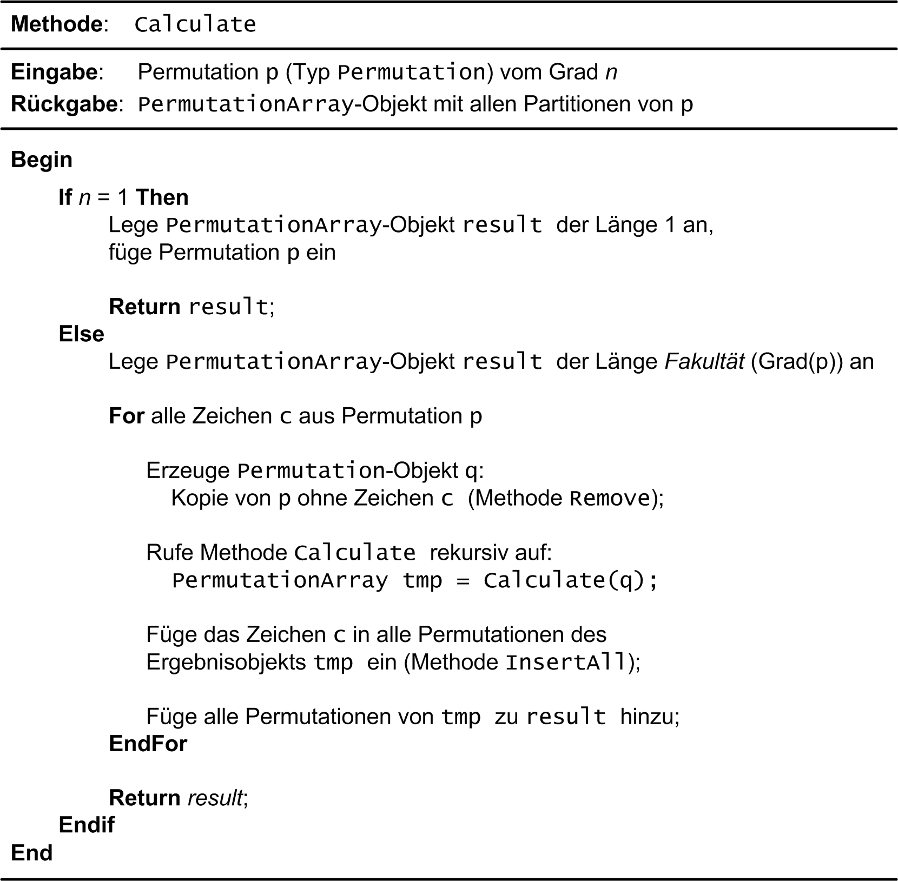

:xrefstyle: short
:listing-caption: Listing
:table-caption: Tabelle
:icons: font
:source-highlighter: coderay

= Permutationen

== Lernziele

* STL-Container (`std::vector<T>`, `std::string_view`)
* STL-Algorithmen (`std::find`)
* Einheitliche Initialisierung
* Initialisierungslisten (`std::initializer_list<T>`)
* `std::vector<T>`: _In-Place_-Konstruktion von Objekten mit 'emplace'

To be done

Range based Loop

== Beschreibung

Ist eine Menge von _n_ Elementen gegeben, so bezeichnet man die möglichen Anordnungen aller dieser _n_ Elemente als Permutationen (lat. permutare: vertauschen). Die Berechnung der Permutationen einer beliebigen Menge von Elementen steht im Mittelpunkt dieser Fallstudie. Als Elemente verwenden wir zunächst Zeichen, also `char`-Variablen.

Für zwei Zeichen `A` und `B` gibt es nur die zwei Permutationen `AB` und `BA`. Drei Zeichen, angenommen `A`, `B` und `C`, können hingegen in sechs verschiedenen Permutationen dargestellt werden: `ABC`, `ACB`, `BAC`, `BCA`, `CAB` und `CBA`. Sind alle _n_ Elemente voneinander verschieden, was wir in dieser Aufgabe zu Grunde legen, so gibt es dafür _n_! Anordnungen (_n_-Fakultät).

Bevor wir auf den Algorithmus zur Berechnung von Permutationen eingehen, entwickeln wir zwei Hilfsklassen `Permutation` und `PermutationArray`.

== Klasse `Permutation`

Die Klasse `Permutation` benötigen wir, um eine einzelne Permutation darzustellen.
Überlegen Sie, welcher Container der STL dafür geeignet sein könnte?
Die Details zur Schnittstelle der Klasse `Permutation` sind in Tabelle 1 zusammengestellt:

.Wesentliche Elemente der Klasse `Permutation`.
[[id_table_permutation]]
[%autowidth]
|===
|Element |Beschreibung

| Konstruktor
a| Der Standardkonstruktor initialisiert ein leeres `Permutation`-Objekt: Es enthält keine Zeichen und die Anzahl der Zeichen ist dementsprechend 0.

[source,c++]
----
Permutation() = default;
----
| Benutzerdefinierter Konstruktor
a| Der Konstruktor initialisiert ein `Permutation`-Objekt an Hand einer beliebig langen Liste von `char`-Werten.
Sinnvollerweise sollten die Zeichen alle voneinander verschieden sein. Sie brauchen das in Ihrer Implementierung aber nicht zu überprüfen.
TODO: Wie kann ich das überprüfen ???

[source,c++]
----
Permutation(const std::initializer_list<char>&);
----
| Benutzerdefinierter Konstruktor
a| Der Konstruktor initialisiert ein `Permutation`-Objekt an Hand der Elemente eines `std::string_view`-Objekts.
Wiederum sollten die Zeichen alle voneinander verschieden sein, Sie brauchen das in Ihrer Implementierung aber nicht zu überprüfen.

[source,c++]
----
Permutation(const std::string_view sv);
----
| _getter_
a| Liefert die Anzahl der `char`-Elemente zurück, die im Objekt abgelegt sind. Man spricht auch von der _Länge_ bzw. vom _Grad_ der Permutation.

[source,c++]
----
int grade() const;
----
| Methode `insertAtFront`
a| Die `insertAtFront`-Methode verändert die aktuelle Permutation wie folgt: Das übergebene Zeichen `ch` wird in der vorliegenden Permutation am Anfang eingefügt.
Inbesondere wird der Grad der Permutation damit um Eins größer.

_Hinweis_: Die `insertAtFront`-Methode benötigen wir für den Algorithmus zur Berechnung von Permutationen!

[source,c++]
----
void insertAtFront(char ch);
----
| Methode `removeAt`
a| Die `removeAt`-Methode erzeugt eine neue Permutation, die aus der aktuellen Permutation durch Entfernen des _i_.-ten Zeichens entsteht.
Die vorliegende Permutation bleibt unverändert. Der Grad der neuen Permutation ist folglich um Eins kleiner als der Grad der aktuellen Permutation.

_Hinweis_: Die `insertAtFront`-Methode benötigen wir für den Algorithmus zur Berechnung von Permutationen!

[source,c++]
----
Permutation removeAt(int i) const;
----
| Operator `[]`
a| Liefert das _i_.-te Zeichen der Permutation zurück.

[source,c++]
----
char operator[] (int i) const;
----
| Operator `<<`
a| Gibt ein `Permutation`-Objekt auf der Konsole aus. Die einzelnen Zeichen der Permutation sind durch Komma voneinander zu trennen,
die Permutation selbst ist in eckige Klammern `[` und `]` zu setzen.

[source,c++]
----
friend std::ostream& operator<< (std::ostream& os, const Permutation& p);
----
|===

Es folgen einige Beispiele, um die Arbeitsweise der Klasse `Permutation` zu verdeutlichen.
Eine Permutation mit den drei Zeichen `'A'`, `'B'` und `'C'` wird so angelegt:

[source,c++]
----
Permutation p{ "ABC" };
std::cout << p << std::endl;
----

_Ausgabe_:

....
[A,B,C]
....

Noch ein ähnliches Beispiel mit einer Permutation der fünf Zeichen bzw. Ziffern `'1'`, `'2'`, `'3'`, `'4'` und `'5'`:

[source,c++]
----
Permutation p{ '1', '2', '3', '4', '5' };
std::cout << p << " (Anzahl der Elemente: " << p.grade() << ')' << std::endl;
----

_Ausgabe_:

....
[1,2,3,4,5] (Anzahl der Elemente: 5)
....

Ein Beispiel zur `grade`-Methode und dem `[]`-Operator könnte so aussehen:

[source,c++]
----
Permutation p{ "ABC" };
for (int i = 0; i < p.grade(); i++)
{
    char ch = p[i];
    std::cout << i << ": " << ch << std::endl;
}
----

_Ausgabe_:

....
0: A
1: B
2: C
....

Wir schließen mit einem Beispiel zur `insertAtFront`-Methode ab:

[source,c++]
----
Permutation p{ "ABC" };
std::cout << p << " (Grad: " << p.grade() << ')' << std::endl;
p.insertAtFront('D');
std::cout << p << " (Grad: " << p.grade() << ')' << std::endl;
----

_Ausgabe_:

....
[A,B,C] (Grad: 3)
[D,A,B,C] (Grad: 4)
....

== Klasse `PermutationArray`

Zum Abspeichern mehrerer Permutation-Objekte konzipieren wir eine Klasse `PermutationArray`.
Eigentlich ist diese Klasse sehr ähnlich zu einem `std::vector<Permutation>`-Objekt.
Da der Algorithmus zur Berechnung aller Permutationen noch einige zusätzliche Hilfsmethoden benötigt,
macht es Sinn, wenn wir für das `std::vector<Permutation>`-Objekt eine Hüllenklasse schreiben,
die für die zusätzlichen Belange des Algorithmus ausgelegt ist. Damit werfen wir einen Blick auf <<id_table_permutationarray>>:

.Wesentliche Elemente der Klasse `PermutationArray`.
[[id_table_permutationarray]]
[%autowidth]
|===
|Element |Beschreibung

| Konstruktor
a| Der Standardkonstruktor initialisiert ein leeres `PermutationArray`-Objekt.

[source,c++]
----
PermutationArray() = default;
----
| Benutzerdefinierter Konstruktor
a| Initialisiert ein `PermutationArray`-Objekt so, dass das zu Grunde liegende STL-Container-Objekt
für die Aufnahme von `capacity` Permutationen-Objekten vorbereitet ist.

[source,c++]
----
PermutationArray(int capacity);
----
| _getter_
a| Liefert die Anzahl der `Permutation`-Elemente zurück, die im Objekt abgelegt sind.

[source,c++]
----
int count() const;
----
| Methode `insert`
a| Fügt ein `Permutation`-Objekt in das `PermutationArray`-Objekt ein.

[source,c++]
----
void insert(const Permutation&);
----
| Methode `emplace`
a| Fügt ein `Permutation`-Objekt in das `PermutationArray`-Objekt ein. Die Vorgehensweise soll in diesem Fall _in-place_ erfolgen.

[source,c++]
----
void emplace(std::string_view&&) noexcept;
----
| Methode `emplace`
a| Fügt ein `Permutation`-Objekt in das `PermutationArray`-Objekt ein. Die Vorgehensweise soll in diesem Fall _in-place_ erfolgen.

[source,c++]
----
void emplace(std::vector<char>&&) noexcept;
----
| Methode `insertAll`
a| Ruft die Methode `insert` an allen `Permutation`-Objekten im vorliegenden `PermutationArray`-Objekt mit dem Parameter `ch` auf.

[source,c++]
----
void insertAll(char ch);
----
| Operator `[]`
a| Liefert das _i_.-te `Permutation`-Objekt aus dem zu Grunde liegenden `PermutationArray`-Objekt zurück.

[source,c++]
----
Permutation operator[] (int) const;
----
| Operator `<<`
a| Gibt ein `PermutationArray`-Objekt auf der Konsole aus: Es sind alle im Array ablegten Permutationen auf der Konsole untereinander auszugeben.

[source,c++]
----
friend std::ostream& operator<< (std::ostream& os, const PermutationArray& p);
----
|===

Ein Beispiel zur `PermutationArray`-Klasse könnte so aussehen:

[source,c++]
----
Permutation p{ "ABC" };
Permutation q{ "CBA" };
PermutationArray array(2);
array.insert(p);
array.insert(q);
std::cout << array << std::endl;
----

_Ausgabe_:

....
[A,B,C]
[C,B,A]
[2 permutations]
....

== Algorithmus zur Berechnung von Permutationen

Nun fehlt nur noch ein Algorithmus, um zu einer gegebenen Menge von Elementen alle Permutationen zu berechnen. Ein sehr einfacher – rekursiver – Algorithmus lässt sich in Worten so beschreiben, wenn _n_ die Anzahl der Elemente ist:

Erster Fall: _n_ = 1

Die Menge hat nur ein Element, nennen wir es a~1~. Es existiert in diesem Fall nur eine einzige Permutation, bestehend aus dem Element a~1~ selbst.

Zweiter Fall: _n_ > 1

Wir bezeichnen die Elemente mit a~1~, a~2~, a~3~, ... , a~_n_-1~, a~_n_~: Nun ist der Reihe nach jedes einzelne Element a~_i_~ (i = 1,2, ..., n)
vorrübergehend aus der vorliegenden Menge von _n_ Zeichen zu entfernen. Die zurückbleibenden _n_-1 Elemente werden nun mit diesem Algorithmus (rekursiv) permutiert.
Der rekursive Methodenaufruf liefert als Ergebnis eine Menge von Permutationen zurück, die alle den Grad _n_-1 besitzen.
Das entfernte Zeichen ist nun in diese Permutationen wieder einzufügen. Die Einfügeposition spielt dabei keine Rolle, wir entscheiden uns für den Anfang, siehe dazu auch die `insert`-Methode aus Tabelle 1.

Mit Hilfe der Vorarbeiten der zwei Klassen `Permutation` und `PermutationArray` (<<id_table_permutation>> und <<id_table_permutationarray>>) 
können wir den vorgestellten Algorithmus etwas präziser formulieren: In Abbildung 3 finden Sie Pseudo-Code für eine Methode `calculate` vor:

[caption="Abbildung {counter:figure}: ", title="Pseudo-Code der Methode `calculate`."]

== Klasse `PermutationCalculator`

Wir sind fast am Ziel angekommen: Die im letzen Abschnitt beschriebe Methode `calculate` ordnen wir der Klasse `PermutationCalculator` zu.
Die Definition in Tabelle 3 stellt im Prinzip nur eine Wiederholung dar:

.Methode `calculate` der Klasse `PermutationCalculator`.
[[id_table_permutationcalculator]]
[%autowidth]
|===
|Methode |Beschreibung

| `calculate`
a| Berechnet alle Permutationen zu einer vorgegebenen Menge von Zeichen, die durch die Permutation `p` beschrieben werden.
Das Ergebnis ist in einem Objekt des Typs `PermutationArray` abzulegen.

[source,c++]
----
PermutationArray calculate(const Permutation& p);
----
|===

Nachfolgend ein Beispiel, wie Sie die Klasse `PermutationCalculator` zur Berechnung von Permutationen einsetzen:

[source,c++]
----
Permutation p("ABC");
PermutationCalculator calc;
PermutationArray result = calc.calculate(p);
std::cout << result << std::endl;
----

_Ausgabe_:

....
[A,B,C]
[A,C,B]
[B,A,C]
[B,C,A]
[C,A,B]
[C,B,A]
[6 permutations]
....

## Aufzählung von Permutationen

In Work

## Lösung

### Klasse `Permutation`

Zur Realisierung der Klasse `Permutation` bietet sich für die Ablage der Zeichen der Permutation ein STL-Containerobjekt des Typs `std::vector<char>` an:

[source,c++]
----
class Permutation
{
private:
    std::vector<char> m_values;
    ...
----

Dieser Vektor kann mit einem geeigneten Konstruktor und der so genannten &ldquo;Initialisierungsliste&rdquo; (engl. &ldquo;List Initialization&rdquo;, seit C++ 11)
elegant vorbelegt werden. Eigentlich hat der in Frage kommende Konstruktor einen Parameter des Typs `std::vector<char>`.
Wir müssen beim Anlegen eines `Permutation`-Objekts aber nicht zwingend vor dem Aufruf ein `std::vector<char>`-Objekt explizit anlegen.
Wir können stattdessen eine Menge von Zeichen in geschweifte Klammern setzen und an den Konstruktor übergeben:

[source,c++]
----
Permutation::Permutation(const std::vector<char>& values) : m_values{ values }{}
...
Permutation p({ '1', '2', '3', '4', '5' });
----

Dieser Quellcode basiert auf der Tatsache, dass der Konstruktor der Klasse `std::vector<T>`, der ein `std::initializer_list<T>`-Objekt erwartet,
nicht als `explicit` definiert ist. Damit kann der Übersetzter implizit eine Wandlung von einer Initialisierungsliste in ein `std::vector<T>`-Objekt durchführen.
Im Rumpf des Konstruktors erhalten wir folglich - dank des Übersetzers - ein `std::vector<T>`-Objekt, das wir der `m_values`-Variablen zuweisen können.
Diese Wertzuweisung habe ich syntaktisch im der Initialisierungsliste des Konstruktors vorgenommen,
und dabei ist zu beachten, dass die geschweiften Klammern dieses Mal für das so genannten Feature der &ldquo;einheitlichen Initialisierung&rdquo;
(engl. &ldquo;Uniform Initialization&rdquo;, seit C++ 11) stehen. Dieses Schreibweise bildet zusammen mit der Initialisierungsliste 
den Ansatz von Modern C++, den Themenbereich der Initialisierung von Variablen und Objekten zu vereinheitlichen.

#### _Purists can do better_: Vermeidung der geschweiften Klammern.

Wenn Sie das letzte Beispiel ganz genau betrachtet haben, werden Sie sich möglicherweise gefragt haben, wozu beim Aufruf des Konstruktors
runde _und_ geschweifte Klammern nötig waren:

[source,c++]
----
Permutation p({ '1', '2', '3', '4', '5' });
----

Versuchshalber könnten wir ja versuchen, die runden oder geschreiften Klammern einfach wegzulassen. Eine Anweisung der Gestalt

[source,c++]
----
Permutation p('1', '2', '3', '4', '5');
----

sieht irgendwie merkwürdig aus: Wir haben es - in diesem Beispiel - mit fünf Parametern zu tun, die logischerweise nicht zu einem der vorhandenen Konstruktoren
passen. Entsprechend reagiert der Compiler auch mit einer Fehlermeldung der Art _&ldquo;'Permutation::Permutation': no overloaded function takes 5 arguments&rdquo;_
Damit ändern wir die runden Klammern einfach in geschweifte Klammern um:

[source,c++]
----
Permutation p{ '1', '2', '3', '4', '5' };
----

Der Compiler bildet dem Ausdruck `{ '1', '2', '3', '4', '5' }` auf eine Initialisierungsliste ab, kann diese aber nicht einem Konstruktor der Klasse `Permutation`
zuordnen: _&ldquo;'initializing': cannot convert from 'initializer list' to 'Permutation'&rdquo;_

Ein gangbare Weg besteht nun darin, einen Konstruktor mit einem Parameter des Typs std::intializer_list<> zu ergänzen:

Das ist irgendwie noch nicht fertig ...

''''

### There's more ...

In <<id_table_permutation>> hatten wir angedeutet, dass es wenig Sinn ergibt, `Permutation`-Objekte zu erzeugen, die gleiche Werte enthalten.
Wenn wir diese Anforderung umsetzen wollen, müssen wir die bisherige Realisierung der Konstruktoren neu konzipieren.
Am einfachsten dürfte das Problem zu lösen sein, wenn wir die Elemente einer Permutation einzeln in das Objekt aufnehmen und pro neuem Element überprüfen,
ob dieses bereits vorhanden ist. Mit der Klasse  'std::vector<T>' und dem STL-Algorithmus `std::find` kommen wir dem Ziel recht nahe:

[source,c++]
----
Permutation::Permutation(const std::initializer_list<char>& list) {

    for (char ch : list) {
        if (std::find(std::begin(m_values), std::end(m_values), ch) != std::end(m_values)) {
            std::stringstream ss;
            ss << "Element " << ch << " already in Permutation!";
            throw std::invalid_argument(ss.str());
        }

        m_values.push_back(ch);
    }
}
----

''''

Da wir aktuell Permutationen von Zeichen (`char`) betrachten, macht es Sinn, auch Zeichenketten zur Initialisierung zu verwenden.
Die `std::string`-Klasse wäre ein erster Ansatz, ab C++ 17 besitzt diese Klasse einen _leichtgewichtigen_ Partner in Gestalt der Klasse `std::string_view`.
Vereinfacht formuliert kann man sagen, dass `std::string_view`-Objekte eine unveränderbare Darstellung einer Zeichenkette sind.
Zum Zwecke der Initialisierung kann man diese Klasse so einsetzen:

[source,c++]
----
Permutation::Permutation(const std::string_view s) {
    m_values = std::vector<char> (s.begin(), s.end());
}
...
Permutation p1("12345");
----

Um die Instanzvariable `m_values` der Klasse `Permutation` mit einem `std::string_view`-Objekt vorzubelegen, gibt es 
in der Klasse `std::vector` einen geeigneten Konstruktor, der zwei Iteratoren erwartet. Damit kann der (unveränderbare) Inhalt des Parameters `s`
im Vektor abgelegt werden.

Die beiden Methoden `insertAtFront` und `removeAt` und der `[]`-Operator lassen sich ohne nennenswerten Aufwand realisieren:

[source,c++]
----
void Permutation::insertAtFront(char ch)
{
    m_values.insert(m_values.begin(), ch);
}

Permutation Permutation::removeAt(int i) const
{
    std::vector<char> tmp = m_values;
    tmp.erase(tmp.begin() + i);
    return Permutation(tmp);
}

char Permutation::operator[] (int i) const
{
    return m_values[i];
}
----

### Klasse `PermutationArray`

Einfach formuliert sind `PermutationArray`-Objekte nichts anderes als Container für Permutationen.
Damit ist die Festlegung für eine Instanzvariable des Typs `std::vector<Permutation>` innerhalb dieser Klasse bereits gefallen:

[source,c++]
----
class PermutationArray
{
private:
    std::vector<Permutation> m_array;
    ...
----

Bei `std::vector<T>`-Instanzen sollten wir immer an den Umfang des benötigten Speicherplatzes denken, sofern dieser sich im Vorneherein bestimmen lässt.
Im Falle der Berechnung von Permutationen haben wir hier ein einfaches Spiel: Besteht eine Permutation aus _n_ Zeichen,
so ist die Anzahl aller Permutationen gleich _n_! ( _n_ Fakultät).
Diese Information übertragen wir auf die `reserve`-Methode einer `std::vector<T>`-Instanz.
Auf diese Weise vermeiden wir unnötige Speicherallokationen und -freigaben während der Ausführungszeit des Algorithmus.

Relativ schnell und unkompliziert sind Methoden implementiert, die `Permutation`-Objekte in einem `PermutationArray`-Objekt ablegen.
Eine  `insert`-Methode an der Klasse `PermutationArray` wird direkt auf die  `push_back`-Methode an der Klasse `std::vector<T>` abgebildet.
Die einzige Stoperfalle, die es hier zu beachten gilt, ist, dass wir die `Permutation`-Objekte nicht _call-by-value_, also
mit unnötigen Kopien durchreichen, sondern mit dem Parameterübergabemechanismus _call-by-reference_ transportieren:

[source,c++]
----
void PermutationArray::insert(const Permutation& p)
{
    m_array.push_back(p);
}
----

Um die `insert`-Methode aufzurufen, benötigen wir natürlich ein `Permutation`-Objekt:

[source,c++]
----
Permutation p{ "ABC" };
PermutationArray array;
array.insert(p);
----

Faktisch haben wir zu bestimmten Zeitpunkten im Ablauf des Programms zwei `Permutation`-Objekte im Spiel:
Eines mit dem Namen `p` und ein zweites, das im `PermutationArray`-Container abgelegt ist.

#### _Performance Optimizer can do better_: _In-Place_ Konstruktion mit `emplace`

Es ist möglich, dass Einfügen von Objekten in STL-Containern so zu gestalten, dass das einzufügende Objekt
gewissermaßen _In-Place_ im Container erzeugt wird. Wir vermeiden auf diese Weise eine zweite Kopie des Objekts,
die nur zum Zwecke des Einfügens angelegt wird und danach wieder verworfen wird.
Dazu benötigen wir zwei Hilfsmittel:

* Eine Methode an der `PermutationArray`-Klasse, die durch die geeignete Wahl ihrer Parameter in der Lage ist, damit ein `Permutation`-Objekt erzeugen zu können.
* Einen Aufruf der `emplace_back`-Methode an einem `std::vector<Permutation>`-Objekt (seit C++ 11).

Der Trick des _In-Place_-Konstruierens eines `Permutation`-Objekt liegt darin, dass die Klasse `std::vector<T>` ab C++ 11 zwei Methoden
`emplace` und `emplace_back` besitzt, die das fragliche Objekt _in-place_ konstruieren können.
In unserem Fall definieren wir zwei Methoden `emplace` wie folgt:

[source,c++]
----
void emplace(std::string_view&&) noexcept;
void emplace(std::initializer_list<char>&&) noexcept;
----

Die zwei Überladungen der `emplace`-Methode sind so definiert, dass mit einem Parameter des Typs `std::string_view` bzw. `std::initializer_list<char>`
in der Folge ein `Permutation`-Objekt erzeugt werden kann, zum Beispiel auf diese Weise:

[source,c++]
----
void PermutationArray::emplace(std::string_view&& s) noexcept
{
    m_array.emplace_back(s);
}

void PermutationArray::emplace(std::initializer_list<char>&& list) noexcept
{
    m_array.emplace_back(list);
}
----

Der Trick im Aufruf der Methode `emplace_back`-Methode besteht zunächst darin, dass diese auf ein Objekt des Typs `std::vector<Permutation>`
angewendet wird. Damit kennt der Übersetzer den Typ des gewünschten Zielobjekts (hier: `Permutation`) und kann versuchen,
zum Datentyp `std::string_view` (bzw. std::initializer_list<char>&) einen passenden Konstruktor in der Klasse `Permutation` aufzuspüren.
So können wir nachvollziehen, wie  _in-place_  `Permutation`-Objekte in einem `std::vector<Permutation>`-Objekt konstruiert werden.

Wenn wir das folgende Programmfragment, zum Beispiel mit dem Debugger oder mit Testausgaben in der Konsole, ausführen, können wir bestätigen,
das die Permutationen-Objekte nur einmal angelegt werden:

[source,c++]
----
PermutationArray array(2);
array.emplace({ "ABC" });
array.emplace({ 'C', 'B', 'A' });
----

'''

### Klasse `PermutationCalculator`

s dgf dgf dgf gdf
