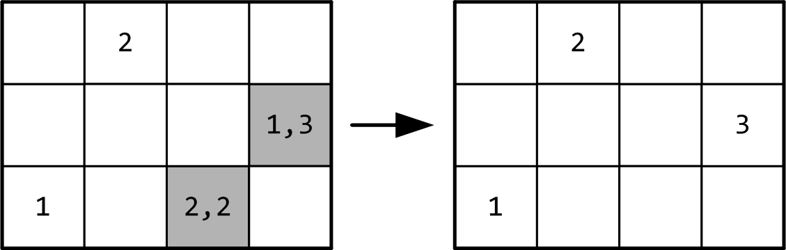

= Das Springerproblem                             
Peter Loos (c) 2021 peterloos.de                                     
Version 0.1, 26.12.2020                                     
                                                                  
:description: Example AsciiDoc document                             
:keywords: AsciiDoc                                                 
                                                 
Gegenstand dieser Fallstudie ist das klassische Springerproblem des Schachspiels. Die Springerfigur wird dazu auf ein beliebiges Feld eines _n_×_n_ Schachbretts gestellt.
Das Problem besteht nun darin, eine Zugfolge zu finden, bei der der Springer, entsprechend seiner Bewegungsmöglichkeiten im Schach, nacheinander alle Felder des Schachbrettes besetzt – jedes Feld genau einmal! Prinzipiell ist von vorneherein nicht klar, ob es überhaupt eine Lösung gibt. Wenn ja, kann es auch sein, dass mehrere Zugfolgen existieren? Eine mögliche Lösung des Springerproblems auf einem realen Schachbrett (also mit 64 Feldern) finden Sie in Abbildung 1 vor:

.Eine Lösung des Springerproblems.

Mit den Rechnern der aktuellen Generation wird es sehr schwer sein, für ein 8×8 Schachbrett alle Lösungen zu bestimmen. Wir konzentrieren uns deshalb in der Aufgabe auf kleinere Bretter. Die Anzahl realistisch ermittelbarer Lösungen für kleinere Schachbretter können Sie Abbildung 2 entnehmen:

.Einige Resultate des Springerproblems.

Die Zugregel für einen Springer kann man so beschreiben: Von seinem Ausgangsfeld kann er zuerst zwei Felder in eine beliebige Richtung gehen (keine Diagonale) und dann noch ein Feld zur Seite treten. Befindet er sich in einem der mittleren Felder des Spielfeldes, so gibt es 8 Zielfelder, die er betreten kann (siehe dazu auch Abbildung 3). Steht er hingegen mehr in der Nähe des Schachbrettrands, so verringert sich die Anzahl der Sprungmöglichkeiten entsprechend.

.Zugmöglichkeiten des Springers auf einem Schachbrett.
image::knight_moves_possible_moves.png[width=300]

== Lösungsstrategie „Trial and Error“

Wir erläutern eine Lösungsstrategie für das Springerproblem am Beispiel eines 3x4-Schachbretts und erklären in einzelnen Schritten den Ablauf. Exemplarisch legen wir für den Springer die Startposition in der linken unteren Ecke fest, also das Feld mit den Koordinaten (2,0), wobei wir den Ursprung des Bretts in der linken, oberen Ecke zu Grunde legen. Es wäre aber auch jedes andere Feld zur Erörterung der Lösungsstrategie geeignet (Abbildung 4). Die „1“ symbolisiert, dass es sich um den ersten Zug des Springers handelt:

.Ausgangssituation „1“: Springer wird im linken unteren Feld platziert.

Anhand der Ausgangsposition des Springers bestimmen wir nun eine Liste seiner möglichen Züge, die er von der aktuellen Position aus bestreiten kann. Sitzt der Springer auf dem Feld (2,0), so hat er in diesem Fall die Wahl zwischen zwei Zielfeldern (0,1) und (1,2), um weiter voran zu schreiten. Sie finden diese Felder in Abbildung 5 grau hinterlegt vor. Wir entscheiden uns für das erste Feld aus der Liste, auf dem Schachbrett nehmen wir durch die „2“ eine entsprechende Nummerierung vor:

.Spielsituation „2“: Springer zieht von Feld (2,0) nach Feld (0,1).

Von der aktuellen Springerposition ausgehend bestimmen wir wieder alle möglichen Felder, auf die der Springer nun springen kann. Es ist wieder eine Liste mit zufälligerweise zwei Positionen, dieses Mal sind es die Felder (1,3) und (2,2), siehe Abbildung 6. Wir wählen wieder das erste Element aus der Liste aus und setzen die Figur auf das Feld (1,3):

.Spielsituation „3“: Springer zieht von Feld (0,1) nach Feld (1,3).

Es wurden bei weitem noch nicht alle Felder des Schachbretts besucht. Von der Springerposition (1,3) ausgehend bietet sich dieses Mal aber nur ein einziges Feld (2,1) für den Folgezug an, siehe Abbildung 7:

.Spielsituation „3“: Springer zieht von Feld (0,1) nach Feld (1,3).

Und noch einmal gilt es diese Runde zu drehen. Dieses Mal können wir zwei Felder (0,0) und (0,2) als mögliche nächste Kandidaten ausmachen. Wir entscheiden uns in Abbildung 8 für das Feld (0,0):

.Spielsituation „5“: Springer zieht von Feld (2,1) nach Feld (0,0).

Ich verspreche es, diese Runde drehen wir jetzt zum letzen Mal. Es gibt wieder nur ein einziges Feld zum Weiterspielen, in Abbildung 9 erkennen Sie das weitere Vorgehen:

.Spielsituation „6“: Springer zieht von Feld (0,0) nach Feld (1,2).

Wir sind an einer entscheidenden Stelle in der Betrachtung der Lösungsstrategie angekommen. Wenn Sie Abbildung 9 betrachten, werden Sie erkennen, dass es von der aktuellen Springerposition aus betrachtet keine weitere Möglichkeit gibt, zu springen und damit zu einer Lösung des Springerproblems zu gelangen. Jetzt kommen die Listen mit den möglichen Folgezügen aus den vorherigen Schritten zum Zuge. Offensichtlich war die Auswahl eines Folgezugs in den Schritten zuvor nicht Erfolg versprechend. Wir müssen die Figur also auf die vorherige Ausgangssituation zurücksetzen. Da wir in diesem Schritt (im konkret vorliegenden Beispiel) aber nur einen einzigen Folgezug hatten, müssen wir gleich noch eine weitere Ausgangssituation zurücksetzen und kommen damit in Abbildung 7 an. Dort hatten wir, vom Spielfeld mit der Nummer 4 ausgehend, die zwei möglichen Folgezüge (0,0) und (0,2) zur Auswahl. Die Entscheidung für (0,0) hat nicht zum Ziel geführt, also versuchen wir es jetzt mit der zweiten Alternative (0,2), siehe Abbildung 10. Wir verstehen jetzt, zu welchem Zweck die Listen mit den möglichen Folgezügen aufzubewahren sind. Gelangt man in einem bestimmten Schritt in die missliche Situation, dass es keine Folgezüge mehr gibt, muss man einen oder mehrere Schritte rückgängig machen und mit einem alternativen Folgezug sein Glück von Neuem versuchen.

.Springer geht zur Spielsituation „4“ zurück und springt jetzt von (2,1) nach Feld (0,2).
image::knight_moves_007.png[width=450]

Dieses Verfahren läuft solange weiter, bis alle Felder des Schachbrettes besucht worden sind (und man damit eine Lösung gefunden hat), oder man feststellt, dass es keine Lösung gibt. Möchte man alle Lösungen zu einer bestimmten Schachbrettgröße finden, bricht man das Verfahren nach dem Entdecken einer Lösung nicht ab, sondern hinterlegt die gefundene Lösung in einer geeigneten Datenstruktur und setzt das Verfahren mit den noch vorhandenen Alternativzügen fort. Wenn Sie alles richtig gemacht haben, werden Sie bei dem betrachteten Beispiel eines 3x4-Schachbretts zwei Lösungen aufspüren, die Sie in Abbildung 11 betrachten können:

.Zwei Lösungen des Springerproblems auf einem 3x4-Schachbrett.

Die dargelegte Lösungsstrategie ist in der Informatik unter dem Begriff „Trial and Error“ geläufig. Sie findet immer dann Anwendung, wenn zur Lösung eines Problems kein systematisches Verfahren zur Verfügung steht. Bei der „Trial and Error“-Methode werden nacheinander alle in Frage kommenden Lösungskandidaten durchprobiert, bis eine oder mehrere Lösungen gefunden wurden.

Im Falle des Springerproblems bedeutet dies, dass nach dem Setzen des Springers auf ein Ausgangsfeld maximal 8 Möglichkeiten zu betrachten sind, um auf das nächste Feld zu springen. Auf diesem Feld gibt es wiederum maximal 8 Möglichkeiten, um zum nächsten Feld weiterzuziehen usw. Geht es auf einem bestimmten Spielfeld überhaupt nicht mehr weiter, wird der letzte Schritt (beziehungsweise die letzten Schritte) zurückgenommen, und es werden stattdessen alternative Zugmöglichkeiten ausprobiert. Hieraus erklärt sich auch der Begriff „Backtracking“, der häufig bei „Trial and Error“-Problemen anzutreffen ist.

Durch das systematische Vorwärts- und Rückwärtsziehen des Springers auf dem Schachbrett ist sichergestellt, dass alle in Frage kommenden Lösungswege betrachtet werden. Bildlich gesprochen kann man die Bewegungen des Springers als „Aufspannen eines Lösungsbaums“ ansehen (Abbildung 12). In diesem Baum gilt es, Ast für Ast zu traversieren, um die Lösungen zu finden. Führt ein Ast nicht zu einer Lösung, so muss man auf diesem Ast ganz zurückgehen und einen anderen Ast überprüfen.

.Lösungsbaum eines Backtracking-Verfahrens.

In der programmiersprachlichen Umsetzung müssen wir den Lösungsbaum nicht explizit erzeugen. Backtracking-Verfahren lassen sich typischerweise am einfachsten rekursiv beschreiben, die Möglichkeit eines rekursiven Methodenaufrufs nimmt einem diese Arbeit quasi ab, oder noch verwirrender: Der Lösungsbaum wird auf dem Methodenaufrufstapel implizit, quasi versteckt aufgespannt.

In unserem konkreten Beispiel lässt sich nun zusammenfassend das Lösungsverfahren durch die in Abbildung 13 skizzierte, rekursive Methode FindMoves darstellen:

.Grobskizze einer rekursiven Methode FindMoves zur Bestimmung aller Zugfolgen.

Wir schließen die theoretischen Vorarbeiten hiermit ab, es folgen Hinweise für eine Umsetzung des Lösungsverfahrens in einer C++-Anwendung.
