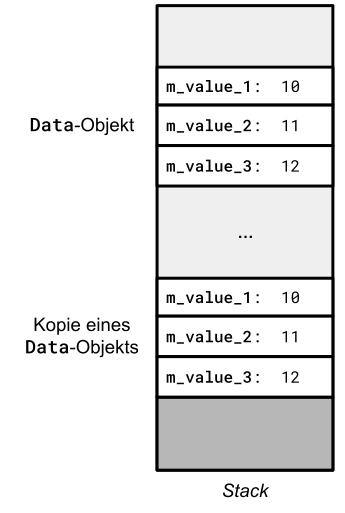
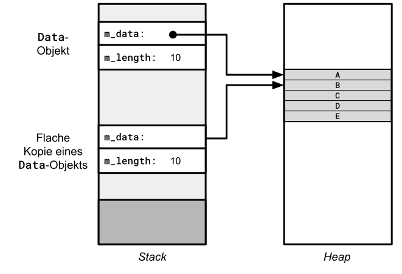
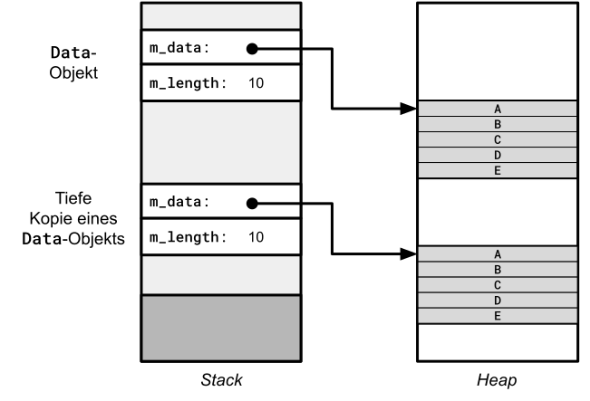
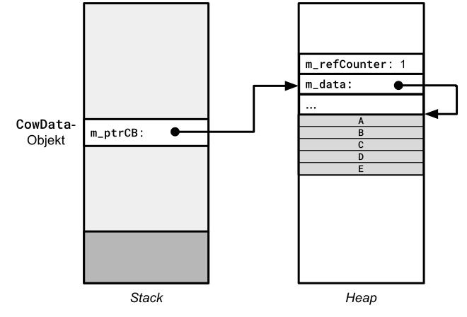
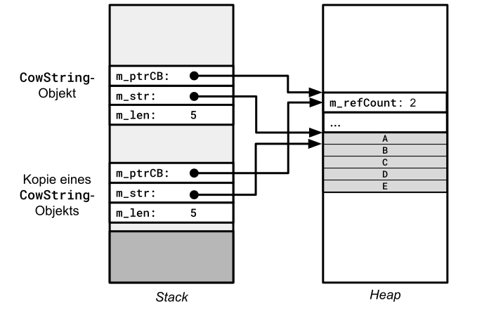
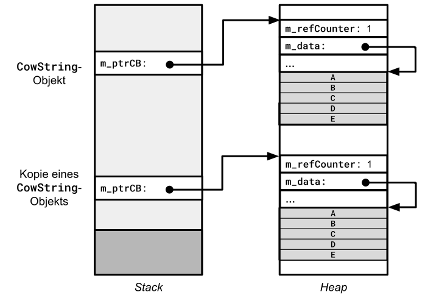

<!-- CopyOnWrite.md -->


# &bdquo;Faules&rdquo; Kopieren: Copy on Write 

## Literatur

https://www.informatik-aktuell.de/entwicklung/programmiersprachen/cow-ptr-der-smartpointer-fuer-copy-on-write.html

https://en.wikibooks.org/wiki/More_C%2B%2B_Idioms/Copy-on-write

https://github.com/ralphtandetzky/cpp_utils

Noch eine String Implementierung:

https://github.com/allenvox/string-cow


Hmm, für den Text ?!?!?

https://stackoverflow.com/questions/1649028/how-to-implement-copy-on-write


## &bdquo;Faules&rdquo; Kopieren: Eine Alternative?

Viele Objekte im täglichen &bdquo;C++&rdquo; Alltag zeichnen sich dadurch aus,
dass ihre Daten über die beiden Speicherbereiche Stack und Heap verteilt sind.
Für das Kopieren derartiger Objekte bedeutet dies, dass es nicht genügt,
die auf dem Stack liegenden Verwaltungsdaten &bdquo;flach&rdquo; zu kopieren. Auch die Daten auf dem Heap wollen kopiert werden,
zumindest wenn man von einer &bdquo;echten&rdquo; (&bdquo;tiefen&rdquo;) Kopie sprechen möchte.

IntereSsanter Weise kann man sich eine dritte Art des Kopierens vorstellen,
einen Mittelweg zwischen flacher und tiefer Kopie:
Wie wäre es, bei einer Kopieranforderung dem Benutzer von Objekt und Objektkopie
(hinter den Kulissen) zunächst einmal datentechnisch *dasselbe* Objekt in die Finger zu geben.
Solange keines dieser beiden Objekte verändert wird, besteht ja kein zwingender Handlungsbedarf, eine neue, unabhängige Kopie zu erstellen.
Problematisch wird der &bdquo;faule&rdquo; Ansatz erst dann, wenn es an einem der beteiligten Objekte zu Änderungen kommt.
Jetzt laufen Objekt und Objektkopie inhaltlich auseinander. Es wäre aber immer noch Zeit vorhanden,
verspätet &ndash; aber eben nicht zu spät &ndash; eine echte Kopie des Objekts zu erzeugen, das soeben Änderungen erfährt.

Diesen Ansatz des Kopierens könnte man als &bdquo;*Lazy Copy*&rdquo; bezeichnen, nur hat sich dieser Begriff nicht so wirklich durchgesetzt.
Wir sprechen hier meistens von der so genannten &bdquo;*Copy-On-Write*&rdquo;-Strategie.

Wir betrachten eine &bdquo;Copy-On-Write&rdquo;-Realisierung für Zeichenketten in dieser Fallstudie.
Neben einem Vergleich der Performanz zwischen der `std::string`-Klasse aus der STL und unserer selbstgeschriebenen `CowString`-Klasse
kommt auch ein Anwendungsbeispiel zum Zuge.


## Allgemeines // Einleitung

Eine häufige Operation in einem Programm ist das Kopieren von Objekten.
Ein Objekt steht in objektorientierten Programmiersprachen für einen zusammengesetzten Datentyp.
Das Kopieren eines Objekts beschreibt den Vorgang, bei dem alle Attribute (Instanzvariablen) eines Objekts
in den Speicherbereich eines anderen Objekts desselben Datentyps umkopiert werden.

Thematisch sind wir sehr nah am Kopierkonstruktor als auch dem Wertzuweisungsoperator von C++&ndash;Klassen dran.
Wir wiederholen zunächst die Prinzipien der flachen und tiefen Kopie von C++&ndash;Objekten,
bevor wir die dritte Alternative thematisieren.

## Unterschiedliche Möglichkeiten des Kopierens von Objekten


### Flache Kopie 

Eine flache Kopie eines Objekts kopiert alle Instanzvariablen bitweise. Dies funktioniert in C++ problemlos,
solange die Variablen Werte elementaren Datentyps sind. Werfen Sie einen Blick auf die folgende Klasse `Data`:

```cpp
class Data
{
private:
    int m_value_1;
    int m_value_2;
    int m_value_3;
};
```

In *Abbildung* 1 finden Sie ein Objekt einer Klasse `Data` dargestellt vor, das nur aus Werten elementaren Datentyps besteht.
Um ein Objekt eines solchen Typs zu kopieren, genügt es, von allen Instanzvariablen eine bitweise
Kopie zu erstellen.



*Abbildung* 1: Zwei Objekte des Typs `Data`: Ein Original und seine Kopie.

### Tiefe Kopie

Wir betrachten nun Objekte, die in den Instanzvariablen neben Variablen elementaren Datentyps
auch Zeigervariablen enthalten, die auf dynamisch allokierten Speicher auf der Halde zeigen.
Das Prinzip einer flachen Kopie funktioniert nun nicht mehr.
Die Zeigervariablen würden zwar korrekt kopiert werden, aber der Speicher, auf den die Zeigervariablen verweisen,
wäre derselbe.
Also die Zeigervariable im Originalobjekt und die in der Kopie verweisen auf *denselben*
dynamisch allokierten Speicherbereich.

Dies ist in den allermeisten Fällen so nicht gewünscht, siehe auch *Abbildung* 2:



*Abbildung* 2: Zwei Objekte des Typs `Data`: Ein Original und eine Kopie &ndash; mit Schwachstellen.

Um zu einer korrekten Kopie zu gelangen, benötigen wir die Vorgehensweise der &bdquo;tiefen Kopie&rdquo;.
Diese kopiert alle Instanzvariablen und erstellt zusätzlich Kopien des dynamisch allokierten Speichers, auf den diese Instanzvariablen verweisen
(*Abbildung* 3). Das bedeutet insbesondere, dass Instanzvariablen, die Zeiger enthalten, mit neuen Werten versorgt werden.



*Abbildung* 3: Zwei Objekte des Typs `Data`: Ein Original und eine korrekte Kopie.

Um eine tiefe Kopie zu erstellen, müssen Sie einen Kopierkonstruktor schreiben und den Zuweisungsoperator überladen
und wie beschrieben implementieren.
Der automtisch erzeugte Standard-Kopierkonstruktor und Zuweisungsoperator erzeugen flache Kopien.

### Lazy Copy

Interessanterweise gibt es neben diesen beiden Kopierstrategien auch noch eine dritte Strategie,
die so genannte &bdquo;*Lazy Copy*&rdquo;-Strategie, auch als &bdquo;*Copy-on-Write*&rdquo; (*COW*) bezeichnet.
Die &bdquo;*Lazy Copy*&rdquo;-Strategie kombiniert auf eine gewisse Weite
die beiden zuvor beschriebenen Kopierstrategien miteinander.

Sind in den Instanzvariablen eines Objekts Adressen vorhanden, die auf Datenstrukturen auf dem Heap zeigen,
müssen der Kopierkonstruktor und der Wertzuweisungsoperator explizit vom Anwender bereitgestellt werden,
so wie wir das soeben studiert haben.
Im Sprachjargon eines Informatikers werden derartige Realisierungen des Kopierkonstruktors und des Wertzuweisungsoperators 
als &bdquo;eifrig&rdquo; oder sogar als &bdquo;gierig&rdquo; bezeichnet.
Etwas weniger emotional formuliert tun die Realisierungen aber nur das, was man von ihnen erwartet:
Eine Kopie eines vorhandenen Objekts erstellen.

Man könnte aber &bdquo;unter der Haube&rdquo; etwas anders vorgehen:
Weniger eifrig, dafür mehr &bdquo;faul&rdquo;, auch wenn das zunächst etwas überraschend klingen mag.
Bei dieser Vorgehensweise benötigen wir zusätzlich zum eigentlichen Objekt ein Hüllenobjekt,
dass neben des Daten des Objekts zusätzliche Verwaltungsinformationen aufnimmt.

In unserer Fallstudie betrachten wir Zeichenketten, unsere Klasse heißt damit `CowString`,
wir wollen sie nun näher studieren (*Abbildung* 4).
Ein `CowString`-Objekt enthält neben den eigentlichen Daten der Zeichenkette noch weitere Daten,
die wir in Gestalt eines so genannten &bdquo;*Kontrollblocks*&rdquo; (*Controlblock*) zusammenfassen:



*Abbildung* 4: Ein `CowString`-Objekt mit einem *Kontrollblock*.

Wir erkennen in *Abbildung* 4, dass neben den eigentlichen Daten zur Verwaltung einer Zeichenkette
ein so genannter &bdquo;*Kontrollblock*&rdquo; ins Spiel gekommen ist.
Dieser enthält im Minimalausbau eine (atomare) Zählervariable, auch als *Referenzcounter* bezeichnet.
Wird ein `CowString`-Objekt zum ersten Mal angelegt, hat dieser Referenzzähler den Wert 1.
Anders herum formuliert: Es gibt keine weiteren `CowString`-Objekte, die sich die Daten des aktuellen
`CowString`-Objekts teilen.
Neben dem Referenzzähler finden wir in *Abbildung* 4 im Kontrollblock eine zweite Variable `m_data` vor.
Sie zeigt auf den Anfang der Zeichenkette. Dies ist aber schon eher ein Detail in der Realisierung der `CowString`-Klasse.
Wesentlich für unsere weiteren Betrachtungen ist der Referenzzähler,
der Bestandteil aller unterschiedlichen COW-Realisierungen ist.

Wird ein Objekt auf Basis der &bdquo;*Lazy Copy*&rdquo;-Strategie zum ersten Mal kopiert,
ist auf dem Stack eine Adresse zu kopieren, die auf den Kontrollblock am Heap zeigt.
Im `CowString`-Objekt selbst wird nur die erwähnte Zählervariable inkrementiert (*Abbildung* 5).



*Abbildung* 5: Ein `CowString`-Objekt &ndash; mit einer (abhängigen) Kopie.

Wir erkennen an *Abbildung* 5, dass eine Kopie äußerst einfach und vor allem sehr schnell erstellt werden kann.
Es wird auf dem Stack ein minimales Stellvertreter-Objekt kopiert,
und im Kontrollblock auf dem Heap wird der Referenzzähler inkrementiert.

Und ja, das kopierte Objekt greift auf dieselben Daten wie das Originalobjekt zu.
Solange an keinem der beteiligten Objekte eine Änderung erfolgt, funktioniert dieser Ansatz.
Offensichtlich bedeutet diese Strategie, dass das Kopieren eines Objekts,
bzw. das, was sich hinter den Kulissen abspielt, extrem performant ist.
Eine Zählervariable protokolliert, wie viele Objekte die Daten gemeinsam nutzen.

*Bemerkung*:<br />
Um es gleich vorweg zu nehmen: Benötigen Sie ein Zeichenkettenobjekt, an dem viele Änderungen durchzuführen sind,
dann ist ein COW-Objekt nicht der prädestinierte Kandidat. Kann man hingegen die Beobachtung machen,
dass die benötigten Zeichenkettenobjekte in der Mehrzahl ohne Änderungen im Programm eingesetzt werden,
dann ist die COW-Strategie ein Ansatz, um Rechenzeit einzusparen.

Wenn das Programm ein Objekt ändern möchte, kann es anhand des Zählers feststellen, ob die Daten gemeinsam genutzt werden oder nicht.
Also: Referenzzähler gleich 1 bedeutet, es gibt kein zweites Hüllenobjekt, dass Zugang zu diesem Objekt hat.
Änderungen können problemlos am vorhandenen Objekt durchgeführt werden. Im Gegensatz dazu hat der Referenzzähler einen Wert größer 1.
Sollen jetzt Änderungen am Objekt erfolgen, dann ist &ndash; zu diesem Zeitpunkt, also verspätet bzw. *on demand* &ndash; eine tiefe Kopie zu erstellen
(*Abbildung* 6):




*Abbildung* 6: Ein `CowString`-Objekt &ndash; und eine (unabhängige) Kopie.

In *Abbildung* 6 sieht man, wie in den beiden `CowString`-Objekten der Referenzzähler angepasst wurde.
Hatten wir in *Abbildung* 5 noch den Wert 2, so gibt es nun zwei Controlblöcke, deren Referenzzähler jeweils den Wert 1 haben.
Man kann beobachten, wie der Wert 2 gewissermaßen aufgeteilt wurde.

*Bemerkung*:<br />
Die Klasse `std::shared_ptr` und eine &bdquo;*Copy-on-Write*&rdquo;-Klasse weisen in ihrer Realisierung gewisse Ähnlichkeiten auf.
Beide Klassen verwenden Referenzzähler, die den geteilten Besitz zählen.

Man kann sagen, dass die *Lazy Copy*-Strategie von außen gesehen sich wie eine tiefe Kopie verhält.
Intern wird aber, soweit möglich, das Prinzip einer flachen Kopie angestrebt.
Flach heißt hier, um es auf den Punkt zu bringen, dass die Adresse des Kontrollblocks kopiert wird.

Erst wenn es zu Änderungen (schreibender Zugriff) an einem der beteiligten Objekte kommt,
ist eine echte (tiefe) Kopie des Objekts zu erstellen, an dem Änderungen erfolgen.


## Etwas zur *Lazy Copy* Nomenklatur

Wir wollen die bisherigen Überlegungen zusammenfassen und dazu einige neue Begrifflichkeiten ins Spiel bringen:

  * Eine COW-Zeichenkette kann zwei Zustände annehmen: Sie besitzt den Puffer exklusiv (Zustand &bdquo;*owning*&rdquo;)
oder teilt ihn mit anderen COW-Zeichenkettenobjekten (Zustand &bdquo;*sharing*&rdquo;).

  * Zu Beginn der Existenz eines COW-Zeichenkettenobjekts befindet sich dieses im &bdquo;*owning*&rdquo;-Zustand.
Zuweisungen und Initialisierungen durch Kopieren können das Objekt in den &bdquo;*sharing*&rdquo;-Zustand versetzen.
Vor dem tatsächlichen Ausführen einer Schreiboperation muss sichergestellt sein, dass dieses sich im &bdquo;*owning*&rdquo;-Zustand befindet.

* Der Übergang vom &bdquo;*sharing*&rdquo;- zum &bdquo;*owning*&rdquo;-Zustand beinhaltet sowohl das Kopieren des Kontrollblocks
  als auch das Anlegen einer neuen Zeichenkette. Diese Daten residieren nun in neuen, exklusiv zugeteilten Speicherbereichen.

* Bei einem für &bdquo;*Copy-On-Write*&rdquo; konzipierten Zeichenketten-Datentyp ist jede Operation entweder nicht-modifizierend (lesende Operation)
  oder modifizierend (schreibende Operation).
  Dadurch lässt sich leicht feststellen, ob die Zeichenkette vor der Ausführung der Operation den &bdquo;*owning*&rdquo;-Zustand sicherstellen muss
  oder den &bdquo;*sharing*&rdquo;-Zustand beibehalten kann.


## Entwurf einer einfachen &bdquo;*Copy-on-Write*&rdquo;-Klasse für Zeichenketten

Wir stellen nun Stück für Stück eine Klasse `CowString` vor.
Es folgt die Klassendefinition im Ganzen:

```cpp
01: class CowString
02: {
03: private:
04:     struct Controlblock
05:     {
06:         std::atomic<std::size_t> m_refCount;
07:         std::size_t              m_length;
08: 
09:         static Controlblock*     create      (const char* src);
10:         static Controlblock*     create      (const char* src, std::size_t length);
11:         static Controlblock*     createEmpty (); 
12:     };
13: 
14:     Controlblock* m_ptr;
15:     char*         m_str;
16: 
17:     // ensure we have a private (unshared) copy before writing
18:     void detach  ();
19: 
20: public:
21:     // c'tor(s), d'tor
22:     CowString             ();
23:     explicit CowString    (const char* s);
24:     CowString             (const char* s, std::size_t count);
25:     explicit CowString    (std::string_view sv);
26:     ~CowString            ();
27: 
28:     // copy semantics
29:     CowString(const CowString& other);
30:     CowString& operator= (const CowString& other);
31: 
32:     // move semantics
33:     CowString(CowString&& other) noexcept;
34:     CowString& operator= (CowString&& other) noexcept;
35: 
36:     // getter
37:     std::size_t  size() const;
38:     const char*  c_str() const;
39:     bool         empty() const;
40: 
41:     // type-conversion operator
42:     operator std::string_view() const;
43: 
44:     // comparison operators
45:     friend bool operator== (const CowString& a, const CowString& b);
46:     friend bool operator!= (const CowString& a, const CowString& b);
47:     friend bool operator<  (const CowString& a, const CowString& b);
48: 
49:     // read- and write-access - no exception handling
50:     char operator[] (std::size_t idx) const;  // read-only access
51:     char& operator[](std::size_t idx);        // possible write access - triggers COW
52:     
53:     char at (std::size_t idx) const;          // read-only access
54:     char& at(std::size_t idx);                // possible write access - triggers COW
55: };
```

In den Zeilen 4 bis 12 finden wir eine geschachtelte Klasse `Controlblock` vor.
Sie hat Gemeinsamkeiten mit einer *Kontrollblock*-Klasse, wie sie in Implementierungen der Smart Pointer Klasse `std::shared_ptr<T>` verwendet wird.
Der beschriebene Referenzzähler `m_refCount` wird in Zeile 6 definiert, es kommt die Klasse `std::atomic<std::size_t>` zum Zuge.
Die Längenvariable `m_length` beschreibt die Länge der gekapselten Zeichenkette.

Es folgen in den Zeilen 21 bis 34 die üblichen Zutaten in der Realisierung einer C++&ndash;Klasse.
Neben mehreren Konstruktoren und einem Destruktor unterstützt die `CowString` sowohl
die Kopier- als auch die Verschiebesemantik.

Die öffentliche Schnittstelle der `CowString` ist absichtlich knapp gehalten.
`CowString`-Objekte sollen schnelles Kopieren und schnelle Wertzuweisungen unterstützen.
Funktionalitäten, die in die Kategorie der &bdquo;Zeichenkettenverarbeitung&rdquo; fallen,
wurden weitestgehend weggelassen. Einzig und allein der Zugriff auf einzelne Zeichen
wird unterstützt. In Analogie zur `std::string`-Klasse sind dies der Index-Operator und eine `at`-Methode.
Der Index-Operator nimmt keine Überprüfung des Indexwerts vor, dies ist der `at`-Methode vorbehalten.

Da die Realisierung der `CowString`-Klasse gewisse Ähnlichkeiten zur `std::string_view`-Klasse besitzt
(beide Klassen verwalten im Wesentlichen die Anfangsadresse einer Zeichenkette und deren Länge),
unterstützen wir eine Konvertierung von `CowString`- und `std::string_view`-Objekten in beide Richtungen
(Konvertierungskonstruktor und Typkonvertierungsoperator).


Die `detach`-Methode aus Zeile 17 vollziegt einen Zustandswechsel eines `CowString`-Objekts 
vom Zustand &bdquo;*sharing*&rdquo; in den Zustand &bdquo;*owning*&rdquo;.
Diese Methode ist folglich in allen Methoden / Operatoren der `CowString`-Klasse zu rufen,
wenn ein schreibender Vorgang angestoßen wird. Bei allen lesende Operationen ändert das `CowString`-Objekt
seinen Zustand nicht.

Noch erkennen wir an Hand der Klassendefinition nicht, wo die Zeichen der Zeichenkette und der Kontrollblock
im Speicher abgelegt werden. Zwei Adressvariablen sind in den Zeilen 14 und 15 zu diesem Zweck vorbereitet:

```cpp
Controlblock* m_ptr;
char*         m_str;
```

Diese Fragen betrachten wir nun bei der Realisierung der einzelnen Methoden der `CowString`-Klasse.
Zuvor wenden wir uns dem Herzstück der `CowString`-Klasse zu, dem Kontrollblock.


## Entwurf des Kontrollblocks der `CowString`-Klasse

Die Hauptaufgabe der Klasse `CowString` besteht darin,
für eine Zeichenkette, deren Anfangsadresse bekannt ist, Speicher zu reservieren, diesen mit der Zeichenkette zu belegen
und weitere Verwaltungsinformationen, zum Beispiel die Zeichenkettelänge, zu berechnen und abzulegen.
Für all diese Verwaltungsinformationen gibt es in der Klasse `CowString` die innere Klasse `Controlblock`,
den schon zitierten Kontrollblock.

Bei der Festlegung der Instanzvariablen dieser Klasse stoßen wir auf ein kleines Problem:
Wie bringen wir die Daten (Zeichen) der Zeichenkette in diesem Objekt unter?
Wir könnten neben dem `Controlblock`-Objekt auch die Zeichen in einem separaten Speicherbereich auf dem Heap ablegen.
Das würde bedeuten, dass für eine Zeichenkette zwei Anforderungen an die Freispeicherverwaltung zu stellen haben.
Dies ist nicht sehr performant, wir beschreiten einen andere Weg.


Wir wollen eine Klasse (Struktur) *Controlblock* so definieren, dass sie in der Lage ist,
am Ende noch einen &bdquo;nachgelagerten&rdquo; Speicherbereich zu besitzen,
der groß genug ist, um die Zeichenkette aufzunehmen.

Nicht übersetzungsfähig sind Strukturen der Art

```cpp
01: struct Controlblock
02: {
03:     std::size_t m_length;
04:     ...
05:     char        m_trailing[];
06: }
```

*Bemerkung*:<br />
Der GCC-Compiler übersetzt eine derartige Struktur problemlos, der MSVC-Compiler hingegen nicht.
Wir kommen nicht umhin, festzustellen, dass diese Struktur nicht dem C++-Standard entspricht.
GCC akzeptiert sie nur als Compiler-Erweiterung (&bdquo;*GNU Flexible Array Extension*&rdquo;).
MSVC lehnt sie gemäß dem C++-Standard korrekt ab.

Wir gehen deshalb wie folgt vor:


```cpp
01: struct Controlblock
02: {
03:     std::size_t m_length;
04:     ...
05:     // no flexible sized array
06: }
```

Die Struktur `Controlblock` soll alle Daten enthalten, die für die Verwaltung eines COW Kontrollblocks erforderlich sind.
Das Anlegen einer `Controlblock`-Instanz führen wir etwas unorthodox durch.
Da wir die Länge der Zeichenkette, die es zu verwalten gilt, kennen,
reservieren wir den Speicher für die `Controlblock`-Instanz dynamisch &ndash; und belegen neben dem für die `Controlblock`-Struktur notwendigen Speicher
noch zusätztlichen Speicher, der die Zeichenkette (inkl. terminierendes Null-Zeichen) aufnehmen kann.
Eine Funktion `createControlblock`, die die Länge der Zeichenkette übergeben bekommt, könnte so aussehen:


```cpp
01: Controlblock* createControlblock(std::size_t length)
02: {
03:     void* mem = ::operator new (sizeof(Controlblock) + length + 1);
04:     return new (mem) Controlblock{};
05: }
```

Mit dem Operator `::operator new` wird Speicher reserviert und sonst nichts weiter.
Es erfolgt keine Initialisierung bzw. Vorbelegung des reservierten Speichers.

Diese erfolgt &ndash; im skizzierten Beispiel &ndash; mit dem so genannten *Placement new*:
Der Aufruf des Standardkonstruktors (`Controlblock{}`) wird auf dem reservierten Speicher angewendet.

Offen ist, wie auf den zusätzlich vorhandenen Speicher im Anschluss an das `struct Controlblock`-Objekt zugegriffen
werden kann. Dies erfolgt mit klassischen C/C++-Sprachmitteln wie `reinterpret_cast` und Zeigerarithmetik:

```cpp
Controlblock* d = createControlblock(10);
char* payload = reinterpret_cast<char*>(data) + sizeof(Controlblock);
// 10 bytes past 'payload' pointer available
```

Dieser Ansatz mag etwas unorthodox und maschinennah erscheinen.
Er ist aber sehr flexibell und vor allem performant, die Schnelligkeit ist eben das Kriterium,
wenn wir eine `CowString`-Klasse einsetzen.


## Methoden der `CowString`-Klasse

Wir gehen auf die zentralen Methoden der `CowString`-Klasse im Detail ein und beginnen mit dem Kontrolblock.

### Kontrolblock

Da es mehrere Konstruktoren der `CowString`-Klasse gibt, die unterschiedliche Anforderunen an den Kontrolblock stellen,
finden wir in der Realisierung drei Varianten vor, ein `Controlblock`-Objekt zu erzeugen:


```cpp
01: CowString::Controlblock* CowString::Controlblock::create(const char* src)
02: {
03:     std::size_t len{ std::strlen(src) };
04:     void* mem{ ::operator new(sizeof(Controlblock) + len + 1) };
05:     Controlblock* sd{ new (mem) Controlblock{ 1, len } };
06:     char* cp{ reinterpret_cast<char*> (mem) + sizeof(Controlblock) };
07:     std::memcpy(cp, src, len + 1);
08:     return sd;
09: }
10: 
11: CowString::Controlblock* CowString::Controlblock::create(const char* src, std::size_t len)
12: {
13:     void* mem{ ::operator new(sizeof(Controlblock) + len + 1) };
14:     Controlblock* sd{ new (mem) Controlblock{ 1, len } };
15:     char* cp{ reinterpret_cast<char*> (mem) + sizeof(Controlblock) };
16:     std::memcpy(cp, src, len);
17:     cp[len] = '\0';
18:     return sd;
19: }
20: 
21: CowString::Controlblock* CowString::Controlblock::createEmpty()
22: {
23:     void* mem{ ::operator new(sizeof(Controlblock) + 1) };
24:     Controlblock* sd{ new (mem) Controlblock{ 1, 0 } };
25:     char* cp{ reinterpret_cast<char*> (mem) + sizeof(Controlblock) };
26:     cp[0] = '\0';
27:     return sd;
28: }
```

Mit dem globalen `new`-Operator wird Speicher allokiert (Zeilen 4, 13 oder 23), groß genug, um den Kontrollblock und die Zeichenkette
(inkl. terminierendem Nullzeichen) auszunehmen.
Der Kontrollblock wir mit der Aggregat-Initialisierung und dem &bdquo;*Placement new*&bdquo;&ndash;Verfahren 
zu Beginn des Speicherblocks ausgebreitet.

Dann wird noch die Anfangsadresse für die Zeichenkette berechnet.
Dazu benötigen wir den `reinterpret_cast`-Operator, um die Anzahl Bytes des Kontrollblocks zur Anfangsadresse
des Speicherblocks zu addieren.

In den ersten beiden `create`-Funktionen wird eine Zeichenkette übergeben.
Wir kopieren diese mit `std::memcpy` hinter den Kontrollblock und achten auf die Null-Terminierung.

In allen drei Fällen liefern wir die Adresse des Heap-Speichers zurück, 
der Kontrollblock und die Zeichenkette sind im Speicher ausgebreitet.

### Konstruktoren und Destruktor der `CowString`-Klasse


WEITER !!!!!!!!!!!!!!!!!

```cpp
```


```cpp
```


```cpp
```


## &bdquo;*Copy-on-Write*&rdquo;-Klassen und die STL-Klasse `std::string`

Häufig wird die Frage gestellt, warum die Klasse `std::string` aus der STL nicht das &bdquo;*Copy-on-Write*&rdquo;-Idiom
umsetzt. Die Antwort ist vergleichsweise einfach: 
Die `std::string`-Klasse besitzt ein historisch gewachsenenes API, für das das &bdquo;*Copy-on-Write*&rdquo;-Idiom 
ungeeignet ist. Was ist damit konkret gemeint?

Viele der `std::string`-Methoden oder Operator hantieren mit Referenzen auf Daten (Zeichen)
innerhalb eines `std::string`-Objekts, zum Beispiel

```cpp
char& at(std::size_t_ pos);
```

oder auch 

```cpp
char& operator[](std::size_t_ pos);
```

oder auch

```cpp
char& front();
```

oder auch

```cpp
char& back(); 
```

Diese Konzeption war ein toller Schachzug beim Design der `std::string`-Klasse.
Es lassen sich sehr intuitive Anweisungen &ndash; mit Referenzen im Hintergrund &ndash; schreiben,
so dass lesende und schreibende Zugriffe über dieselben Methoden der `std::string`-Klasse angebildet werden können.

Nur sind wir bei diesem Ansatz mit dem Problem konfrontiert, dass wir innerhalb der `std::string`-Klasse
nicht erkennen können, ob diese Referenz außerhalb der Klasse nur lesend oder auch schreibend verwendet wird.

Man könnte natürlich &ndash; aus Sicht des &bdquo;*Copy-on-Write*&rdquo;-Idioms den Worst-Case
eines Schreibens zugrunde legen, nur wäre dies ein pessimistischer Ansatz,
der nicht zu einer praktikablen Realisierung führt.

Wenn wir eine Klasse für Zeichenketten inklusive des &bdquo;*Copy-on-Write*&rdquo;-Idioms realisieren wollen,
dann müsste man die öffentliche Schnittstelle auch anpassen.
Zum Beispiel, dass die Mehrzahl der Methoden einen lesenden Zugriff umsetzt.
Und die wenigen schreibenden Zugriffe auch klar dokumentieren, dass es hier hinter den Kuluissen
zu einer tiefen Objektkopie kommt.

Es handelt sich lediglich um eine gravierende Diskrepanz zwischen dem Design von `std::string`
und den idealen Anforderungen an die Zeichenkettenverarbeitung (COW).


## Fazit / Zusammenfassung

Die &bdquo;*Lazy Copy*&rdquo; / &bdquo;*Copy-On-Write*&rdquo;-Kopierstrategie bedeutet,
dass beim Kopieren eines Objekts &bdquo;unter der Haube&rdquo; nur eine Adresse
auf die vorhandenen tatsächlichen Daten des Objekts weitergereicht wird.
Eine echte und tiefe Kopie der eigentlichen Daten wird erst dann durchgeführt,
wenn an einer Instanz Werte geändert werden.

Auf diese Weise entsteht für den Benutzer eines Objekts die Illusion,
dass es sich um zwei unabhängige Instanzen des Objekts handelt.

Hinter den Kulissen wird die Anzahl der Referenzen auf die interne Datenstruktur mitgezählt,
so dass der letzte Besitzer die Struktur löschen kann.

Das hat den Vorteil, dass beim Verändern von Daten, die nur einmal referenziert werden,
keine gesonderte Kopie notwendig ist und so das Kopieren erspart werden kann.

## Literatur

