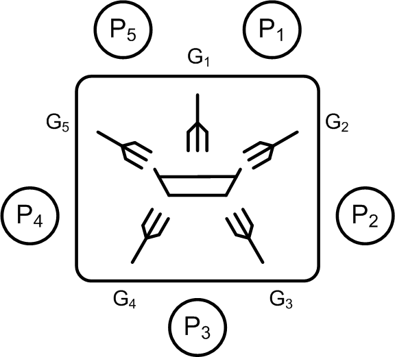

<!-- Dinierende Philosophen -->

Das Beispiel der dinierenden Philosophen ist eines der populärsten Standardprobleme
aus dem Bereich der Parallelprogrammierung.
Es erlaubt, sowohl die Synchronisation wie auch die Kooperation der beteiligten Threads
in einer lebendigen Simulation darzustellen.

<!--more-->

# Lernziele

  * `std::mutex`
  * `std::unique_lock`
  * `std::condition_variable`
  * `std::this_thread::sleep_for`
  * `std::future`
  * `std::async`

# Einführung

Das Problem ist das Folgende: In einem Kloster gibt es fünf Mönche, die sich der Philosophie widmen.
Jeder Philosoph wäre glücklich, wenn er nur denken könnte, aber gelegentlich ist auch der menschliche Trieb des Essens zu beachten.
Somit kennt jeder Philosoph drei Beschäftigungen:

  * denken
  * hungrig sein
  * essen

Die gemeinschaftliche Nahrungsaufnahme findet an einem großen Tisch statt, an dem die Philosophen im Kreis sitzen.
In der Mitte des Tisches steht eine Schüssel mit Reis, die immer wieder gefüllt wird.
Auf dem Tisch gibt es ferner fünf Teller und fünf Gabeln. Solange ein Philosoph denkt, geschieht nichts.
Bekommt er Hunger, versucht er zwei Gabeln, und zwar die zu seiner linken und rechten Seite, aufzunehmen.
Ist einer seiner benachbarten Glaubensbrüder gerade beim Essen, muss er warten.
Sind beide Gabeln frei, kann er mit dem Essen beginnen. Nachdem er satt ist, legt er beide Gabeln zurück und denkt wieder.
Die drei Zustände *denken*, *hungrig sein* und *essen* werden folglich ständig in dieser Reihenfolge durchlaufen.



Abbildung 1: Die dinierenden Philosophen.

Eine Lösung dieses Problems gestattet es, dass jederzeit so viele Philosophen wie möglich essen können
und dass keiner der Philosophen verhungert. Man kann sich leicht überlegen, 
dass stets maximal zwei Philosophen gleichzeitig essen können und dass eine Gabel immer ungenutzt bleibt.

---

In einer semi-grafischen Ausgabe können wir das Problem zum Beispiel auf diese Weise visualisieren:

```
[1]: Dining Philosophers Simulation [TID=1]
[1]: _____
[2]: philosopher enters room
[3]: philosopher enters room
[4]: philosopher enters room
[5]: philosopher enters room
[5]: ___XX
[3]: _XXXX
[6]: philosopher enters room
[5]: _XX__
[3]: _____
[2]: XX___
[4]: XXXX_
[2]: __XX_
[4]: X___X
[3]: XXX_X
[6]: X_XXX
[3]: X___X
[6]: _____
[5]: ___XX
[2]: XX_XX
[5]: XX___
[4]: XXXX_
[2]: __XX_
[6]: X_XXX

...

[2]: ___XX
[3]: _XXXX
[5]: _XX__
[6]: XXX_X
[3]: X___X
[4]: X_XXX
[4]: X___X
[6]: _____
[3]: _XX__
[5]: _XXXX
[5]: _XX__
[3]: _____
[4]: __XX_
[6]: X_XXX
[6]: __XX_
[2]: XXXX_
[2]: __XX_
[6]: X_XXX
[4]: X___X
[3]: XXX_X
[3]: X___X
[4]: X_XXX
[6]: __XX_
[2]: XXXX_
[4]: XX___
[5]: XX_XX
[2]: ___XX
[3]: _XXXX
[2]: philosopher at seat 0 quits.
[1]: philosopher 0 done: 148 activities completed.
[5]: _XX__
[6]: XXX_X
[6]: _XX__
[5]: _XXXX
[3]: ___XX
[3]: philosopher at seat 1 quits.
[1]: philosopher 1 done: 152 activities completed.
[5]: _____
[4]: __XX_
[6]: X_XXX
[4]: X___X
[6]: _____
[5]: ___XX
[4]: philosopher at seat 2 quits.
[1]: philosopher 2 done: 148 activities completed.
[5]: _____
[6]: X___X
[5]: philosopher at seat 3 quits.
[1]: philosopher 3 done: 156 activities completed.
[6]: _____
[6]: philosopher at seat 4 quits.
[1]: philosopher 4 done: 152 activities completed.
[1]: Done.
```

Die Nummer in den eckigen Klammern steht für eine Thread Id. 

---

*Anmerkung*:

Wenn Sie den Quellcode gut studieren, werden Sie feststellen, dass für den konfliktfreien Zugriff auf die Gabeln
genau ein `std::mutex`-Objekt verwendet wird. Dies bedeutet, dass also die Gabeln 0 und 1 als auch 2 und 3 
nicht echt-parallel aufgenommen werden können, obwohl dies zulässig wäre.
Einen Ansatz, der dies berücksichtigt, finden Sie in Marius Bancila's Blog unter 

[Dining Philosophers in C++ 11](https://mariusbancila.ro/blog/2017/01/16/dining-philosophers-in-cpp11/)

vor. 


---

[Zurück](../../Readme.md)

---
