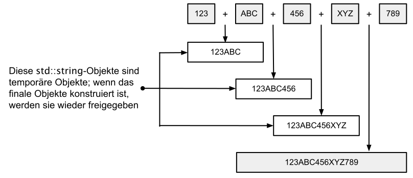

<!-- ExpressionTemplates.md -->

# Expression Templates / Lazy Evaluation

Wir betrachten in dieser Fallstudie das Thema &ldquo;Expression Templates&rdquo; und damit in Zusammenhang stehend 
die so genannte &ldquo;Lazy Evaluation&rdquo;.
Auf einen einfachen Nenner gebracht sind &ldquo;Expression Templates&rdquo; eine Metaprogrammiertechnik.
Sie verschieben die Aus­wertung von Ausdrücken in eine Funktion,
die zu einem späteren Zeitpunkt ausgeführt wird. An dieser Stelle kommt der Aspekt der
&ldquo;Lazy Evaluation&rdquo; ins Spiel, so wie man sie von vielen funktionalen Sprachen kennt.

Wir betrachten das Thema am Beispiel der Verknüpfung von Zeichenketten, also beispielsweise an einem Ausdruck in der Art

```cpp
std::string result = "123"s + "ABC"s + "456"s + "XYZ"s + "789"s;
```

Mit &ldquo;Expression Templates&rdquo; lernen Sie einen alternativen Ansatz kennen,
diesen geschachtelten (arithmetischen) Ausdruck zu berechnen mit dem Vorteil,
nahezu alle temporären Objekte zu vermeiden,
die bei der klassischen Berechnung eines solchen Ausdrucks entstehen würden.

<!--more-->

# Lernziele

  * TODO
  * Klasse `std::string_view`, `std::string_view`-Literale, Suffix &ldquo;sv&rdquo;
  * `constexpr`-Objekte
  * Lambda-Funktionen
  * STL-Algorithmen `std::begin`, `std::end`, `std::for_each`, `std::find_if`
  * STL-Klasse `std::array`
  * `using` Direktive
  * Zerlegung von Zeichenketten (*string splitting*)


# Einführung

Der Einsatz von &ldquo;Expression Templates&rdquo; ist dann sinnvoll,
wenn wir einen komplexen Ausdruck mit programmiersprachlichen Anweisungen auswerten wollen,
aber die Berechnung von Teilergebnissen, die zur Berechnung des Endergebnisses notwendig sind,
zu einer ineffizienten Laufzeit in der Auswertung des gesamten Ausdrucks führen.

Häufig kennen wir im Vorneherein viele oder alle Schritte eines Ausdrucks, den wir berechnen wollen.
Trotzdem führt dies nicht immer zu der von uns gewünschten laufzeitmäßig optimalen Ausführungszeit.
Wie ist diese widersprüchliche Aussage zu verstehen?

Betrachten wir einen in der Praxis sehr häufig auftretenden
programmiersprachlichen Ausdruck, die Konkatenation von Zeichenketten:

```cpp
std::string result = "123"s + "ABC"s + "456"s + "XYZ"s + "789"s;
```

Der vorstehende Ausdruck ist syntaktisch und semantisch korrekt,
er tut auch das, was er soll. Trotzdem könnte die Laufzeit besser sein,
als dies im vorliegenden Beispiel der Fall ist!
Wie übersetzt ein C++-Compiler diesen Ausdruck?
Der `operator+` ist ein binärer, links-assoziativer Operator,
damit ist der Ausdruck äquivalent zu

```cpp
std::string result = (((("123"s + "ABC"s) + "456"s) + "XYZ"s) + "789"s);
```

Wenn der Teilausdruck `"123"s + "ABC"s` ausgeführt wurde, wird ein temporäres `std::string`-Objekt erzeugt.
Für jeden der nachfolgenden `operator+`&ndash;Aufrufe wird an diesem Temporärobjekt
ein entsprechender Aufruf der `append`-Methode abgesetzt mit den Operanden `"456"s`, `"XYZ"s` und `"789"s`.
Diese Aufrufe kreieren alle wiederum ein neues, temporäres `std::string`-Objekt!

Aus diesen Betrachtungen wird leicht ersichtlich, dass übermäßig viele Aufrufe an 
die dynamische Speicherverwaltung einher gehen, wenn das Resultat eines `append`-Methodenaufrufs
im aktuellen Teilzeichenkettenobjekt nicht mehr Platz findet.

Es kosten nicht nur die vielen Aufrufe an die dynamische Speicherverwaltung Laufzeit,
es finden auch viele unnötige Kopieroperationen statt, um eine temporär konstruierte Zeichenkette in
den Speicherbereich eines größeren Zeichenkettenobjekts umzukopieren.

Dieses Vorgehensweise ist ineffizient.
Es werden zahlreiche Speicherbereiche für die temporären Zeichenketten angelegt (und wieder freigegeben),
die am endgültigen Resultat nicht direkt beteiligt sind. Man spricht hier auch von der so genannten
&ldquo;eager&rdquo; Vorgehensweise (zu deutsch etwa &ldquo;gierig&rdquo;),
was eben nicht immer von Vorteil sein muss.



Es ergibt sich an dieser Stelle doch die folgende Fragestellung:
Wenn wir die Menge der zu konkatenierenden Zeichenketten im Vorneherein kennen,
warum berechnen wir dann nicht die Länge der Resultatzeichenkette vorab,
um damit all die unnötigen Aufrufe in die dynamische Speicherverwaltung zu umgehen.
Damit müssen wir allerdings die vorzeitige Konkatenationen von Teilzeichenketten verzögern,
oder eben verspätet (&ldquo;Lazy Evaluation&rdquo;) ausführen.

Ist die Länge der Resultatzeichenkette bekannt, legen wir mit nur einem Aufruf dynamisch ein
entsprechend großes Zeichenkettenobjekt an. Danach kopieren wir die Teilzeichenketten entsprechend in
diesen Speicherbereich um. Es sind keine weiteren dynamischen Speicheranforderungen notwendig.
Dies lässt sich aber mit der klassischen Schreibweise nicht erzielen.

# Ansatz mit &ldquo;Expression Templates&rdquo;

An dieser Stelle kommen die so genannten &ldquo;Expression Templates&rdquo; ins Spiel
(in manchen Aufsätzen zu diesem Thema auch &ldquo;Loop Unrolling&rdquo; als bezeichnet).
Ein &ldquo;Expression Template&rdquo; steht für einen Teilausdruck, der die beteiligten Operanden abspeichert,
aber die Operation (noch) nicht ausführt! Man könnte hier auch von einem &ldquo;Proxy&rdquo;-Objekt sprechen,
das für eine bestimmte Operation steht, die aber zu einem späteren Zeitpunkt ausgeführt wird.

*Hinweis*: Für die Liebhaber von Software Entwurfsmustern erkennen wir (grob) an dieser Stelle gleich zwei Muster:
Das *Command Pattern* und das *Proxy Pattern*. Ersteres kapselt die Operationen für deren &ldquo;lazy&rdquo; Ausführung.
Zweiteres verlagert Operanden und Operator in ein separates Objekt, um die &ldquo;eagert&rdquo; Ausführung zu umgehen.

Jetzt stehen wir nur noch vor dem Problem, dass wir es in den meisten Fällen nicht 
mit der Konkatenation von zwei, sondern beliebig vielen Zeichenketten zu tun haben.
Ein &ldquo;Expression Template&rdquo; wird deshalb als rekursive Datenstruktur definiert.
Jedes solche Objekt enthält eine einzelne Teilzeichenkette und ein zweites Objekt, 
dass die restliche Teilzeichenkette beschreibt.


Der Vorteil einer rekursiven Datenstruktur ist, dass diese leicht traversierbar ist,
wenn es um die nachgelagerte Berechnung des Resultatobjekts geht.

Zusammenfassend kann man also festhalten, dass &ldquo;Expression Templates&rdquo;

  * einen komplexen Ausdruck in mehrere Proxy-Objekte zerlegen,
    die einen rein passiven Charakter haben (keine arithmetischen Berechnungen, keine &ldquo;eager&rdquo;-Funktionalität) und
  * einen Mechanismus bereitstellen, der eine nachgelagerte, effiziente Berechnung des Gesamtergebnisses gestattet.

# Realisierung

Nun fehlt nur noch die Umsetzung der vorliegenden Theorie in den schnöden Alltag eines C++&ndash;Programms.
Da wir es mit einer beliebige Anzahl von Teilzeichenketten zu tun haben,
liegt ein Ansatz mit variadisches Templates nahe ([Listing 1]):

###### {#listing_1_class_stringhelper}

```cpp
01: // primary template
02: template <typename... Strings>
03: class StringHelper;
04: 
05: template <typename String, typename... Strings>
06: class StringHelper<String, Strings...> {
07: private:
08:     const String& m_data;  // storing reference of first string
09:     StringHelper<Strings...> m_tail;  // structure that contains other strings
10: 
11: public:
12:     StringHelper(const String& data, StringHelper<Strings...> tail)
13:         : m_data{ data }, m_tail{ tail }
14:     {}
15: 
16:     StringHelper(const String& data)
17:         : m_data{ data }, m_tail{ StringHelper<>() }
18:     {}
19: 
20:     // calculating size of all strings being concatenated
21:     size_t size() const
22:     {
23:         return m_data.size() + m_tail.size();
24:     }
25: 
26:     void save(const std::string::iterator& end) const
27:     {
28:         const std::string::iterator begin{ end - m_data.size() };
29:         std::copy(std::begin(m_data), std::end(m_data), begin);
30:         m_tail.save(begin);
31:     }
32: 
33:     operator std::string() const
34:     {
35:         size_t length{ size() };
36:         std::string result(length, '\0');  // <--- preallocate result string
37: 
38:         save(std::end(result));
39:         return result;
40:     }
41: 
42:     StringHelper<std::string, String, Strings...>
43:         operator+(const std::string& next) const
44:     {
45:         return StringHelper<std::string, String, Strings...>(
46:             next,
47:             *this
48:             );
49:     }
50: };
```

*Listing* 1: Template Klasse `StringHelper`.

Dieser Quellcode ist nicht ganz trivial, wir gehen nun auf die interessanten Stellen in [Listing 1] ein:

In den Zeilen 1 und 2 wird das *Primary Template* `StringHelper` definiert,
in den Zeilen XXX bis XXX folgt eine partielle Spezialisierung dieses Templates.

Die `StringHelper`-Klasse besitzt zwei Instanzvariablen:

  * `m_data` &ndash; eine `std::string`-Referenz, die auf eine der beteiligten Teilzeichenketten verweist.
  * `m_tail` &ndash; eine Spezialisierung der `StringHelper<>`-Klasse, die die übrigen Zeichenketten verwaltet.


Man beachte, dass es sich in Zeile XXX *nicht* um eine rekursive Klassendefinition handelt.
Haben wir es zum Beispiel mit einer Spzialisierung der Klasse `StringHelper<>` in der Ausprägung
`StringHelper<std::string, std::string, std::string>` zu tun,
dann ist in diesem Fall die Instanzvariable `m_tail` vom Typ `StringHelper<std::string, std::string>`!

Die Methode size in den Zeilen XXX bis XXX berechnet die gesamte Länge aller beteiligten Zeichenketten.
Die Methode ist rekursiv, sie startet mit der Längenberechnung von `m_data` und setzt ihre Arbeit dann
rekursiv mit den restlichen Zeichenketten fort, die im Objekt `m_tail` abgelegt sind.

Das tatsächliche Aneinanderhängen der Teilzeichenketten findet im Typkonvertierungsoperator `operator std::string()` statt.
Dieser steht folglich für die viel zitierte &ldquo;Lazy Evaluation&rdquo;!
Es findet eine Tyumwandlung von `StringHelper` nach `std::string` statt.
Die Variable `result` von Zeile XXX ist die Resultatzeichenkette.
Sie wird zu Beginn mit einer entsprechenden internen Länge angelegt, so dass keine weiteren
Aufrufe an die dynamische Speicheranforderung erfolgen (siehe Methode `size()`).
Die einzelnen Teilzeichenketten werden wiederum innerhalb der Methode `save` umkopiert.
Zu diesem Zweck wird `save` mit einem Iteratorobjekt so aufgerufen,
dass das Iteratorobjekt auf das Ende der Resultatzeichenkette zeigt.
Dies hat den Grund, dass die einzelnen Teilzeichenketten auf Grund des rekursiven Charakters der Verarbeitung
in umgekehrter Reihenfolge vorliegen und dementsprechend von &ldquo;rechts&rdquo; nach &ldquo;links&rdquo;
abgearbeitet werden müssen.

Wie muss nun eigentlich ein Konkatenationsausdruck in der optimierten Version aussehen,
da ja der Ausdruck

```cpp
std::string result = "123"s + "ABC"s + "456"s + "XYZ"s + "789"s;
```

für die ineffiziente Ausführung steht? Wir müssen hierzu zu einem kleinen Trick greifen,
und die vielen `operator+`&ndash;Aufrufe auf eine Verkettung mit `StringHelper`-Objekten
umlenken. Der einfache Trick besteht darin, in die Folge von `operator+`&ndash;Aufrufen als ersten Operanden
ein leeres `StringHelper<>`-Objekt einzufügen! Eine einfache Umformulierung lautet nun

```cpp
std::string result = StringHelper<>{} + "123"s + "ABC"s + "456"s + "XYZ"s + "789"s;
```

`StringHelper<>{}` steht hier für ein &ldquo;leeres&rdquo; `StringHelper`-Objekt, 
alle nachfolgenden `operator+`&ndash;Aufrufe kreieren eine verschachtelte (rekursive) `StringHelper`-Objektstruktur,
wenn wir den `operator+` in der Template Klasse `StringHelper<>` wie in den Zeile XX bis YY gezeigt implementieren:

```cpp
StringHelper<std::string, String, Strings...>
operator+(const std::string& next) const
{
    return StringHelper<std::string, String, Strings...>(
        next,
        *this
    );
}
```

Lassen Sie sich bei der Realisierung dieser Operators nicht verwirren:
Der Operator liefert ein Objekt derselben Klassen zurück, zu der der Operator gehört!
Das möglicherweise erwartete Reduzieren der Zeichenketten findet im Konstruktor der `StringHelper<>`-Klasse statt
(Zeilen XX bis XX). Dieser Konstruktor besitzt die Schnittstelle

```cpp
StringHelper(const String& data, StringHelper<Strings...> tail)
```

Der ihm zugeordnete Klassentyp lautet

```cpp
template <typename String, typename... Strings>
class StringHelper<String, Strings...>
```

Folglich wird aus einer variablen langen Liste von *n* Zeichenketten eine erste Zeichenkette extrahiert,
um damit die Rekursionsebene von *n* auf *n*-1 zu reduzieren!
Die rekursive `StringHelper`-Objektstruktur darf wiederum nicht zu einer Endlos-Rekursion führen,
dazu ist die `StringHelper`-Klassendefinition mit einer weiteren (expliziten) Spezialisierung zu definieren ([Listing 2]):

###### {#listing_2_class_stringhelper_specialization}

```cpp
template <>
class StringHelper<> {
public:
    StringHelper() = default;

    size_t size() const { return 0; }

    void save(const std::string::iterator&) const {}

    StringHelper<std::string> operator+(const std::string& next) const
    {
        return StringHelper<std::string>(next, *this);
    }
};
```

*Listing* 2: (Vollständige) Spezialisierung der Template Klasse `StringHelper`.

In dieser Klassendefinition liefert Methode `size` den Wert 0 zurück. Und ein Aufruf
von `save` beendet ebenfalls eine zuvor begonnene rekursive `save`-Aufrufkaskade.

Natürlich ist es auch möglich, die Konkatenation von Zeichenketten mit &ldquo;Modern C++&rdquo;
Sprachkonstrukten angenehmer zu schreiben: An die Stelle der Wiederholung des `+`-Operators könnten
Funktionen mit einer variadischen Anzahl von Parametern einspringen:
Ein *Folding*-Ausdruck tritt an die Stelle der wiederholten operator+&ndash;Aufrufe:

```cpp
template<typename ... ARGS>
std::string concat(ARGS&& ... args)
{
    std::string result{ (StringHelper<>{} + ... + std::forward<ARGS>(args)) };
    return result;
}
```

# Laufzeitvergleich

Damit sollten wir nach all der Mühe einen Testrahmen betrachten, um zu guter Letzt 
einen Vergleich der Laufzeiten betrachten zu können:

```cpp
void Test_Classic()
{
    const auto start{ std::chrono::high_resolution_clock::now() };
    for (size_t i{}; i != IterationCount; ++i)
    {
        std::string result{ s1 + ". " + s2 + ". " + s3 + ". " + s4 + "." };
    }
    const auto end{ std::chrono::high_resolution_clock::now() };
    const auto diff{ std::chrono::duration_cast<std::chrono::duration<double, std::milli>>(end - start).count() };
    std::cout << std::fixed << diff << " msecs." << std::endl;
}

void Test_ExpressionTemplates()
{
    const auto start{ std::chrono::high_resolution_clock::now() };
    for (size_t i{}; i != IterationCount; ++i)
    {
        std::string result{ StringHelper<>{} + s1 + ". " + s2 + ". " + s3 + ". " + s4 + "." };
    }
    const auto end{ std::chrono::high_resolution_clock::now() };
    const auto diff{ std::chrono::duration_cast<std::chrono::duration<double, std::milli>>(end - start).count() };
    std::cout << std::fixed << diff << " msecs." << std::endl;
}
```

Bevor wir das Programm ausführen, ein letzter Hinweis:
Die erhofften Ergebnisse erhalten wir (auf meinem Rechner und mit meiner Entwicklungsumgebung) nur,
wenn wir das Programm im &ldquo;Release Modus&rdquo; ausführen. Damit zu den Laufzeiten:

```
15.475500 msecs.
7.752800 msecs.
```

Eine Verbesserung um den Faktor 2 ist sicherlich ein großartiges Ergebnis, 
wenn Performance eine Rolle spielt!

# Die Realisierung und GCC

Der Quellcode des Beispiels ist nicht mit GCC übersetzbar. Um ehrlich zu sein, ich bin eigentlich verwundert,
dass er mit dem Visual C++ Compiler akzeoptiert wird. Das Problem ist eine einzige Zeile XXX von [Listing 1]:

<pre>
StringHelper(const String& data)
    : m_data{ data }, m_tail{ <b>StringHelper<>()</b> }
{}
</pre>

Innerhalb der Klassendefinition von `StringHelper<String, Strings...>` wird bereits ein Objekt dieser Klasse
mit einer bestimmten Spezialisierung erzeugt.

Dies quittiert der GCC-Compiler mit der Fehlermeldung

```
error: implicit instantiation of undefined template 'StringHelper<>'
```

Mit zwei Handgriffen kann man diesen Fehler beseitigen:

  * Die Definitionen der beiden Template Klassen `StringHelper<String, Strings...>` und `StringHelper<>` sind bzgl. ihrer Reihenfolge im Quellcode zu vertauschen.
  * Der `+`-Operator wird nicht in der Template Klasse `StringHelper<>` definiert, sondern seine Definition
    wird als so genannte &ldquo;*out of class* Member Definition&rdquo; außerhalb der Template Definition angesiedelt:

```
StringHelper<std::string>
StringHelper<>::operator+(const std::string& next) const
{
    return StringHelper<std::string>(
        next,
        *this
        );
}
```

Damit ist das vorliegende Beispiel auch unter dem GCC übersetzbar!


WEITER: Ein Hinweis: Das Beispiel mit den Referenzen

WEITER: Auch einen Screen SHot vom Debugger

WEITER: Auch das Bild vom Buch übernehmen ...

WEITER: Evtl. noch ein zweites Bild vom Buch machen ..

WEITER: Dann das Beispiel mit a * b + c * d


# Literatur

// https://www.modernescpp.com/index.php/expression-templates

//https://gieseanw.wordpress.com/2019/10/20/we-dont-need-no-stinking-expression-templates/

// https://www.grimm-jaud.de/index.php/private-vortraege/17-expression-templates

// https://www.linuxtopia.org/online_books/programming_books/c++_practical_programming/c++_practical_programming_132.html


## Literatur

Die Anregungen zum Zerlegen von Zeichenketten stammen aus

[Jonathan Boccara, &ldquo;How to split a string in C++&rdquo;](https://www.fluentcpp.com/2017/04/21/how-to-split-a-string-in-c//).

Die Hinweise zum Initialisieren eines `std::array`-Objekts sind

[Stackoverflow, &ldquo;C++11: Correct std::array initialization?&rdquo;](https://stackoverflow.com/questions/14178264/c11-correct-stdarray-initialization/)

entnommen.  

# There&lsquo;s more

Der Einsatz eines `std::array`-Objekts ist für performantes  Chiffrieren und Dechiffrieren nicht die
performanteste Lösung. Überlegen Sie, wie man eine *BiMap*-Klasse implementieren könnte,
um laufzeit-optimalere Ergebnisse zu erzielen.

<br/>

<!-- Links Definitions -->


[Listing 1]: #listing_1_class_stringhelper
[Listing 2]: #listing_2_class_stringhelper_specialization

<!-- End-of-File -->
