<!-- HappyNumbers.md  -->

## Glückliche Zahlen, Schildkröten und Hasen

Unter der sehr ironischen Überschrift ist zunächst die Suche nach so genannten  &bdquo;*Happy Numbers*&rdquo;, also glücklichen Zahlen, zu verstehen.
Damit sind, ausgehend von einer natürlichen Zahl als Startwert, solche Zahlen gemeint, für die
eine bestimmte Iterationsvorschrift nach endlich vielen Iterationsschritten zum Wert 1 führt.
Wenn wir dieses Thema näher betrachten, stellen wir fest, dass wir auch manchmal mit Zahlenfolgen konfrontiert sind, die Zyklen enthalten und damit endlos sind.
Beim Umschiffen dieser Stolperfalle kommen Schildkröten und Hasen ins Spiel, aber dazu später noch mehr.

Schlussendlich überlegen wir uns, ob `constepr` auch ein gangbarer Weg sein könnte,
um derartige Zahlen zu suchen, eben dann mit dem Übersetzer und nicht mit in Maschinencode gegossenen CPU-Anweisungen.

In dieser Fallstudie stellen wir mehrere Lösungsvarianten zur Berechnung glücklicher Zahlen vor.
In einem Nebenschauplatz gehen wir auf Zyklen in verketteten Listen ein.
Hashtabellen und die schon zitierten Hasen und Schildkröten helfen uns dabei,
die Zyklen zu entdecken und damit das Traversieren von unendlichen Zahlenfolgen zu vermeiden.

<!--more-->

# Lernziele

  * STL Container `std::unordered_set`, `std::array` und `std::vector`<br />
  * STL Algorithmen `std::find` und `std::copy_n`<br />
  * `if`-Anweisung mit Initializer<br />
  * &bdquo;*Brace*&rdquo;-Initialisierung
  * Hilfsklasse `std::span`<br />
  * Einfach verkettete Listen<br />

# Einführung

Unter einer Zahlenfolge (auch Zahlenreihe) verstehen wir in der Mathematik eine Auflistung von endlich (oder auch unendlich) vielen fortlaufend nummerierten Zahlen.
Die Zahl mit der Nummer *i* – man sagt auch: mit dem Index *i* – wird *i*-tes Glied der Folge genannt.
In dieser Fallstudie betrachten wir Zahlenfolgen, deren Startwert eine &bdquo;*Happy Number*&rdquo; sein kann,
oder auch nicht. Wenn nicht, sprechen wir von einer &bdquo;*Sad Number*&rdquo;, also einer traurigen Zahl.

Wie berechnet sich nun eine &bdquo;*Happy Number*&rdquo;?
Ausgehend von einer beliebigen natürlichen Zahl wird die nächste Zahl durch die Summe der Quadrate ihrer Ziffern gebildet.
Auf diese Weise entsteht eine Folge von Zahlen, die endlich oder unendlich sein kann.
Wird die Zahl 1 erreicht, haben alle folgenden Folgenglieder ebenfalls den Wert 1.
Wir beenden in diesem Fall die Folge bzw. betrachten sie als endlich und sprechen in Bezug auf den Startwert von einer &bdquo;*Happy Number*&rdquo;,
also einer glücklichen Zahlenfolge.
Im anderen Fall ist die Zahlenfolge unendlich, wir haben es dann mit einer traurigen Zahl zu tun.
Problematisch ist für uns der Umstand des Unendlichen an der Zahlenfolge, da wir dies auf irgendeine Weise erkennen müssen.

Hier ein Beispiel für eine &bdquo;*Happy Number*&rdquo; Zahlenfolge, wir nehmen den Startwert 19:

```
Start Number: 19
 19 ==>  82
 82 ==>  68
 68 ==> 100
100 ==>   1
```

Die Zahl 19, in ihre Ziffern zerlegt, ergibt 1 und 9.
Diese Zahlen quadriert ergeben 1 und 81, also 82.
Die Zahl 82 besitzt die Ziffern 8 und 2,
diese quadriert lauten 64 und 4, und addiert folglich 68.
Die Zahl 68 zerlegt man in die Ziffern 6 und 8.
Quadriert sind dies 36 und 64, addiert 100.
Die Zahl 100 besteht aus den Ziffern 1 und zwei Mal die 0.
Diese Zahlen quadriert und addiert ergeben 1, was 19 zu einer glücklichen Zahl macht.

Wie sieht es mit dem Startwert 20 aus?
Wir erhalten hier die Zahlenfolge

20  &Rightarrow; 4 &Rightarrow; 16  &Rightarrow; 37  &Rightarrow; 58  &Rightarrow; 89  &Rightarrow;
145  &Rightarrow; 42  &Rightarrow; 20

Oops, nach 8 Schritten sind wir bei der Berechnung des nachfolgenden Werts wieder beim Startwert angekommen.
Dies bedeutet, dass die Zahl 1 niemals erreicht werden kann, wir haben es mit einer unendlichen (zyklischen) Zahlenfolge zu tun,
damit ist 20 eine traurige Zahl.

Es gibt verschiedene Lösungsansätze für die Berechnung von &bdquo;*Happy Number*&rdquo; Zahlenfolgen.
Da diese unendlich sein können, müssen wir uns zusätzlich mit dem Problem von Zyklen in Zahlenfolgen beschäftigen.

# Der naive Ansatz

Der naive Ansatz lässt den zuvor geschilderten Aspekt von unendlich vielen Folgengliedern zunächst einmal außer Acht.
Damit erhalten wir zwar keine wirklich funktionsfähige Realisierung, wir nähern uns dafür 
dem Problem in einfachen Schritten.

#### Lösung

> Quellcode: Siehe auch [Github](https://github.com/pelocpp/cpp_case_studies.git).

Eine Umsetzung des Algorithmus zur Berechnung der Zahlenfolge könnte so erfolgen:

###### {#listing_01_isHappy_naive_version}


```cpp
01: bool isHappy(std::size_t number)
02: {
03:     const std::size_t stop{ 100 };
04: 
05:     std::println("Start: {}", number);
06:     auto n{ number };
07: 
08:     std::size_t count{};
09:     while (true)
10:     {
11:         auto prevNumber{ n };
12:         n = sumOfSquares(n);
13:         std::println("{:3} ==> {:3}", prevNumber, n);
14: 
15:         if (n == 1) {
16:             return true;
17:         }
18:         else if (count == stop) {
19:             std::println("Aborting calculation ...");
20:             return false;
21:         }
22: 
23:         ++count;
24:     }
25: }
```

*Listing* 1: Erster Versuch einer Realisierung einer `isHappy`-Funktion.

Der Quellcode ist nicht ganz vollständig, es fehlt die Routine `sumOfSquares` aus Zeile 12:

###### {#listing_02_sumOfSquares_function}


```cpp
01: std::size_t sumOfSquares(std::size_t n)
02: {
03:     std::size_t squareSum{};
04:     while (n != 0) {
05:         std::size_t digit{ n % 10 };
06:         squareSum += digit * digit;
07:         n /= 10;
08:     }
09:     return squareSum;
10: }
```

*Listing* 2: Funktion `sumOfSquares`.

Rufen wir die Funktion `isHappy` mit dem Wert 19, so erhalten wir die folgende Ausgabe:

```
Start: 19
 19 ==>  82
 82 ==>  68
 68 ==> 100
100 ==>   1
```

Das sieht schon einmal recht gut aus, aber die Lösung hat eben auch ihre Schwächen:
Wir wiederholen den Aufruf mit dem Wert 20:

```
Start: 20
 20 ==>   4
  4 ==>  16
 16 ==>  37
 37 ==>  58
 58 ==>  89
 89 ==> 145
145 ==>  42
 42 ==>  20
 20 ==>   4
  4 ==>  16
 16 ==>  37
 37 ==>  58
...
```

Wir brechen die Ausgabe ab, bei genauem Hinsehen erkennt man, dass die Werte sich wiederholen.
Nach acht Iterationen wird das Folgenelement 42 erreicht, dessen nachfolgendes Element den Wert 4 * 4 + 2 * 2 = 20 hat.
Das war doch der Startwert der Zahlenfolge. Wir erkennen, 20 ist eine traurige Zahl,
und wir müssen das Problem der Wiederholungen genauer betrachten.

# Ein Ansatz mit Rekursion

Der rekursive Ansatz berechnet das Ergebnis für die ersten vier natürlichen Zahlen gewissermaßen &bdquo;von Hand&rdquo;.
Der Wert 1 als Startwert ist trivial bzw. kennzeichnet sogleich das Ende der Zahlenfolge,
da dies das Endekriterium einer jeden (endlichen) &bdquo;*Happy Number*&rdquo; Zahlenfolge ist.
Ist die Summe größer als 1, aber kleiner oder gleich 4 ist, wissen wir, dass sie in einer Endlosschleife hängen bleibt und niemals den Wert 1 erreicht.
Es handelt sich also definitiv nicht um &bdquo;*Happy Numbers*&rdquo;.

Wir müssen dies aber vorab selbst berechnen:
Wenn der Startwert 2 ist, dann haben wir<br />

2<sup>2</sup> ist 4,<br />
4<sup>2</sup> ist 16,<br />
1<sup>2</sup> + 6<sup>2</sup> = 1 + 36 = 37,<br />
3<sup>2</sup> + 7<sup>2</sup> = 9 + 49 = 58,<br />
5<sup>2</sup> + 8<sup>2</sup> = 25 + 64 = 89,<br />
8<sup>2</sup> + 9<sup>2</sup> = 64 + 81 = 145,<br />
1<sup>2</sup> + 4<sup>2</sup> + 5<sup>2</sup> = 1 + 16 + 25 = 42,<br />
4<sup>2</sup> + 2<sup>2</sup> = 16 + 4 = 20 und schließlich<br />
2<sup>2</sup> + 0<sup>2</sup> = 4 + 0 = 4.<br />

Wir befinden uns jetzt in derselben Schleife, wenn wir auf den Anfang blicken.
Der Korrektheit halber probieren wir das noch mit 3 aus:

3<sup>2</sup> = 9,<br />
9<sup>2</sup> = 81,<br />
8<sup>2</sup> + 1<sup>2</sup> = 64 + 1 = 65,<br />
6<sup>2</sup> + 5<sup>2</sup> = 36 + 25 = 61,<br />
6<sup>2</sup> + 1<sup>2</sup> = 36 + 1 = 37,<br />
3<sup>2</sup> + 7<sup>2</sup> = 9 + 49 = 58,<br />
5<sup>2</sup> + 8<sup>2</sup> = 25 + 64 = 89,<br />
8<sup>2</sup> + 9<sup>2</sup> = 64 + 81 = 145,<br />
1<sup>2</sup> + 4<sup>2</sup> + 5<sup>2</sup> = 1 + 16 + 25 = 42,<br />
4<sup>2</sup> + 2<sup>2</sup> = 16 + 4 = 20,<br />
2<sup>2</sup> + 0<sup>2</sup> = 4 + 0 = 4,<br />
4<sup>2</sup> ist 16,<br />
1<sup>2</sup> + 6<sup>2</sup> = 1 + 36 = 37.<br />

Oops, den Wert 37 haben wir ca. nach dem ersten Drittel der Folge bereits erzielt, wir sind wieder in
eine Endlosschleife geraten. Die Zahl 4 ist ebenfalls nicht glücklich, das haben wir bereits bei dem Startwert 2 gesehen.
Also sind die Zahlen 2 bis einschließlich 4 nicht glücklich.
Mit diesem Vorwissen beginnen wir nun die Konzeption einer Funktion `isHappy`:

```cpp
bool isHappy(std::size_t number)
{
    std::size_t sum{};
    ....
}
```

Wir definieren eine lokale Variable namens `sum` und initialisieren diese mit Null.

Die Ziffern der Zahl `number` werden zerlegt, mit dem Wert 2 potenziert und dann addiert.
Diese Berechnungen lagern wir in der schon gezeigten Funktion `sumOfSquares` aus.
Nun müssen wir die Summe überprüfen.
Wenn die Summe gleich 1 ist, dann haben wir eine glückliche Zahl gefunden und können `true` zurückgeben:

```cpp
bool isHappy(std::size_t number)
{
    std::size_t sum{};
    sum = numSquareSum(number);
    if (sum == 1) {
        return true;
    }
    ...
}
```


Wenn die Summe größer als 1, aber kleiner oder gleich 4 ist, wissen wir, dass sie in einer Endlosschleife hängen bleibt
und niemals den Wert 1 erreichen kann.
Es handelt sich also definitiv nicht um eine glückliche Zahl.
Wir geben somit `false` zurück, wenn die Summe größer als 1 und kleiner oder gleich 4 ist:


```cpp
bool isHappy(std::size_t number)
{
    std::size_t sum{};
    sum = numSquareSum(number);
    if (sum == 1) {
        return true;
    } else if (sum > 1 && sum <= 4) {
        return false;
    }
    ...
}
```

Zum Schluss rufen wir die Funktion `isHappy` rekursiv auf.
Falls die Summe keinen der Basisfälle erfüllt &ndash; also nicht gleich 1, 2, 3 oder 4 ist &ndash;,
wollen wir wieder den Algorithmus zur Berechnung des nächsten Folgenglieds anstoßen,
also die Ziffern der Zahl aufteilen, quadrieren und addieren.
Wir rufen folglich die Funktion `isHappy` erneut auf, dieses Mal aber mit der Variablen `sum` als Argument:

###### {#listing_03_isHappy_recursive_variant}

```cpp
01: bool isHappy(std::size_t number)
02: {
03:     std::size_t sum{ sumOfSquares(number) };
04: 
05:     if (sum == 1) {
06:         return true;
07:     }
08:     else if (sum > 1 && sum <= 4) {
09:         return false;
10:     }
11:     else {
12:         return isHappy(sum);
13:     }
14: }
```

*Listing* 3: Rekursive Version der `isHappy`-Funktion.


Wichtig ist auch, vor dem Funktionsaufruf von `isHappy` in Zeile 12 ein `return` einzufügen,
um den vom rekursiven Funktionsaufruf berechneten Wert zurückzugeben.

Bei der Betrachtung der Realisierung könnte man die Frage stellen, was passiert,
wenn es von einem Folgenglied größer 4 aus betrachtet niemals mehr ein Folgenglied kleiner oder gleich als 4 gibt.
Der Algorithmus würde auf diese Weise in einer rekursiven Endlosschleife landen.
Die Antwort auf diese Frage ist sehr einfach: Dieser Fall tritt nicht ein! 
Dies mathematisch zu beweisen, steht auf einem anderen Blatt Papier &ndash; und soll hier nicht weiter
Gegenstand der Überlegungen sein. Wir können in jedem Fall davon ausgehen, dass wir nach endlich
vielen Schritten ein Resultat von der `isHappy`-Realisierung erhalten.

# Ein iterativer Lösungsansatz

Die rekursive Lösung hat das Problem zur Bestimmung glücklicher Zahlen gelöst,
dennoch sind rekursive Lösungen nicht jedermanns Geschmack. Das Problem einer solchen Lösung besteht darin,
dass jeder rekursive Funktionsaufruf Platz auf dem Laufzeitstack benötigt (Stichwort *Stackframe*),
was so nicht wirklich erwünscht ist. Ferner kommt hinzu, dass man bei unbekannter Anzahl von rekursiven Funktionsaufrufen nicht in der Lage ist,
den wirklich benötigten Speicherplatzbedarf des Algorithmus von vornherein abschätzen zu können.
In Embedded-Szenarien ist dies keine Option.

Deshalb versuchen wir es nun mit einem iterativen Lösungsansatz.
Wie wir bereits im ersten, naiven Ansatz gesehen haben, stehen wir vor einem kleinen Detailproblem:
Die Zahlenfolge zur Bestimmung glücklicher Zahlen kann potentiell unendlich lang werden,
sie enthält in solchen Fällen einen Zyklus.
Damit wenden wir uns zunächst diesem Detailproblem zu:

# Zyklen in verketteten Listen erkennen

Wie kann man Zyklen in verketteten Listen erkennen?
Warum wechseln wir jetzt das Thema und wenden uns verketteten Listen zu?
Ganz einfach: Wollte man alle Elemente einer Zahlenfolge berechnen, dann bietet sich in diesem Fall als Datenstruktur
eine verkettete Liste an.
Am Ende lassen sich neue Elemente sehr schnell und effizient hinzufügen.
Auch stellt ein Zyklus a priori kein Problem für das Erzeugen einer verketteten Liste dar.
Will man eine solche Liste aber durchlaufen (traversieren), dann kann es hier zu Endlosschleifen kommen.
Damit sind wir zunächst mit dem Problem konfrontiert, wie sich derartige Zyklen erkennen lassen?


Wir wollen das Problem zunächst an einem Beispiel betrachten:
In [Abbildung 1] stellt das Element &bdquo;1&rdquo; den Kopf einer einfach verketteten Liste dar.
Ein Zyklus liegt vor, wenn beim Durchlaufen der Liste über die Zeiger auf den nächsten Knoten ein bereits besuchter Knoten erreicht wird,
anstatt schlussendlich den Nullzeiger zu erreichen.

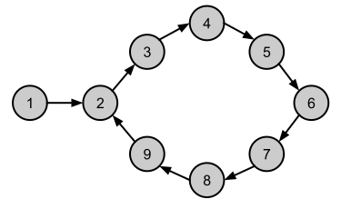

*Abbildung* 1: Eine einfach verkettete Liste mit Zyklus.


###### {#abbildung_1_linked_list_with_cycle}



*Abbildung* 1: Eine einfach verkettete Liste mit Zyklus..


Der letzte Knoten der verketteten Liste aus [Abbildung 1] zeigt nicht auf `NULL`,
sondern auf einen früheren Knoten in der Liste, wodurch ein Zyklus entsteht.
Überhaupt gibt es gar kein Element, das einen `NULL`-Zeiger als Folgeelement besitzt.
Zur Abgrenzung betrachten wir noch eine zweite verkettete Liste in [Abbildung 2]:

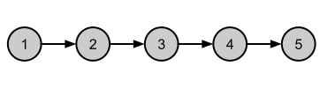

*Abbildung* 2: Eine einfach verkettete Liste ohne Zyklus.


###### {#abbildung_2_linked_list_without_cycle}



*Abbildung* 2: Eine einfach verkettete Liste ohne Zyklus.


Der letzte Knoten der verketteten Liste zeigt auf `NULL` und signalisiert damit das Ende der Liste.
Wie lassen sich nun Zyklen in verketteten Listen erkennen?
Hierzu gibt es gleich zwei Verfahren, die wir nun betrachten.

## Zyklen in verketteten Listen mit einer Hashtabelle erkennen

Das erste Verfahren bedient sich zur Lösung des Problems einer zusätzlichen Datenstruktur, einer Hashtabelle.
Die Idee liegt nun darin, die Knoten beim Durchlaufen der Liste in so eine Tabelle einzutragen.
Wir konzipieren nun eine Funktion `detectCycle`, die den Anfangsknoten der Liste übergeben bekommt und durch einen boolschen Rückgabewert
die Frage nach dem Vorhandensein eines Zyklus beantwortet.
Immer wenn ein Knoten gefunden wird, der bereits in der Hashtabelle vorhanden ist (was auf einen Zyklus in der Liste hinweist), wird `true` zurückgegeben.
Wird ein Folgeknoten mit dem Wert `NULL` gefunden, was das Ende der verketteten Liste darstellt, wird `false` zurückgegeben, da kein Zyklus vorhanden ist.

###### {#listing_04_detectCycle_variant_hashtable}

```cpp
01: bool detectCycle(Node* head)
02: {
03:     std::unordered_set<Node*> cache;
04: 
05:     while (head != nullptr) {
06: 
07:         // node is already present in hash table, we've found a cycle
08:         if (cache.find(head) != cache.end()) {
09:             return true;
10:         }
11: 
12:         // we see the node for the first time,
13:         // insert node into the hash table
14:         cache.insert(head);
15: 
16:         head = head->m_next;
17:     }
18: 
19:     return false;
20: }
```

*Listing* 4: `detectCycle`-Funktion, unterstützt mit einer Hashtabelle.


Den soeben beschriebenen Lösungsansatz ordnet man in der Informatik auch unter dem Fachwort *Memoization* ein: Was versteht man darunter?
*Memoization* ist eine Optimierungstechnik, die die Leistung von Programmen steigert,
indem sie die Ergebnisse bereits absolvierter Funktionsaufrufe zwischenspeichert,
um redundante Neuberechnungen bei gleichen Eingaben zu vermeiden.
Technisch gesehen legt diese Technik typischerweise eine Cache-Struktur wie eine Hash-Tabelle
zu Grunde und wird oft bei rekursiven Algorithmen (oder in der dynamischen Programmierung) eingesetzt.

Im Falle der Erkennung von Zyklen in einer verketteten Liste besteht der Einsatz der *Memoization*-Technik darin,
bereits besuchte Adressen von Knoten in einer Datenstruktur aufzuheben. Bei sehr umfangreichen Listen kann das einiges an Speicherplatz in Anspruch nehmen,
dennoch ist diese Idee sehr effizient.


## Zyklen in verketteten Listen unter Verwendung des Floyd-Algorithmus erkennen

Der iterative Lösungsansatz mit einer Hashtabelle birgt einen kleinen Nachteil in sich:
Die Verwaltung der Cache-Datenstruktur nimmt zusätzlichen Speicherplatz in Anspruch. Dieses Manko haben wir bereits thematisiert.
Bei einem Problem wie dem der Suche nach glücklichen Zahlen ist der Umfang an zusätzlich benötigtem Speicher vermutlich vernachlässigenswert,
dennoch wäre es wünschenswert, auch eine Alternative zu haben.
Eine Idee für einen Algorithmus ohne Cache-Datenstruktur stammt von dem amerikanischen Informatiker Robert &bdquo;Bob&rdquo; Floyd.
Sie besteht darin, eine verkettete Liste mit zwei Zeigern zu durchlaufen, die in unterschiedlichen Geschwindigkeiten voranschreiten.

Jetzt kommen wir auf die schon erwähnten Schildkröten und Hasen zu sprechen.
Der erste Zeiger wird als &bdquo;langsamer&rdquo; Zeiger bezeichnet, in einer anschaulichen Darstellung auch als Schildkröte (oder Igel).
Der &bdquo;schnellere&rdquo; Zeiger bewegt sich durch die Liste mit doppelter Geschwindigkeit. Er wird anschaulich auch als Hase bezeichnet.
Der Hase überspringt folglich immer ein Element in der Liste, er ist auf diese Weise doppelt so schnell wie die Schildkröte.
Damit erklären sich auch die anschaulichen Namensgebungen wie
&bdquo;*Tortoise and Hare*&rdquo;-Algorithmus (&bdquo;Schildkröte und Hase&rdquo;) oder auch &bdquo;*Hare and Hedgehog*&rdquo;-Algorithmus (&bdquo;Hase und Igel&rdquo;).

Wie kann man nun mit zwei Zeigern Zyklen in einer verketteten Liste finden?
Zum Start des Algorithmus werden beide Zeiger auf dem ersten Knoten der Liste platziert.
Beim Durchlaufen der verketteten Liste kann Folgendes passieren:

  * Der schnellere Zeiger erreicht das Ende der Liste (`NULL`), was bedeutet, dass die Liste keinen Zyklus enthält.
  * Irgendwann stößt der schnellere Zeiger erneut auf den langsameren Zeiger, was auf einen Zyklus in der Liste hinweist.

Wir betrachten den Algorithmus an einem Beispiel:

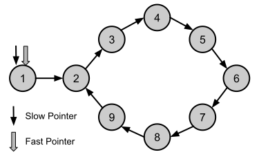

*Abbildung* 3: Anfangs zeigen beide Zeiger (Hase und Schildkröte) auf den Startknoten.

###### {#abbildung_3_floyd_algorithm}



*Abbildung* 3: Anfangs zeigen beide Zeiger (Hase und Schildkröte) auf den Startknoten..


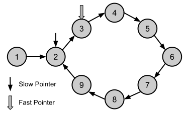

*Abbildung* 4: Der langsame Zeiger bewegt sich um einen Schritt vorwärts, der schnelle um zwei Schritte.

###### {#abbildung_4_floyd_algorithm}



*Abbildung* 4: Der langsame Zeiger bewegt sich um einen Schritt vorwärts, der schnelle um zwei Schritte.


Da aktuell die beiden Zeigerpositionen verschieden sind,
können wir noch keine Aussage treffen, ob wir in der Liste einen Zyklus haben.
Wir setzen die Bewegungen der beiden Zeiger fort.


*Abbildung* 5: Der langsame Zeiger bewegt sich um einen Schritt vorwärts, der schnellere um zwei Schritte.


###### {#abbildung_5_floyd_algorithm}



*Abbildung* 5: Der langsame Zeiger bewegt sich um einen Schritt vorwärts, der schnelle um zwei Schritte.


Noch ist der Algorithmus nicht zu Ende, wir müssen die Schildkröte und den Hasen weiter um die Wette laufen lassen.

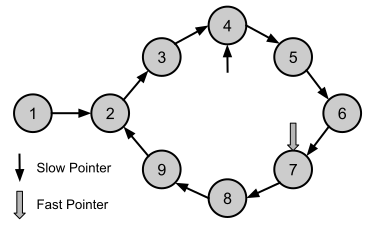

*Abbildung* 6: Der langsame Zeiger bewegt sich um einen Schritt vorwärts, der schnellere um zwei Schritte.


###### {#abbildung_6_floyd_algorithm}



*Abbildung* 6: Der langsame Zeiger bewegt sich um einen Schritt vorwärts, der schnelle um zwei Schritte.


Same Procedure: Der Algorithmus ist noch nicht zu Ende.

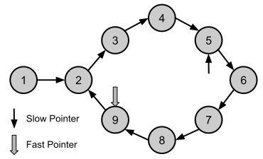

*Abbildung* 7: Der langsame Zeiger bewegt sich um einen Schritt vorwärts, der schnellere um zwei Schritte.

###### {#abbildung_7_floyd_algorithm}



*Abbildung* 7: Der langsame Zeiger bewegt sich um einen Schritt vorwärts, der schnelle um zwei Schritte.


Und auch in diesem Zustand bleibt es &ndash; zunächst &ndash; beim Unentschieden.

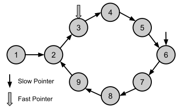

*Abbildung* 8: Der langsame Zeiger bewegt sich um einen Schritt vorwärts, der schnellere um zwei Schritte.

###### {#abbildung_8_floyd_algorithm}



*Abbildung* 8: Der langsame Zeiger bewegt sich um einen Schritt vorwärts, der schnelle um zwei Schritte.


&bdquo;Und täglich grüßt das Murmeltier&rdquo;: Noch immer wissen wir nicht, wie dieses Wettrennen ausgeht.

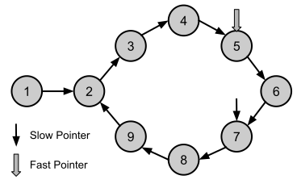

*Abbildung* 9: Der langsame Zeiger bewegt sich um einen Schritt vorwärts, der schnellere um zwei Schritte.

###### {#abbildung_9_floyd_algorithm}



*Abbildung* 9: Der langsame Zeiger bewegt sich um einen Schritt vorwärts, der schnelle um zwei Schritte.


Der schnellere Zeiger hat langsam Sicht auf den langsameren Zeiger:

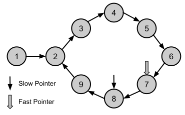

*Abbildung* 10: Der langsame Zeiger bewegt sich um einen Schritt vorwärts, der schnellere um zwei Schritte.

###### {#abbildung_10_floyd_algorithm}



*Abbildung* 10: Der langsame Zeiger bewegt sich um einen Schritt vorwärts, der schnelle um zwei Schritte.


Der langsamere Zeiger spürt nun den Atem des schnelleren Zeigers in seinem Rücken, kommt es zu einer Begegnung?

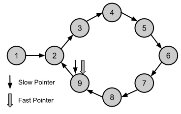

*Abbildung* 11: Beide Zeiger verweisen auf denselben Knoten.


###### {#abbildung_11_floyd_algorithm}



*Abbildung* 11: Beide Zeiger verweisen auf denselben Knoten.


Der schnellere Zeiger hat den langsameren Zeiger eingeholt:
In [Abbildung 11] erkennen wir, dass beide Zeiger auf denselben Knoten verweisen.
Damit können wir die Aussage treffen, dass wir einen Zyklus in der verketteten Liste lokalisiert haben.

Wir betrachten nun die zweite Variante unserer `detectCycle`-Funktion:

###### {#listing_05_detectCycle_variant_floyd_algorithm}

```cpp
01: bool detectCycle(Node* root)
02: {
03:     Node* slow = root;
04:     Node* fast = root;
05: 
06:     while (fast != nullptr && fast->m_next != nullptr) {
07: 
08:         slow = slow->m_next;
09:         fast = fast->m_next->m_next;
10: 
11:         if (slow == fast) {
12:             return true;
13:         }
14:     }
15: 
16:     return false;
17: }
```

*Listing* 5: `detectCycle`-Funktion unter Verwendung des Floyd-Algorithmus.


Beachten Sie in der Realisierung, dass wir beim schnelleren Zeiger vorsichtig sein müssen, wenn es um das Vorhandensein von `NULL`-Zeigern geht!
Aus diesem Grund muss in der Zeile 6 neben dem Inhalt des `fast`-Zeigers auch der Nachfolger `fast->m_next` mit überprüft werden,
ob dieser eine gültige Adresse darstellt.

Für beide Varianten der `detectCycle`-Funktion entwerfen wir nun einen Testrahmen.

###### {#listing_06_linked_list_with_nodes}


```cpp
01: struct Node
02: {
03:     std::size_t m_value;
04:     Node*       m_next;
05: };
06: 
07: Node* createLinkedListWithCycle()
08: {
09:     static Node node01{ 1 };
10:     static Node node02{ 2 };
11:     static Node node03{ 3 };
12:     static Node node04{ 4 };
13:     static Node node05{ 5 };
14:     static Node node06{ 6 };
15:     static Node node07{ 7 };
16:     static Node node08{ 8 };
17:     static Node node09{ 9 };
18: 
19:     node01.m_next = &node02;
20:     node02.m_next = &node03;
21:     node03.m_next = &node04;
22:     node04.m_next = &node05;
23:     node05.m_next = &node06;
24:     node06.m_next = &node07;
25:     node07.m_next = &node08;
26:     node08.m_next = &node09;
27:     node09.m_next = &node02;
28: 
29:     return &node01;
30: }
31: 
32: Node* createLinkedListWithoutCycle()
33: {
34:     static Node node01{ 1 };
35:     static Node node02{ 2 };
36:     static Node node03{ 3 };
37:     static Node node04{ 4 };
38:     static Node node05{ 5 };
39: 
40:     node01.m_next = &node02;
41:     node02.m_next = &node03;
42:     node03.m_next = &node04;
43:     node04.m_next = &node05;
44:     node05.m_next = nullptr;
45: 
46:     return &node01;
47: }
48: 
49: void printLinkedList(Node* root)
50: {
51:     struct Node* next = root;
52:     while (next != nullptr) {
53: 
54:         std::println("{}", next->m_value);
55:         next = next->m_next;
56:     }
57: }
```

*Listing* 6: Testrahmen für eine verkettete Liste mit `Node`-Objekten.


*Bemerkung*:<br />
In [Listing 6] habe ich als Knoten eine Struktur `Node` verwendet.
Warum kommt die Klasse `std::forward_list` aus der STL nicht zum Zuge, dann müsste man das Rad an dieser Stelle doch nicht neu erfinden?
Die Antwort ist vergleichsweise einfach, und vielleicht auch ein wenig überraschend:
Mit der STL Klasse `std::forward_list` lassen sich keine Zyklen erzeugen, bzw. nur dann, wenn man die vorgesehene Verwendung ihrer Methoden missachtet.

Die Methoden eines `std::forward_list`-Objekts lassen nur die Operationen

  * Elemente einfügen,
  * Elemente löschen oder
  * ganze Listen zusammenfügen

zu. Keine dieser Operationen erlaubt es, den Zeiger auf das nächste Element eines Knotens auf einen vorherigen Knoten zeigen zu lassen.
Daher ist ein `std::forward_list`-Objekt bei Verwendung des öffentlichen APIs ausschließlich azyklisch.

Die beiden Funktionen `createLinkedListWithCycle` und `createLinkedListWithoutCycle` aus [Listing 7] erzeugen die verketten Listen
aus [Abbildung 1] und [Abbildung 2]. Wir wollen diese nun an Hand der beiden Realisierungen von `detectCycle` testen:

###### {#listing_07_test_functions}

```cpp
01: void test_cycle_detection_using_hash_table()
02: {
03:     Node* root = createLinkedListWithCycle();
04:     bool isCyclic{ LinkedList_CycleDetection_Using_HashTable::detectCycle (root) };
05:     std::println("{}", isCyclic);
06: 
07:     root = createLinkedListWithoutCycle();
08:     isCyclic = LinkedList_CycleDetection_Using_HashTable::detectCycle(root);
09:     std::println("{}", isCyclic);
10: }
11: 
12: void test_cycle_detection_using_floyd()
13: {
14:     Node* root = createLinkedListWithCycle();
15:     bool isCyclic{ LinkedList_CycleDetection_Floyd::detectCycle(root) };
16:     std::println("{}", isCyclic);
17: 
18:     root = createLinkedListWithoutCycle();
19:     isCyclic = LinkedList_CycleDetection_Floyd::detectCycle(root);
20:     std::println("{}", isCyclic);
21: }
```

*Listing* 7: Testfunktionen `test_cycle_detection_using_hash_table` und `test_cycle_detection_using_floyd`.

Die Ausgabe entspricht unseren Erwartungen:

```
true
false
true
false
```


# Ein Ansatz mit Hashtabelle

Wir kehren zurück zu unserem Ausgangspunkt, der Suche nach glücklichen Zahlen. 
Für Hashtabellen gibt es in der STL mehrere Container, vorzugsweise sind dies die Klassen `std::unordered_set` oder `std::unordered_map`.
Die Klasse `std::unordered_map` verwaltet in klassischer Manier Schlüssel-Wert Paare (*key*-*value pairs*).
Spielt &ndash; wie in unserem Fall &ndash; der Wert keine Rolle, dann genügt auch ein `std::unordered_set`-Objekt.
Ein solches Objekt verwaltet einzelne Elemente einer &bdquo;*Happy Number*&rdquo; Zahlenfolge,
es können aber keine Elemente doppelt eingefügt werden. Das ist genau die Datenstruktur, die wir für unsere Zwecke benötigen.

###### {#listing_08_isHappy_hashtable_variant}


```cpp
01: bool isHappy(std::size_t number)
02: {
03:     std::unordered_set<std::size_t> checkedNumbers;
04: 
05:     auto n{ number };
06:     while (true)
07:     {
08:         n = sumOfSquares(n);
09:         if (n == 1) {
10:             return true;
11:         }
12:         else if (checkedNumbers.contains(n)) {
13:             return false;
14:         }
15: 
16:         checkedNumbers.insert(n);
17:     }
18: }
```

*Listing* 8: `isHappy`-Funktion, unterstützt mit einer Hashtabelle.

In Zeile 16 von [Listing 8] fügen wir pro Schleifendurchlauf das aktuell berechnete Folgenelement in die Hashtabelle ein.
In Zeile 12 fragen wir vor dem Einfügen ab, ob das Element schon in der Tabelle vorhanden ist.
Wenn ja, dann haben wir einen Zyklus gefunden; die Folge hat potentiell unendlich viele Folgenglieder,
es kann sich nicht um eine glückliche Zahlenfolge handeln.
Erreichen wir jedoch (in Zeile 9) den Wert 1, dann terminiert die Folge nach endlich vielen Schritten und
die Startzahl ist glücklich.


# Ein Ansatz unter Verwendung des Floyd-Algorithmus

Wir stellen die Funktion `isHappy` aus dem letzten Abschnitt noch einaml vor, 
dieses Mal ohne Hashtabelle.
In den Zeilen 3 und 4 definieren wir die beiden Indizes `slow` und `fast`, besser als Schildkröte und Hase bekannt.
Der Igel bewegt sich in Zeile Element für Element durch die Zahlenfolge.
Das Hase überspringt (Zeile 11) pro Fortbewegung immer ein Folgenelement.

###### {#listing_09_isHappy_floyd_variant}


```cpp
01: bool isHappy(std::size_t number)
02: {
03:     std::size_t slow{ number };
04:     std::size_t fast{ number };
05: 
06:     do {
07:         // move slow number by one step
08:         slow = sumOfSquares(slow);
09: 
10:         // move fast number by two steps
11:         fast = sumOfSquares(sumOfSquares(fast));
12:     } while (slow != fast);
13:         
14:     // if both number meet at 1, then we've found a happy number
15:     return (slow == 1) ? true : false;
16: }
```

*Listing* 9: `isHappy`-Funktion unter Verwendung des Floyd-Algorithmus.


Damit haben wir drei Möglichkeiten zur Berechnung glücklicher (und trauriger) Zahlen gefunden.


# Noch eine Variante mit `constexpr` 

Vielleicht haben Sie sich auch dieselbe Frage gestellt: Das Problem der glücklichen Zahlenfolgen ist ja recht amüsant,
aber können wir es uns tatsächlich leisten, die Rechenzeit unseres Rechners für solche Spielereien zu vergeuden?
Hmm, wir wäre es, wenn wir die Berechnung glücklicher Zahlen den Übersetzer vornehmen lassen.
Dann bleibt unser Maschinenprogramm von derlei &bdquo;unnützen&rdquo; Tätigkeiten verschont.

Das mag jetzt etwas ironisch geklungen haben, aber eigentlich war es meine Absicht, den letzten Abschnitt dieser Fallstudie
dem Thema `constexpr` zu widmen. Und ja, im Großen und Ganzen lassen sich tatsächlich alle Vorarbeiten aus den vorherigen Abschnitten
in die `constexpr`-Welt übertragen.

Zu den Details: Die beiden Varianten des rekursiven Ansatzes und der Einsatz des Floyd-Algorithmus lassen sich nahezu eins zu eins
in `constexpr` umsetzen. Einzig und allein die `std::println`-Anweisungen sind zu entfernen, aber das ist ja keine Überraschung:

###### {#listing_10_isHappy_two_variants_constexpr}


```cpp
01: constexpr std::size_t sumOfSquares(std::size_t n)
02: {
03:     std::size_t squareSum{};
04:     while (n != 0) {
05:         std::size_t digit{ n % 10 };
06:         squareSum += digit * digit;
07:         n /= 10;
08:     }
09:     return squareSum;
10: }
11: 
12: namespace Constexpr_RecursiveApproach {
13: 
14:     constexpr bool isHappy(std::size_t number)
15:     {
16:         std::size_t sum{ sumOfSquares(number) };
17: 
18:         if (sum == 1) {
19:             return true;
20:         }
21:         else if (sum > 1 && sum <= 4) {
22:             return false;
23:         }
24:         else {
25:             return isHappy(sum);
26:         }
27:     }
28: }
29: 
30: namespace Constexpr_UsingFloydsAlgorithm {
31: 
32:     constexpr bool isHappy(std::size_t number)
33:     {
34:         std::size_t slow{ number };
35:         std::size_t fast{ number };
36: 
37:         do {
38:             slow = sumOfSquares(slow);
39:             fast = sumOfSquares(sumOfSquares(fast));
40:         }
41:         while (slow != fast);
42: 
43:         return (slow == 1) ? true : false;
44:     }
45: }
```

*Listing* 10: `isHappy`-Funktion in zwei `constexpr`-Varianten.


Wie sieht es mit der Variante mit der Hashtabelle aus? Hier stellt sich zunächst die Frage,
inwieweit STL Container `constexpr`-fähig sind? Einfache Antwort: Sie sind es &bdquo;teilweise&rdquo;.
Die Klasse `std::unordered_set` ist es nicht (zumindest bis einschließlich C++ 23), aber mit der Klasse `std::vector` können wir es versuchen.

Sollten Sie sich an dieser Stelle die Frage stellen, wie das überhaupt funktionieren kann, da viele der STL Containerklassen
ihre Daten auf dem Heap ablegen, gelangen Sie unweigerlich zum Begriff der &bdquo;*Transient Allocation*&rdquo;:

Dieses Feature besagt, dass man Speicher in einem `constexpr`-Block (*Scope*) auf dem Heap reservieren kann,
dieser Speicherblock aber am Ende des Blocks wieder freigegeben werden muss.
Die kann explizit mit den Operatoren `new` und `delete` erfolgen oder eben implizit durch den Gebrauch von STL-Containerklassen,
die die Allokationen auf dem Heap vor unseren Augen verstecken.
Dadurch kann der Compiler alle Speicherbelegungen auf einfache Weise nachverfolgen und eben am Ende des Blocks auch wieder freigeben.
Auf diese Weise sind (einige der) STL Container in einem `constexpr`-Kontext einsetzbar.

Die dritte Variante unserer Suche nach glücklichen Zahlen sieht nun so aus:

###### {#listing_11_isHappy_using_std_vector}


```cpp
01: constexpr bool isHappy(std::size_t number)
02: {
03:     std::vector<std::size_t> checkedNumbers;
04: 
05:     while (true)
06:     {
07:         number = sumOfSquares(number);
08:         if (number == 1) {
09:             return true;
10:         }
11:         else if (auto pos = std::find(checkedNumbers.begin(), checkedNumbers.end(), number); pos != checkedNumbers.end()) {
12:             return false;
13:         }
14:         checkedNumbers.push_back(number);
15:     }
16: }
```

*Listing* 11: `isHappy`-Funktion mit STL Container `std::vector`.

Zu beachten ist die Definition eines `std::vector`-Objekts in Zeile 3 von [Listing 11].
Auch Algorithmen der STL sind `constexpr`-fähig, wir bemühen `std::find`, um das Vorhandensein eines Folgenelements zu überprüfen.
Das `std::vector`-Objekt fällt am Ende der `isHappy`-Funktion aus dem Scope, der von ihm reservierte Speicher auf dem Heap wird wieder freigegeben.

Wir wollen das `constexpr`-Feature noch ein wenig strapazieren.
Zu diesem Zweck zählen wir beispielsweise alle glücklichen Zahlen bis zu einem maximalen Wert auf:

###### {#listing_12_countHappyNumbersLessThan_constexpr}

```cpp
01: constexpr auto countHappyNumbersLessThan(std::size_t max)
02: {
03:     std::size_t count{};
04: 
05:     for (std::size_t i{ 1 }; i != max; i++) {
06:         if (Constexpr_RecursiveApproach::isHappy(i)) {
07:             ++count;
08:         }
09:     }
10: 
11:     return count;
12: }
13: 
14: constexpr auto countHappyNumbersLessThan10{ countHappyNumbersLessThan(10) };
15: constexpr auto countHappyNumbersLessThan100{ countHappyNumbersLessThan(100) };
16: constexpr auto countHappyNumbersLessThan1000{ countHappyNumbersLessThan(1000) };
```

*Listing* 12: `constexpr`-Funktion `countHappyNumbersLessThan`.


Wenn wir das Programm tatsächlich nicht ausführen wollen, sondern nur dem Übersetzer bei seiner Arbeit zuschauen wollen,
dann können wir das ganz simpel mit einem Tooltip versuchen:

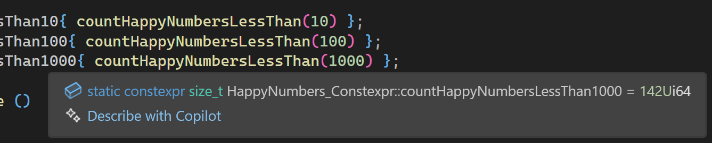

*Abbildung* 12: Anzahl glücklicher Zahlen im Bereich von 1 bis 1000.

###### {#abbildung_12_count_happy_numbers}



*Abbildung* 12: Anzahl glücklicher Zahlen im Bereich von 1 bis 1000.


Wir erkennen in [Abbildung 12], das es im Bereich von 1 bis 1000 genau 142 glückliche Zahlen gibt.
Auch können wir die Zahlen explizit berechnen bzw. in einem Container abspeichern.
Hier wird es zur Übersetzungszeit ein wenig komplizierter, da sich `std::vector`-Objekte nicht so einfach
als Parameter oder Rückgabewerte zwischen Funktionsaufrufen transportieren lassen.

Mit einem Feld fester Größe kann man das Problem umgehen, auch wenn der Charme eines flexibel langen Datencontainers damit verloren geht.
Wir führen das Ganze am Beispiel aller glücklichen Zahlen im Bereich von 1 bis 1000 vor.
Da wir nun wissen, dass es sich im genau 142 Zahlen handelt, können wir ein entsprechendes Feld in einer Funktion vorhalten:

###### {#listing_13_calcHappyNumbersTableLessThan_constexpr}

```cpp
01: constexpr auto calcHappyNumbersTableLessThan(std::size_t max)
02: {
03:     constexpr std::size_t TableSize = 142;
04: 
05:     std::array<std::size_t, TableSize> table{};
06:     std::vector<std::size_t> numbers{};
07: 
08:     for (std::size_t i{ 1 }; i != max; i++) {
09:         if (Constexpr_RecursiveApproach::isHappy(i)) {
10:             numbers.push_back(i);
11:         }
12:     }
13: 
14:     std::size_t count = (numbers.size() < TableSize) ? numbers.size() : TableSize;
15:     std::copy_n(numbers.begin(), count, table.begin());
16:     return table;
17: }
18: 
19: constexpr auto tableLessThan10{ calcHappyNumbersTableLessThan(10) };
20: constexpr auto tableLessThan100{ calcHappyNumbersTableLessThan(100) };
21: constexpr auto tableLessThan1000{ calcHappyNumbersTableLessThan(1000) };
```

*Listing* 13: `constexpr`-Funktion `calcHappyNumbersTableLessThan`.

Der Tooltip funktioniert auch in diesem Beispiel, wenngleich er uns dieses Mal nicht den Gefallen tut, das Ergebnis komplett anzuzeigen:

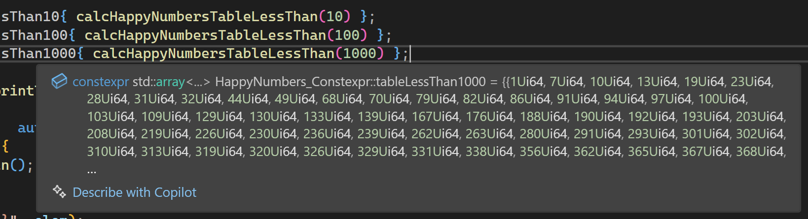

*Abbildung* 13: Teilweise Darstellung glücklicher Zahlen im Bereich von 1 bis 1000.

###### {#abbildung_13_table_happy_numbers}



*Abbildung* 13: Teilweise Darstellung glücklicher Zahlen im Bereich von 1 bis 1000.


Natürlich können wir die vom Übersetzer berechneten Zahlen auch in einer Konsole ausgeben,
damit kommen wir zum Ende unserer Fallstudie:

###### {#listing_14_printTable_function}


```cpp
01: void printTable(std::span<const std::size_t> table)
02: {
03:     for (auto pos{ 0 };  auto elem : table) {
04:         if (elem == 0) {
05:             std::println();
06:             return;
07:         }
08:         std::print("{:5}", elem);
09:         ++pos;
10:         if (pos % 15 == 0) {
11:             std::println();
12:         }
13:     }
14: }
15: 
16: void test_constexpr()
17: {
18:     std::span sp{ tableLessThan1000 };
19:     printTable(sp);
20: }
```

*Listing* 14: `printTable`-Funktion.


Beachten Sie im letzten [Listing 14], auf welche Weise wir das `std::array`-Objekt, das von der Funktion `tableLessThan1000` zurückgegeben wird,
an die nächste Funktion weiterreichen (hier: `printTable`): In einem `std::span`-Objekt.
Das muss so nicht sein, aber damit kann die `printTable`-Funktion etwas vielfältiger verwendet werden.
`std::span`-Objekte lassen sich von Arrays im C-Stil, von `std::array`-Objekten und sogar von `std::vector`-Objekten bilden.

*Ausgabe*:

```
    1    7   10   13   19   23   28   31   32   44   49   68   70   79   82
   86   91   94   97  100  103  109  129  130  133  139  167  176  188  190
  192  193  203  208  219  226  230  236  239  262  263  280  291  293  301
  302  310  313  319  320  326  329  331  338  356  362  365  367  368  376
  379  383  386  391  392  397  404  409  440  446  464  469  478  487  490
  496  536  556  563  565  566  608  617  622  623  632  635  637  638  644
  649  653  655  656  665  671  673  680  683  694  700  709  716  736  739
  748  761  763  784  790  793  802  806  818  820  833  836  847  860  863
  874  881  888  899  901  904  907  910  912  913  921  923  931  932  937
  940  946  964  970  973  989  998
```

# There&lsquo;s more

Das erste Paar aufeinanderfolgender glücklicher Zahlen ist das Paar 
n<sub>1</sub> = 31 und n<sub>2</sub> = 32.

Die folgende Liste gibt Aufschluss über die kleinsten weiteren Paare aufeinanderfolgender glücklicher Zahlen,
welche kleiner als 1000 sind (es wird immer nur die kleinere der beiden Zahlen):

31, 129, 192, 262, 301, 319, 367, 391, 565, 622, 637, 655, 912, 931, ...

Erweitern Sie Ihr Programm um die Berechnung aller aufeinanderfolgenden glücklichen Zahlen kleiner 1000.
Schaffen Sie die Berechnung auf mit dem Übersetzer, also mit `constexpr`?

Sollten Sie Spaß an derlei Berechnungen gefunden haben: Es gibt auch Tripel aufeinanderfolgender glücklicher Zahlen,
zum Beispiel die drei Zahlen n<sub>1</sub> = 1880, n<sub>2</sub> = 1881 und n<sub>3</sub> = 1882.
Wir erkennen, dass unterhalb von 1000 derartige Zahlen nicht vorhanden sind.

Berechnen Sie alle Tripel aufeinanderfolgender glücklicher Zahlen, welche kleiner als 10000 sind.
Weitere Beispiele sind z. B. die Zahlen 4780, 4870 und 7480.
Es ist wiederum nur die kleinste der drei Zahlen angegeben.

<br/>

## Literatur

Im Folgenden habe ich einige interessante Artikel zum Thema &bdquo;Happy Numbers&rdquo;
zusammengestellt:

[Fröhliche Zahl](https://de.wikipedia.org/wiki/Fr%C3%B6hliche_Zahl)

[Solving the Happy Number Algorithm](https://medium.com/@alisabajramovic/solving-the-happy-number-algorithm-334afa34599)

Zum Problem von Zyklen kann man hier einiges nachlesen:

[Floyd's Linked List Cycle Finding Algorithm](https://cp-algorithms.com/others/tortoise_and_hare.html)

Zu glücklichen Zahlen und `constexpr` findet sich hier ein Artikel:

[constexpr All the Things! (but gently)](https://levelup.gitconnected.com/constexpr-all-the-things-but-gently-f567a8b93603)

<br/>

<!-- Links Definitions -->
[Listing 1]:    #listing_01_isHappy_naive_version
[Listing 2]:    #listing_02_sumOfSquares_function
[Listing 3]:    #listing_03_isHappy_recursive_variant
[Listing 4]:    #listing_04_detectCycle_variant_hashtable
[Listing 5]:    #listing_05_detectCycle_variant_floyd_algorithm
[Listing 6]:    #listing_06_linked_list_with_nodes
[Listing 7]:    #listing_07_test_functions
[Listing 8]:    #listing_08_isHappy_hashtable_variant
[Listing 9]:    #listing_09_isHappy_floyd_variant
[Listing 10]:   #listing_10_isHappy_two_variants_constexpr
[Listing 11]:   #listing_11_isHappy_using_std_vector
[Listing 12]:   #listing_12_countHappyNumbersLessThan_constexpr
[Listing 13]:   #listing_13_calcHappyNumbersTableLessThan_constexpr
[Listing 14]:   #listing_14_printTable_function

[Abbildung 1]:  #abbildung_1_linked_list_with_cycle
[Abbildung 2]:  #abbildung_2_linked_list_without_cycle
[Abbildung 3]:  #abbildung_3_floyd_algorithm
[Abbildung 4]:  #abbildung_4_floyd_algorithm
[Abbildung 5]:  #abbildung_5_floyd_algorithm
[Abbildung 6]:  #abbildung_6_floyd_algorithm
[Abbildung 7]:  #abbildung_7_floyd_algorithm
[Abbildung 8]:  #abbildung_8_floyd_algorithm
[Abbildung 9]:  #abbildung_9_floyd_algorithm
[Abbildung 10]: #abbildung_10_floyd_algorithm
[Abbildung 11]: #abbildung_11_floyd_algorithm
[Abbildung 12]: #abbildung_12_count_happy_numbers
[Abbildung 13]: #abbildung_13_table_happy_numbers

<!-- End-of-File -->
