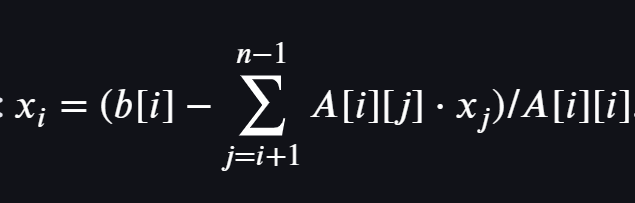

# Lineare Gleichungssysteme

https://share.google/aimode/aft5asTCDimwL1wgI

Der Gauß-Algorithmus &ndash; auch als Gaußsches Eliminationsverfahren bezeichnet &ndash; ist eine Methode
zur Lösung linearer Gleichungssysteme, bei der die Matrix in eine obere Dreiecksform (Zeilenstufenform) überführt wird.

Dies geschieht durch elementare Zeilenoperationen (Multiplizieren einer Zeile mit einer Zahl ungleich Null,
Addieren des Vielfachen einer Zeile zu einer anderen Zeile), ohne die Reihenfolge der Zeilen zu tauschen.

Bemerkung: 
In einer sehr einfachen Realisierung kann man hierbei auf die so genannte *Pivotisierung* verzichten.
Ohne Pivotisierung kann der Algorithmus instabil werden oder fehlschlagen, wenn ein Diagonalelement (Pivot-Element) null oder sehr nahe bei null ist.
Die Pivotisierung wird normalerweise verwendet, um dies zu vermeiden und die numerische Stabilität zu gewährleisten

## Einfache Darstellung des Algorithmus

Der Algorithmus besteht aus zwei Hauptphasen:

  * **Vorwärtselimination**: Die erweiterte Koeffizientenmatrix wird in obere Dreiecksform gebracht.
  * **Rückwärtssubstitution**: Die Variablen werden von unten nach oben berechnet und in die darüberliegenden Gleichungen eingesetzt.

Unter der erweiterten Koeffizientenmatrix verstehen wir eine Matrix, die neben den Elementen des Gleichungssystems
auch die Elemente des Vektors auf der rechten Seite enthält.

## Schritt-für-Schritt-Erklärung der Vorwärtselimination

Angenommen, wir haben ein lineares Gleichungssystem mit *n* Gleichungen und *n* Unbekannten,
dargestellt durch die erweiterte Matrix [A|b].

Für jede Spalte *k* von 0 bis *n*-*2* (Indexierung beginnt bei 0):

  * Prüfung des Pivot-Elements: Stelle sicher, dass das Diagonalelement *A[k][k]* ungleich Null ist.
    Ohne Pivotisierung wird hier kein Zeilentausch vorgenommen; falls *A[k][k]==0*, bricht der Algorithmus ab oder liefert falsche Ergebnisse).
 
  * Elimination: Für jede Zeile *i* unterhalb der aktuellen Zeile *k* (von *k+1* bis *n-1*):
    * Berechne den Multiplikator *F=A[i][k]/A[k][k]*.
    * Subtrahiere das *F*-fache der Zeile *k* von der Zeile *i*, um *A[i][k]* zu Null zu machen. Wende dies auf alle Elemente in Zeile *i* an, einschließlich der rechten Seite *b*. 

## Schritt-für-Schritt-Erklärung der Rückwärtssubstitution

Nach der Elimination liegt eine obere Dreiecksmatrix vor. Wir können nun die Variablen von der letzten bis zur ersten berechnen:

Für jede Zeile *i* von *n-1* bis 0 (absteigend):
Löse die Gleichung für die Variable *x*i mit den bereits berechneten Werten
für *x*i+1, ... ,x**n*-1*.

Die Formel lautet: *x*i=(b[i]-\sum *j=i+1^{n-1A[i][j]\cdot x*j)/A[i][i]*. 

*Abbildung* 1: Berechnung eines Elements des Lösungsvektors.

---
---
---

## Test Tabellen und lineare Gleichungssystem

Wir betrachten zum Lösung eines linearen Gleichungssystems den Algorithmus von Gauß.

https://www.geeksforgeeks.org/google-docs/how-to-insert-matrix-in-google-docs/

Was versteht man Lösen eines linearen Gleichungssystems nach dem Algorithmus von Gauß
unter der Vorwärtselimination?

Wie funktioniert die Vorwärtselimination beim
Lösen eines linearen Gleichungssystems nach dem Algorithmus von Gauß
im Detail?

Wie funktioniert die Rückwärtssubstitution beim
Lösen eines linearen Gleichungssystems nach dem Algorithmus von Gauß
im Detail?

## Lineare Gleichungssysteme

Wir betrachten zum Lösung eines linearen Gleichungssystems den Algorithmus von Gauß.
Die Vorwärtselimination ist hierbei der erste Schritt des Algorithmus,
bei dem ein lineares Gleichungssystem schrittweise in eine obere Dreiecksform umgewandelt wird.
Dabei werden durch äquivalente Zeilenumformungen systematisch Variablen eliminiert,
sodass unter der Hauptdiagonalen der Matrix nur noch Nullen stehen.

Das Ziel ist die Umwandlung in ein System von vereinfachten Gleichungen,
das von unten nach oben leicht lösbar ist.
Wir betrachten das Ganze an folgendem Beispiel. Zu Lösen ist das lineare Gleichungssystem

<pre>
2x2 + 3x1 -  x0 = -9
 x2 - 2x1 +  x0 =  9
-x2 +  x1 + 2x0 =  0
</pre>

#### Detaillierte Schritte der Vorwärtselimination

#### 1. Aufschreiben der erweiterten Koeffizientenmatrix

Zunächst ist das lineare Gleichungssystem in eine erweiterte Matrix so umzuformulieren,
dass die Koeffizienten der Variablen in den ersten *m* Spalten einer *n*&times;*m*+1 Matrix
und die konstanten Werte auf der rechten Seite der Gleichungen in der *m*+1.-ten Spalte stehen:

<pre>
 2.0    3.0   -1.0   -9.0
 1.0   -2.0    1.0    9.0
-1.0    1.0    2.0    0.0
</pre>

#### 2. Auswahl des Pivotelements

Wählen Sie in der ersten Spalte das erste Element als Pivotelement aus.
Diese Auswahl erfolgt unter der Annahme, dass der Wert von Null verschieden ist.
Andernfalls ist für diese Zeile nichts zu tun.

#### 3. Eliminieren der Elemente unter dem Pivotelement

Verwenden Sie das Pivotelement, um alle Koeffizienten in der ersten Spalte unterhalb der ersten Zeile
auf Null zu setzen.
Dazu subtrahieren wir ein geeignetes Vielfaches der ersten Zeile von den jeweiligen darunterliegenden Zeilen.

*Beispiel*: 
Um die erste Spalte einer ersten Zeile *zeile*1 in der zweiten Zeile (*zeile*2) auf Null zu setzen,
können Sie die neue Zeile als *zeile*2 &ndash; *k* &times; *zeile*1 definieren,
wobei *k* so gewählt wird, dass der neue Eintrag in der ersten Spalte Null wird.

Wir betrachten dies am Beispiel des obigen Gleichungssystems.
Zunächst betrachten wir das erste Element in der zweiten Gleichung, wir wollen
dieses mit dem Pivot-Element 1/2 auf Null setzen:

Ausgehend von

<pre>
 2.0    3.0   -1.0   -9.0
 1.0   -2.0    1.0    9.0
-1.0    1.0    2.0    0.0
</pre>

erhalten wir die neue Matrix

<pre>
 2.0     3.0   -1.0   -9.0
 0.0    -3.5    1.5   13.5
-1.0     1.0    2.0    0.0
</pre>

Es folgt die Umwandlung der dritten Gleichung, hier verwenden wir das Pivot-Element -1/2:

<pre>
 2.0     3.0   -1.0   -9.0
 0.0    -3.5    1.5   13.5
 0.0     2.5    1.5,  -4.5
</pre>

#### 4. Fortsetzen für die nächste Spalten

Man bewege sich zur zweiten Spalte. Die erste Zeile wird nicht mehr für die folgenden Umformungen verwendet.
Wählen Sie in der zweiten Spalte das nächste Pivotelement, das nun der erste Nicht-Null-Eintrag in der zweiten Zeile ist.
Wiederholen Sie den Eliminationsschritt, indem Sie ein Vielfaches der zweiten Zeile von den darunterliegenden Zeilen subtrahieren,
um die Einträge in der zweiten Spalte auf Null zu setzen.

In unserem Beispiel hat das Pivot-Element nun den Wert -2.5/3.5 oder einfacher -5/7.
Wir erhalten die neue Matrix

<pre>
 2.0     3.0   -1.0     -9.0
 0.0    -3.5    1.5     13.5
 0.0     0.0    2.571    5.143
</pre>

#### 5. Wiederholungen bis zur Dreiecksform

Führen Sie diesen Vorgang für alle Spalten fort, bis die Matrix in der oberen Dreiecksform vorliegt. Das bedeutet, alle Einträge unter der Hauptdiagonalen sind Null. 

### Detaillierte Beschreibung der Rückwärtssubstitution

Die Rückwärtssubstitution beim Gauß-Algorithmus ist ein Prozess, bei dem man,
nachdem ein lineares Gleichungssystem in die obere Dreiecksform gebracht wurde,
die Lösungen schrittweise &bdquo;von unten nach oben&rdquo; ermittelt.

Man beginnt mit der letzten Gleichung, die nur eine Unbekannte enthält, um deren Wert zu bestimmen.
Diesen Wert setzt man dann in die Gleichung darüber ein, um die nächste Variable zu ermitteln,
und fährt so fort, bis alle Variablen berechnet sind. 

### Schritt-für-Schritt-Anleitung

  * Beginnen Sie mit der letzten Zeile: 
In der oberen Dreiecksform (auch Zeilenstufenform genannt) ist die letzte Zeile des Gleichungssystems eine einfache Gleichung,
die nur eine Unbekannte enthält. Sie können diese Gleichung nun direkt nach dieser Variable auflösen.

  * Setzen Sie den Wert in die vorletzte Zeile ein: 
Nehmen Sie den gerade berechneten Wert und setzen Sie ihn in die vorletzte Gleichung ein.
Diese Gleichung enthält nun nur noch zwei Unbekannte, von denen eine jetzt bekannt ist.

  * Lösen Sie nach der nächsten Variablen auf: 
Die Gleichung hat sich zu einer linearen Gleichung mit nur noch einer unbekannten Variablen reduziert,
die Sie nun leicht berechnen können.

  * Wiederholen Sie den Vorgang: 
Setzen Sie die Werte der beiden gerade berechneten Variablen in die nächsthöhere Gleichung ein.
Auch diese vereinfacht sich nun zu einer Gleichung, die nur noch eine unbekannte Variable enthält.

  * Setzen Sie alle ermittelten Werte in die erste Zeile ein: 
Fahren Sie so fort, bis Sie alle Werte ermittelt haben. Zum Schluss setzen Sie die Werte aller bereits berechneten Variablen
in die erste Gleichung ein, um die letzte verbliebene Variable zu bestimmen und um das System vollständig zu lösen. 

### Ein ausführliches Beispiel

Wir betrachten die einzelnen Schritte während der Vorwärtselimination und Rückwärtssubstitution
nun im Detail. Es handelt sich um ein lineares Gleichungssystem
mit den vier Unbekannten *x*0, *x*1, *x*2 und *x*3:

<pre>
 3<i>x</i>3 + 1<i>x</i>2 - 5<i>x</i>1 + 4<i>x</i>0 = -18
 2<i>x</i>3 - 3<i>x</i>2 + 3<i>x</i>1 - 2<i>x</i>0 =  19
 5<i>x</i>3 - 3<i>x</i>2 + 4<i>x</i>1 + 1<i>x</i>0 =  22
-2<i>x</i>3 + 4<i>x</i>2 - 3<i>x</i>1 - 5<i>x</i>0 = -14
</pre>

#### Betrachtung der Vorwärtselimination:

##### Elimintation der Null in der ersten Spalte

###### Umwandlung der zweiten Gleichung:

Wir wählen das Pivot-Element 2/3:

<pre>
 3<i>x</i>3 +    1<i>x</i>2 -    5<i>x</i>1 +    4<i>x</i>0 = -18
      -11/3<i>x</i>2 + 19/3<i>x</i>1 - 14/3<i>x</i>0 =  31
 5<i>x</i>3 -    3<i>x</i>2 +    4<i>x</i>1 +    1<i>x</i>0 =  22
-2<i>x</i>3 +    4<i>x</i>2 -    3<i>x</i>1 -    3<i>x</i>0 = -14
</pre>

oder in Gleitpunktdarstellung:

<pre>
 3<i>x</i>3 +    1<i>x</i>2 -     5<i>x</i>1 +      4<i>x</i>0 = -18
     -3.666<i>x</i>2 + 6.333<i>x</i>1 -  4.666<i>x</i>0 =  31
 5<i>x</i>3 -    3<i>x</i>2 +     4<i>x</i>1 +      1<i>x</i>0 =  22
-2<i>x</i>3 +    4<i>x</i>2 -     3<i>x</i>1 -      3<i>x</i>0 = -14
</pre>

---

###### Umwandlung der dritten Gleichung:

Wir wählen das Pivot-Element 5/3:

<pre>
 3<i>x</i>3 +    1<i>x</i>2 -    5<i>x</i>1 +    4<i>x</i>0 = -18
      -11/3<i>x</i>2 + 19/3<i>x</i>1 - 14/3<i>x</i>0 =  31
      -14/3<i>x</i>2 + 37/3<i>x</i>1 - 17/3<i>x</i>0 =  52
-2<i>x</i>3 +     4<i>x</i>2 -   3<i>x</i>1 -    3<i>x</i>0 = -14
</pre>

oder in Gleitpunktdarstellung:

<pre>
 3<i>x</i>3 +    1<i>x</i>2 -      5<i>x</i>1 +      4<i>x</i>0 = -18
     -3.666<i>x</i>2 -  6.333<i>x</i>1 -  4.666<i>x</i>0 =  31
     -4.666<i>x</i>2 + 12.333<i>x</i>1 -  5.666<i>x</i>0 =  52
-2<i>x</i>3 +    4<i>x</i>2 -      3<i>x</i>1 -      3<i>x</i>0 = -14
</pre>

---

###### Umwandlung der vierten Gleichung:

Wir wählen das Pivot-Element -2/3:

<pre>
 3<i>x</i>3 +    1<i>x</i>2 -    5<i>x</i>1 +    4<i>x</i>0 = -18
      -11/3<i>x</i>2 + 19/3<i>x</i>1 - 14/3<i>x</i>0 =  31
      -14/3<i>x</i>2 + 37/3<i>x</i>1 - 17/3<i>x</i>0 =  52
       14/3<i>x</i>2 - 19/3<i>x</i>1 -  7/3<i>x</i>0 = -26
</pre>

oder in Gleitpunktdarstellung:

<pre>
 3<i>x</i>3  +   1<i>x</i>2 -      5<i>x</i>1 +      4<i>x</i>0 = -18
     -3.666<i>x</i>2 -  6.333<i>x</i>1 -  4.666<i>x</i>0 =  31
     -4.666<i>x</i>2 + 12.333<i>x</i>1 -  5.666<i>x</i>0 =  52
      4.666<i>x</i>2 -  6.333<i>x</i>1 -  2.333<i>x</i>0 = -26
</pre>

---

##### Elimintation der Null in der zweiten Spalte

###### Umwandlung der dritten Gleichung:

Wir wählen das Pivot-Element 14/11:

<pre>
 3<i>x</i>3 +    1<i>x</i>2 -    5<i>x</i>1 +    4<i>x</i>0 = -18
      -11/3<i>x</i>2 + 19/3<i>x</i>1 - 14/3<i>x</i>0 =  31
              141/33<i>x</i>1 + 9/33<i>x</i>0 =  138/11
       14/3<i>x</i>2 - 19/3<i>x</i>1 -  1/3<i>x</i>0 = -26
</pre>

oder in Gleitpunktdarstellung:

<pre>
 3<i>x</i>3  +   1<i>x</i>2 -      5<i>x</i>1 +     4<i>x</i>0 = -18
     -3.666<i>x</i>2 -  6.333<i>x</i>1 - 4.666<i>x</i>0 = 31
                 4.272<i>x</i>1 + 0.272<i>x</i>0 = 12,545
      4.666<i>x</i>2 -  6.333<i>x</i>1 - 0.333<i>x</i>0 = -26
</pre>

###### Umwandlung der vierten Gleichung:

Wir wählen das Pivot-Element -14/11:

<pre>
 3<i>x</i>3 +    1<i>x</i>2 -    5<i>x</i>1 +      4<i>x</i>0 = -18
      -11/3<i>x</i>2 + 19/3<i>x</i>1 -   14/3<i>x</i>0 = 31
              141/33<i>x</i>1 +   9/33<i>x</i>0 = 138/11
               57/33<i>x</i>1 - 273/33<i>x</i>0 = 148/11
</pre>

oder in Gleitpunktdarstellung:

<pre>
 3<i>x</i>3  +   1<i>x</i>2 -      5<i>x</i>1 +     4<i>x</i>0 = -18
     -3.666<i>x</i>2 -  6.333<i>x</i>1 - 4.666<i>x</i>0 = 31
                 4.272<i>x</i>1 + 0.272<i>x</i>0 = 12,545
                 1.727<i>x</i>1 - 8.272<i>x</i>0 = 13.454
</pre>

---

##### Elimintation der Null in der dritten Spalte

###### Umwandlung der vierten Gleichung:

Wir wählen das Pivot-Element 57/141:

<pre>
 3<i>x</i>3 +    1<i>x</i>2 -    5<i>x</i>1 +      4<i>x</i>0 = -18
      -11/3<i>x</i>2 + 19/3<i>x</i>1 -   14/3<i>x</i>0 = 31
              141/33<i>x</i>1 +   9/33<i>x</i>0 = 138/11
                    -39006/4653<i>x</i>0 = 13002/1551
</pre>

oder in Gleitpunktdarstellung:

<pre>
 3<i>x</i>3  +   1<i>x</i>2 -      5<i>x</i>1 +     4<i>x</i>0 = -18
     -3.666<i>x</i>2 -  6.333<i>x</i>1 - 4.666<i>x</i>0 = 31
                 4.272<i>x</i>1 + 0.272<i>x</i>0 = 12,545
                         -8.3829<i>x</i>0 = 8,38297
</pre>

---

### Berechnung des Ergebnisses mit der Rückwärtssubstitution

Wir wollen einmal das Verfahren der Rückwärtssubstitution ansehen.
Die letzte, umgewandelte Gleichung lautet

<pre>
-39006/4653<i>x</i>0 = 13002/1551
</pre>

Da können wir die Zähler mit `13002` und die Nenner mit `1551` kürzen und erhalten

<pre>
-3/3<i>x</i>0 = -<i>x</i>0 = 1/1 = 1
</pre>

Folglich berechnet sich <i>x</i>0 zu -1.
Dieser Wert wird nun in die vorletzte Gleichung eingesetzt:

<pre>
141/33<i>x</i>1 + 9/33<i>x</i>0 = 138/11
</pre>

also

<pre>
141/33<i>x</i>1 - 9/33 = 138/11
</pre>

Weiter zu

<pre>
141/33<i>x</i>1 = 138/11 + 9/33 = (138*3)/33 + 9/33 = 423/33
</pre>

und 

<pre>
141<i>x</i>1 = 423
</pre>

und damit ist <i>x</i>1 gleich 3.

Auf geht es zur dritten Gleichung von unten aus gesehen:

<pre>
-11/3<i>x</i>2 + 19/3<i>x</i>1 - 14/3<i>x</i>0 = 31
</pre>

<i>x</i>0 gleich -1 und <i>x</i>1 gleich 3 eingesetzt ergibt 

<pre>
-11/3<i>x</i>2 + (3*19)/3 + 14/3 = 31
</pre>

Weiter folgt

<pre>
-11/3<i>x</i>2 + 19 + 14/3 = 31
</pre>

und 

<pre>
-11/3<i>x</i>2 = 31 - 19 - 14/3 = ((3*31) - (19*3) - 14)/3 = (93-57-14)/3 = 22/3
</pre>

Damit folgt

<pre>
-11<i>x</i>2 = 22
</pre>

Es ist somit 1<i>x</i>2 gleich -2. Alle drei gefundenen Werte setzen wir in die erste Gleichung ein:

<pre>
3<i>x</i>3 + 1<i>x</i>2 - 5<i>x</i>1 + 4<i>x</i>0 = -18
</pre>

Sprich

<pre>
3<i>x</i>3 -2 - 5*3 - 4 = -18
</pre>

und damit

<pre>
3<i>x</i>3 = -18 + 2 + 5*3 + 4 = -18 + 2 + 15 + 4 = -18 + 21 = 3 
</pre>

Es ergibt sich <i>x</i>3 = 1.

Abschließend können wir den berechneten
Lösungsvektor `{` <i>x</i>3, <i>x</i>2, <i>x</i>1, <i>x</i>0 `}` = `{ 1, -2, 3, -1 }` mit der Matrix des Gleichungssystems multiplizieren,
um uns von der Korrektheit des Ergebnisses überzeugen zu können:

<pre>
 3<i>x</i>3 + 1<i>x</i>2 - 5<i>x</i>1 + 4<i>x</i>0 =  3 * 1 + 1 * (-2) - 5 * 3 + 4 * (-1) = -18
 2<i>x</i>3 - 3<i>x</i>2 + 3<i>x</i>1 - 2<i>x</i>0 =  2 * 1 - 3 * (-2) + 3 * 3 - 2 * (-1) =  19
 5<i>x</i>3 - 3<i>x</i>2 + 4<i>x</i>1 + 1<i>x</i>0 =  5 * 1 - 3 * (-2) + 4 * 3 + 1 * (-1) =  22
-2<i>x</i>3 + 4<i>x</i>2 - 3<i>x</i>1 - 5<i>x</i>0 = -2 * 1 + 4 * (-2) - 3 * 3 - 5 * (-1) = -14
</pre>

