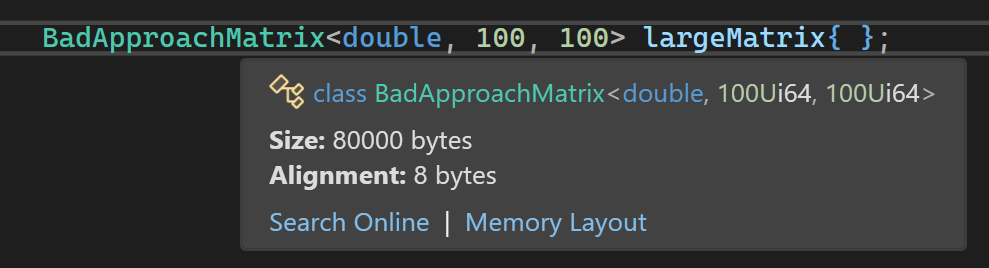

# Matrizen

https://studyflix.de/mathematik/was-ist-eine-matrix-8111

https://home.mathematik.uni-freiburg.de/knies/lehre/bkla/Skript-Brueckenkurs.pdf

https://www.matheretter.de/wiki/matrizen

https://www.heise.de/tipps-tricks/LaTeX-Matrix-erstellen-so-geht-s-4352833.html


Mit Google:

https://www.geeksforgeeks.org/google-docs/how-to-insert-matrix-in-google-docs/

KI:  markdown math matrices examples

## Einleitung

Eine Matrix ist eine rechteckige Anordnung von Werten (mathematischen Objekten),
die in Zeilen und Spalten organisiert sind.

Die Anzahl der Zeilen wird durch *m* und die Anzahl der Spalten durch *n* angegeben.
Eine Matrix mit *m* Zeilen und *n* Spalten nennt man *m*&times;*n* Matrix.

Matrizen stammen aus einem Teilgebiert der höheren Mathematik, der linearen Algebra,
die sich mit Vektorräumen beschäftigt.

Anwendungsfälle für das Arbeiten mit Matrizen
sind zum Beipiel lineare Gleichungssysteme,
das Lösen von linearen Gleichungssystemen,
die Computergrafik mit Transformationen wie Rotation und Skalierung,
die Kryptografie und natürlich nicht zu vergessen die KI mit dem maschinellen Lernen zur Verarbeitung großer Datenmengen.

Elementare Rechenoperationen für Matrizen sind die Addition, Subtraktion und Multiplikation.


## Darstellung // TEST

Eine allgemeine *m*&times;*n*  Matrix sieht dabei so aus:

$ A = \begin{pmatrix} a & b \\ c & d \end{pmatrix} $

$$
\begin{pmatrix}
1 & 2 & 3 \\
a & b & c
\end{pmatrix}
$$

$$
\begin{bmatrix}
x_{11} & x_{12} \\
x_{21} & x_{22}
\end{bmatrix}
$$


## Darstellung // TEST

Eine allgemeine *m*&times;*n*  Matrix sieht dabei so aus:

$$
\begin{pmatrix}
x_{11} & x_{12} & &mldr; & x_{1n} \\
x_{21} & x_{22} & &mldr; & x_{2n} \\
&mldr; &        &        & \\
       & &mldr; &        & \\
       &        & &mldr; & \\
       &        &        & &mldr; \\
x_{m1} & x_{m2} & &mldr; & x_{mn} \\
\end{pmatrix}
$$

$$
\begin{pmatrix}
x_{11} & x_{12} & &mldr; & x_{1n}\\
x_{21} & x_{22} & &mldr; & x_{2n}\\
&mldr; &  & &mldr; & &mldr;\\
&mldr; & &mldr; & & &mldr;\\
&mldr; & &mldr; & &mldr; \\
x_{m1} & x_{m2} & &mldr; & x_{mn}\\
\end{pmatrix}
+
\begin{pmatrix}
x_{11} & x_{12} & &mldr; & x_{1n}\\
x_{21} & x_{22} & &mldr; & x_{2n}\\
&mldr; &  & &mldr; & &mldr;\\
&mldr; & &mldr; & & &mldr;\\
&mldr; & &mldr; & &mldr; \\
x_{m1} & x_{m2} & &mldr; & x_{mn}\\
\end{pmatrix}
$$

## Darstellung einer Matrix in C++

Für tabellenartige Strukturen von Werten gibt es in höheren Programmiersprachen keine unmittelbare Umsetzung.

Alle Daten, die zu einem Programm gehören, sind in &ndash; möglicherweise unterschiedlichen &ndash; Speicherbereichen
eines Programms immer sequentiell angeordnet, rechteckige Datenbereiche gibt es hier nicht.

Denkt man sich alle Zeilen einer Matrix der Reihe nach hintereinander angeordnet vor,
kommen wir einer datentechnischen Umsetzung schon recht nahe.

Datenstrukturen wie ein C-Style Array oder Objekte der Klassen `std::array` oder `std::vector`
sind für solche Datensequenzen geeignet.

In einer nächsten Stufe einer Verfeinerung der Realisierung einer Klasse `Matrix` müssten wir die Frage beantworten,
ob wir die Elemente einer Matrix auf dem *Stack* (Stapel) oder dem *Heap* (Halde) sehen.
Der Stack ist per se für Zwischenergebnisse und Daten kleineren Umfangs konzipiert.

Würden wir die Elemente einer Matrix in einem `Matrix`-Objekt direkt in den Instanzvariablen aufbewahren,
so würden alle Daten dieses Objekts auf dem Stack liegen, sofern es sich beispielsweise im lokale Objekte einer freien Funktion oder eines Objekts handelt.
Damit könnte man keine `Matrix`-Objekte mit großer Spalten- oder Zeilenanzahl anlegen, da so der begrenzte Speicherumfang des Stack
schnell überschritten werden dürfte.

Man könnte fordern, dass Instanzen einer solchen
Klasse  `Matrix` nur dynamisch, also auf dem Heap angelegt werden dürften.
Das ist aber eine sehr ungewöhnliche Einschränkung und wird so in der Praxis nicht praktiziert.
Abgesehen davon, dass ein Compiler derartige Einschränkungen gar nicht überprüfen kann.

Ich habe (spaßeshalber) für eine solche Klasse `Matrix` einen ersten Entwurf gemacht:


```cpp
01: template <typename T, std::size_t Rows, std::size_t Cols>
02: class BadApproachMatrix
03: {
04: protected:
05:     std::array<std::array<T, Cols>, Rows> m_values{};
06: 
07: public:
08:     // c'tors
09:     BadApproachMatrix() = default;
10: 
11:     BadApproachMatrix(std::initializer_list<double> values)
12:     {
13:         std::copy(
14:             values.begin(),
15:             values.end(),
16:             &m_values[0][0]
17:         );
18:     }
19:     ...    
20: };
```


Auf den ersten Blick schaut die Implementierung nicht so schlecht aus.
Bei genauerem Hinsehen können Sie jedoch erkennen, dass alle Werte des geschachteten `std::array`-Objekts 
*im* Instanzvariablenbereich des Objekts liegen. Bei großen Werten von `Rows` oder `Cols` kommen hier schnell
viele Werte zusammen. Siehe das folgende Beispiel mit 100 Zeilen und Spalten:

```cpp
BadApproachMatrix<double, 100, 100> largeMatrix{ };
```

Ein Blick hinter die Kulissen des Objekts zeigt uns, dass hier 8.000.000 Bytes auf dem Stack verbraucht werden.




*Abbildung* 1: Compiler Flag `/Zc:nrvo`.

Das ist in dieser Weise nicht akzeptabel, wir müssen einen anderen Weg beschreiten.
Wir können jetzt folgern, dass für die Elemente einer Matrix grundsätzlich nur dynamischer Speicherplatz
in Frage kommt.

Hier geht es nun mit den Operatoren `new` und `delete` oder Smart-Pointer Klassen weiter.

Eine Matrix kann durch die Anordnung ihrer Elemente in einem einzigen, eindimensionalen Feld dargestellt werden.
Um so auf die Elemente der Matrix zugreifen zu können, werden die Zeilen- und Spalteninformationen
eines jeden Elements durch eine Formel komprimiert ausgedrückt.

Üblicherweise werden die Elemente eines solchen rechteckigen Datenstruktur
in der Reihenfolge der Zeilen abgelegt (so genannte *Zeilen*-*Major*-Anordnung),
die alternative Anordnung wäre eine *Spalten*-*Major*-Anordnung, also gemäß der Reihenfolge der Spalten.

Speichern wir zum Beispiel eine *rows*&times;*cols*-Matrix (*rows* Zeilen, *cols* Spalten) in einem eindimensionalen Feld der Größe *rows* * *cols* ab,
lautet die Formel für den Zugriff auf das Element in Zeile *row* und Spalte *col*

*row* * *n* + *col*.

*Beispiel*:<br />
Eine 2&times;3-Matrix des Aussehens

$$
\begin{pmatrix}
1 & 2  & 3 \\
4 & 5  & 6 \\
\end{pmatrix}
$$

legen in einem eindimensionalen `int`-Array mit den Werten `{ 1, 2, 3, 4, 5, 6 }` ab.

Damit sind wir in C++ angekommen, unser Entwurf eine Klasse `Matrix` sieht so aus:

```cpp
01: class Matrix
02: {
03: protected:
04:     std::size_t m_rows;
05:     std::size_t m_cols;
06:     std::shared_ptr<double[]> m_values;
07:     ...
08: };
```


## Konstruktoren der Klasse `Matrix`

Wir wollen `Matrix`-Objekte in unterschiedlicher Weise anlegen können.
Eine Zusammenfassung der überladenen Konstruktoren folgt:
Der Standard-Konstruktor ist mehr der Vollständigkeit halber vorhanden.
Matrizen mit 0 Zeilen und 0 Spalten spielen in der Praxis keine Rolle:

```cpp
Matrix::Matrix() : m_rows{}, m_cols{}, m_values{} {}
```

Der nächste Konstruktor mit der Schnittstelle

```cpp
Matrix::Matrix(std::size_t rows, std::size_t cols)
```

legt Matrizenobjekte mit einer vorgegebenen Anzahl von Zeilen und Spalten an. Er besitzt folgende Realisierung:

```cpp
01: Matrix::Matrix(std::size_t rows, std::size_t cols)
02:     : m_rows{ rows }, m_cols{ cols } 
03: {
04:     m_values = std::make_shared<double[]>(m_rows * m_cols);
05: }
```

Man beachte hierbei, dass das Funktionstemplate `std::make_shared` den reservierten Speicher mit `0.0` vorbelegt.
Als ob wir `new double[m_rows * m_cols] {}` aufgerufen hätten.
Damit können wir Matrizen mit Null-Werten anlegen:

```cpp
Matrix matrix{ 3, 3 };
```

Hübsch wären aber andere Schreibweisen, wie wäre es beispielsweise mit

```cpp
Matrix matrix{ 3, 3, { 1, 2, 3 ,4 , 5, 6, 7, 8, 9 } };
```


Hier kommt uns die C++-Klasse `std::initializer_list` zu Hilfe.
In einer ersten Umsetzung können wir mit ihrer Hilfe eine beliebig lange Liste von Werten
an einen Konstruktorenaufruf übergeben. Diese Liste mit Werten muss dann Zeile für Zeile an das `Matrix`-Objekt übertragen werden,
so dass am Ende alle Elemente der Matrix mit den Werten aus der Liste vorbelegt sind.

Man könnte &ndash; wie in C/C++ bei unvollständigen Initialisierungen von Arrays oder Strukturen &ndash; diskutieren,
ob man für Matrizen auch diese Option einräumt, also Listen mit weniger Werten, als es die Matrix benötigt, zulässt.
Ich habe den Weg eingeschlagen, dass die Liste vollständig sein muss:


```cpp
01: Matrix::Matrix(std::size_t rows, std::size_t cols, std::initializer_list<double> values)
02:     : m_rows{ rows }, m_cols{ cols }
03: {
04:     if (m_rows * m_cols != values.size()) {
05:         throw std::invalid_argument("Wrong number of values!");
06:     }
07: 
08:     m_values = std::make_shared<double[]>(m_rows * m_cols);
09: 
10:     std::copy(
11:         values.begin(),
12:         values.end(),
13:         m_values.get()
14:     );
15: }
```

Dieser Konstruktor profitiert in seiner Realisierung davon, dass die Elemente der Matrix in einem ein-dimensionalen Feld vorliegen.
Auf diese Weise kann der STL-Algorithmus `std::copy` angeworfen werden.
Ein `std::initializer_list`-Objekt kann als Beriech (*Range*) aufgefasst werden, er unterstützt die beiden Methoden
`begin()` und `end()`. Das dritte Argument kann ein *Raw*-Zeiger sein, die STL wurde so konzipiert, 
dass Zeiger die Rolle von *random-access* Iteratoren spielen.

Noch prägnanter wäre natürlich eine Schreibweis in der Art

```cpp
Matrix matrix{ 3, 3, { { 1, 2, 3 } , { 4, 5, 6 }, { 7, 8, 9 } } };
```

Auch dies können wir realisieren, eine geschachtelte `std::initializer_list` obliegt dem Lösungsansatz:


```cpp
Matrix(
    std::size_t rows, 
    std::size_t cols,
    std::initializer_list<std::initializer_list<double>> values
);
```

In der Realisierung dieses Konstruktors achten wir wiederum darauf, dass alle `std::initializer_list`-Listen
die Länge der Zeilen und Spalten respektieren.


## Konzepte und Anforderungen für Matrizen

Die einzelnen Elemente unserer Matrix sollen Gleitpunktwerte aufnehmen.
Dabei wollen wir aber den Freiheitsgrad aufrecht erhalten, ob die Werte vom Typ `float`, `double` oder `long double` sind.
In C++ sind Klassentemplates die Antwort auf einen solchen Wunsch.

Eine Verfeinerung unserer `Matrix`-Klassendefinition sieht damit so aus:

```cpp
01: template <typename T>
02: concept FloatNumber = std::floating_point<T>;
03: 
04: template <typename T>
05:     requires FloatNumber<T>
06: class Matrix
07: {
08: protected:
09:     std::size_t m_rows;
10:     std::size_t m_cols;
11:     std::shared_ptr<T[]> m_values;
12: 
13: public:
14:     // c'tors
15:     Matrix();
16:     Matrix(std::size_t rows, std::size_t cols);
17:     Matrix(std::size_t rows, std::size_t cols, std::initializer_list<T> values);
18:     Matrix(std::size_t rows, std::size_t cols, std::initializer_list<std::initializer_list<T>> values);
19: 
20:     // getter   
21:     std::size_t rows() const { return m_rows; }
22:     std::size_t cols() const { return m_cols; }
23: 
24:     // public interface
25:     void print() const;
26:     T& at(std::size_t row, std::size_t col);
27:     const T& at(std::size_t row, std::size_t col) const;
28: 
29:     Matrix transpose() const;
30:     Matrix add(const Matrix& other) const;
31:     Matrix sub(const Matrix& other) const;
32:     Matrix mul(const Matrix& other) const;
33: };
```


Die Klasse `Matrix` formulieren wir nun in Gestalt einer Klassenschablone.
Für die zulässigen Datentypen, die für `T` in Betracht kommen, greifen wir auf die beiden Sprachmittel
`concept` und `requires` zurück.

Wenn wir nun versuchen, eine Templateinstantiierung für T = int vornehmen zu wollen, 
reagiert der C++&ndash;Compiler mit der Fehlermeldung

```
'Matrix': the associated constraints are not satisfied
```


## Kopieren und Verschieben von Matrix-Objekten

## Rechenmethoden für Matrizen: Addition, Subtraktion und Multipliaktion

Wir starten in diesen Kapitel mit der Betrachtung der Matrizen-Addition.
Diese ist so definiert, dass in der Ergebnis-Matrix jedes Element die Summe der beiden Elemente aus erstem und zweiten Operanden ist:

$$
\begin{pmatrix}
a_{11} & a_{12} & &mldr; & a_{1n}\\
a_{21} & a_{22} & &mldr; & a_{2n}\\
&mldr; &  & &mldr; & &mldr;\\
&mldr; & &mldr; & & &mldr;\\
&mldr; & &mldr; & &mldr; \\
a_{m1} & a_{m2} & &mldr; & a_{mn}\\
\end{pmatrix}
+
\begin{pmatrix}
b_{11} & b_{12} & &mldr; & b_{1n}\\
b_{21} & b_{22} & &mldr; & b_{2n}\\
&mldr; &  & &mldr; & &mldr;\\
&mldr; & &mldr; & & &mldr;\\
&mldr; & &mldr; & &mldr; \\
b_{m1} & b_{m2} & &mldr; & b_{mn}\\
\end{pmatrix}
$$


$$
\begin{pmatrix}
a_{11} & a_{12} & &mldr; & a_{1n}\\
a_{21} & a_{22} & &mldr; & a_{2n}\\
&mldr; &  & &mldr; & &mldr;\\
&mldr; & &mldr; & & &mldr;\\
&mldr; & &mldr; & &mldr; \\
a_{m1} & a_{m2} & &mldr; & a_{mn}\\
\end{pmatrix}
+
\begin{pmatrix}
b_{11} & b_{12} & &mldr; & b_{1n}\\
b_{21} & b_{22} & &mldr; & b_{2n}\\
&mldr; &  & &mldr; & &mldr;\\
&mldr; & &mldr; & & &mldr;\\
&mldr; & &mldr; & &mldr; \\
b_{m1} & b_{m2} & &mldr; & b_{mn}\\
\end{pmatrix}
+
\begin{pmatrix}
a_{11}+b_{11} & a_{12}+b_{12} & &mldr; & a_{1n}+b_{1n}\\
a_{21}+b_{21} & a_{22}+b_{22} & &mldr; & a_{2n}+b_{2n}\\
&mldr; &  & &mldr; & &mldr;\\
&mldr; & &mldr; & & &mldr;\\
&mldr; & &mldr; & &mldr; \\
a_{m1}+b_{m1} & a_{m2}+b_{m2} & &mldr; & a_{mn}+b_{mn}\\
\end{pmatrix}
$$

Ein Umsatzung in C++&ndash;Quellcode ist nicht sonderlich schwer:


```cpp
01: template <typename T>
02: Matrix<T> Matrix<T>::add(const Matrix& other) const
03: {
04:     Matrix<T> result{ m_rows, m_cols };
05:     for (std::size_t i{}; i != m_rows * m_cols; ++i) {
06: 
07:         result.m_values[i] = m_values[i] + other.m_values[i];
08:     }
09:     return result;
10: }
```


