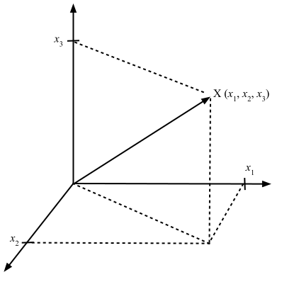

# Vektoren

## Links

https://studyflix.de/mathematik/was-ist-eine-matrix-8111

https://home.mathematik.uni-freiburg.de/knies/lehre/bkla/Skript-Brueckenkurs.pdf

https://www.matheretter.de/wiki/matrizen

https://www.heise.de/tipps-tricks/LaTeX-Matrix-erstellen-so-geht-s-4352833.html

Youtube:
https://www.youtube.com/watch?v=9Ule9qQaBB0

Mit Google:

https://www.geeksforgeeks.org/google-docs/how-to-insert-matrix-in-google-docs/

KI:  markdown math matrices examples

// BEISPIELE FÜR MAthematik in Markdown

https://damienbod.com/2022/06/06/using-math-expressions-in-github-markdown/

oder

https://www.upyesp.org/posts/makrdown-vscode-math-notation/

Der Text dieses Abschnitts stamm aus
// https://www.grund-wissen.de/mathematik/lineare-algebra-und-analytische-geometrie/vektoren.html

## Einleitung zu Vektoren

Bei Vektoren handelt es sich aus geometrischer Sicht um Strecken, die eine bestimmten Länge und Richtung haben.
Betrachten wir Vektoren im zwei- oder dreidimensionalen Raum, so reicht ein geordnetes Paar aus zwei oder ein Tupel aus drei Koordinatenwerten aus,
um den Vektor zu beschreiben &ndash; also etwa 
$\vec{a}$ = (<i>a</i>1, <i>a</i>2)
oder
$\vec{a}$ = (<i>a</i>1, <i>a</i>2, <i>a</i>3).

Die einzelnen Koordinatenwerte (&bdquo;Komponenten&rdquo;) geben dabei an,
um wie viele Längeneinheiten die Spitze des Vektors entlang der jeweiligen Raumrichtung vom Anfangspunkt des Vektors entfernt liegt.

*Abbildung* 1: Ein Vektor im dreidimensionalen Raum.

### Betrag eines Vektors

Die Länge der Verbindungsstrecke vom Anfangspunkt eines Vektors zu seinem Endpunkt wird *Betrag* des Vektors genannt.
Im zwei- oder dreidimensionalen Vektorraum kann der Betrag eines Vektors 
mit Hilfe des Satzes von Pythagoras anhand seiner Komponenten berechnet werden:

$$
|\vec{a}| = \sqrt{a_{1}^2+a_{2}^2}
$$

oder

$$
|\vec{a}| = \sqrt{a_{1}^2+a_{2}^2+a_{3}^2}
$$

*Beispiel*: 
Der dreidimensionale Vektor

$$
a=\begin{pmatrix}
3 \cr
4 \cr
12 \cr
\end{pmatrix}
$$

hat den Betrag

$$
|a| = \sqrt{3^2+4^2+12^2} = \sqrt{9+16+144} = \sqrt{169} = 13
$$

Dieselbe Formel lässt sich entsprechend auf Vektoren einer beliebigen Dimension übertragen.

### Gleichheit (Identität) von Vektoren

Zwei Vektoren $\vec{a}$ und $\vec{b}$ sind gleich,
wenn sie in allen Koordinaten übereinstimmen.
Beide Vektoren haben dann den gleichen Betrag und die gleiche Richtung.

### Ein normierter Vektor

Ein Vektor, dessen Länge den Wert 1 besitzt, wird &bdquo;normierter&rdquo; Vektor $\vec{a}_0$ genannt.

### Addition von Vektoren

Man erhält rechnerisch einen Summenvektor,
indem man die einzelnen Komponenten beider Vektoren addiert:

$$
\vec{a} + \vec{b} =
\begin{pmatrix}
a_{1} \\
a_{2} \\
&mldr; \\
a_{n} \\
\end{pmatrix}
\+
\begin{pmatrix}
b_{1} \\
b_{2} \\
&mldr; \\
b_{n} \\
\end{pmatrix}
\=
\begin{pmatrix}
a_{1}+b_{1} \\
a_{2}+b_{2} \\
&mldr; \\
a_{n}+b_{n} \\
\end{pmatrix}
$$

Eine Addition von Vektoren mit unterschiedlicher Dimension ist nicht definiert.

### Subtraktion von Vektoren: Der Differenzvektor

Rechnerisch erhält man den Differenzvektor, indem man die einzelnen Komponenten beider Vektoren subtrahiert:

$$
\vec{a} - \vec{b} =
\begin{pmatrix}
a_{1} \\
a_{2} \\
&mldr; \\
a_{n} \\
\end{pmatrix}
\-
\begin{pmatrix}
b_{1} \\
b_{2} \\
&mldr; \\
b_{n} \\
\end{pmatrix}
\=
\begin{pmatrix}
a_{1}-b_{1} \\
a_{2}-b_{2} \\
&mldr; \\
a_{n}-b_{n} \\
\end{pmatrix}
$$

### Multiplikation von Vektoren

Vektoren können entweder mit einer reellen Zahl (einem so genannten &bdquo;Skalar&rdquo;)
oder auch mit anderen Vektoren multipliziert werden.
Man spricht dann von einer skalaren Multiplikation oder von einer Multiplikation von Vektoren. 

#### Multiplikation eines Vektors mit einer reellen Zahl (skalare Multiplikation)

Multipliziert man einen Vektor $\vec{a}$ mit einer reellen Zahl *c*,
so ergibt sich ein Vektor, der diesselbe gleiche Richtung hat,
dessen Betrag jedoch um den Faktor *c* verändert ist.

  * Ist *c* > 1, so ist der Vektor gestreckt.
  * Ist 0 < *c* < 1, so ist der Vektor gestaucht.
  * Ist *c* < 0, so wird zusätzlich zur Streckung beziehungsweise Stauchung des Vektors der Richtungssinn umgedreht.

Rechnerisch lässt sich ein Vektor $\vec{a}$ mit einer reellen Zahl *c* multiplizieren,
indem jede Komponente des Vektors mit dieser Zahl multipliziert wird:

$$
c \cdot \vec{a} = c \cdot
\begin{pmatrix}
a_{1} \\
a_{2} \\
&mldr; \\
a_{n} \\
\end{pmatrix}
\=
\begin{pmatrix}
c \cdot a_{1} \\
c \cdot a_{2} \\
&mldr; \\
c \cdot a_{n} \\
\end{pmatrix}
$$

#### Das Skalarprodukt

Bevor wir auf das Skalarprodukt näher eingehen, beachten Sie bitte:
Es gibt hier möglicherweise etwas verwirrende Namensgebungen für die 
unterschiedliche Rechenoperationen im Umfeld der Multiplikationen von Vektoren.

Der Begriff &bdquo;Skalarprodukt&rdquo; kann zwei verschiedene Operationen bezeichnen:
die Multiplikation von zwei Vektoren, was einen Skalar ergibt,
und die Multiplikation eines Skalars mit einem Vektor, was zum Ergebnis einen Vektor hat.
Zur besseren Unterscheidung werden oft folgende Begriffe verwendet: 

  * &bdquo;Skalarprodukt&rdquo;: Vektor x Vektor Das Ergebnis ist ein Skalar (eine Zahl).
    Alternativ kann man auch Punktprodukt sagen, um den Unterschied zu verdeutlichen.

  * &bdquo;skalare Multiplikation&rdquo;: Skalar x Vektor Das Ergebnis ist ein Vektor.

| Operation | Begriff | Ergebnis |
| :---- | :---- | :---- |
| Vektor &times; Vektor | Skalarprodukt oder Punktprodukt | Skalar (Wert) |
| Skalar &times; Vektor | Skalare Multiplikation | Vektor |

*Tabelle* 1: Unterscheidung Skalarprodukt versus skalare Multiplikation.

Schreibt man die beiden Vektoren $\vec{a}$ und $\vec{b}$ in Spaltenform,
so kann das Skalarprodukt komponentenweise nach folgender Formel berechnet werden:

$$
\vec{a} * \vec{b} =
\begin{pmatrix}
a_{1} \\
a_{2} \\
&mldr; \\
a_{n} \\
\end{pmatrix}
\*
\begin{pmatrix}
b_{1} \\
b_{2} \\
&mldr; \\
b_{n} \\
\end{pmatrix}
\=
a_{1}*b_{1} + a_{2}*b_{2} + &mldr; + a_{n}*b_{n}
$$

## Vektoren

In der Mathematik und Physik spielen Skalare und Vektoren eine große Rolle.
Während man unter einem Skalar eine Größe versteht, deren Wert sich eindeutig durch die Angabe einer Maßzahl beschreiben lässt,
benötigt man zur vollständigen Charakterisierung eines Vektors noch die Angabe einer Richtung im Raum.
So lassen sich beispielsweise Windgeschwindigkeiten, Beschleunigungen, elektrische oder magnetische Feldstärken durch Vektoren beschreiben.

## Darstellung eines Vektors in C++
