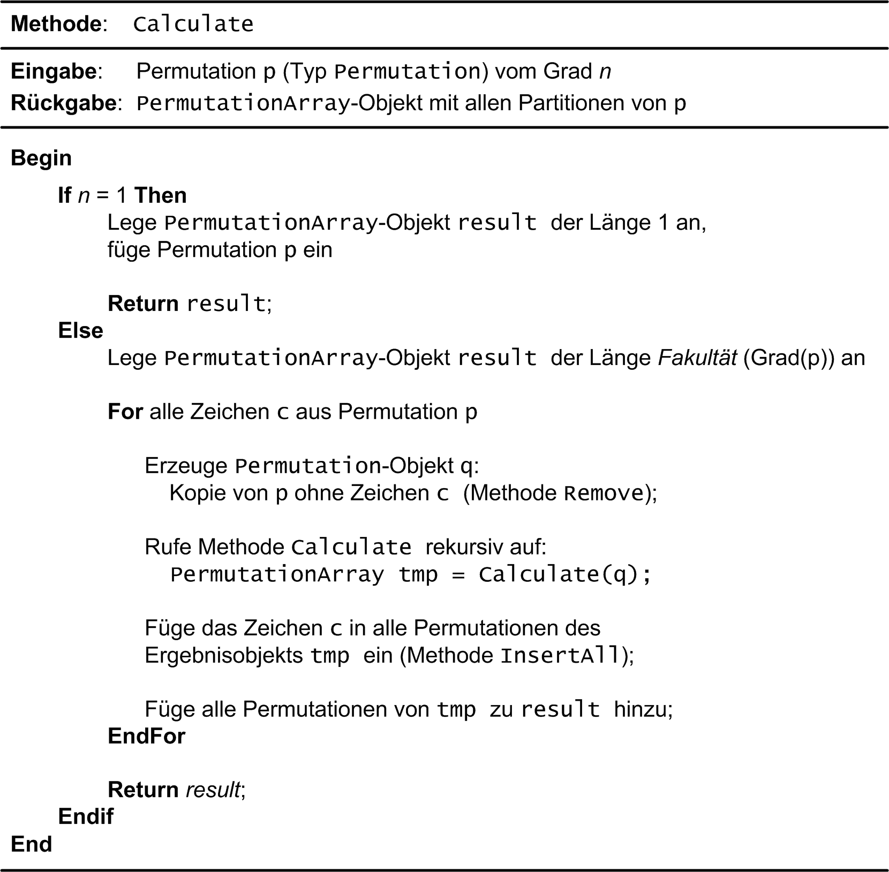

<!-- Permutationen -->

Ist eine Menge von _n_ Elementen gegeben, so bezeichnet man die möglichen Anordnungen
aller dieser _n_ Elemente als *Permutationen* (lat. _permutare_: vertauschen).
Die Berechnung der Permutationen einer beliebigen Menge von Elementen
steht im Mittelpunkt dieser Fallstudie.
Als Elemente verwenden wir zunächst Zeichen, also `char`-Variablen.
Dies soll aber verallgemeinerbar sein, also auch für Variablen eines beliebigen Datentyps funktionieren.

Für zwei Zeichen `A` und `B` gibt es nur die zwei Permutationen `AB` und `BA`.
Drei Zeichen, angenommen `A`, `B` und `C`, können hingegen
in sechs verschiedenen Permutationen dargestellt werden:
`ABC`, `ACB`, `BAC`, `BCA`, `CAB` und `CBA`.
Sind alle _n_ Elemente voneinander verschieden, was wir in dieser Aufgabe zu Grunde legen,
so gibt es dafür _n_! Anordnungen (_n_-Fakultät).

<!--more-->

# Lernziele

  * Template-Technik
  * STL-Container `std::vector<T>` und `std::list<T>`
  * STL-Algorithmen `std::for_each`, `std::begin`, `std::end`, `std::rbegin` und `std::rend`
  * STL-Iteratoren
  * Lambda-Funktionen mit Zugriffsklausel
  * Initialisierungsliste (`std::initializer_list<T>`)
  * Anwendungsbeispiel für `std::move`
  * Anwendungsbeispiel für `std::next_permutation`
  * Benutzerdefinierter Literaloperator (`operator""`)
  * Bereichsbasierte `for`-Wiederholungsschleife (Range-based `for`-Loop)

# Einführung

Bevor wir auf den Algorithmus zur Berechnung von Permutationen eingehen,
entwickeln wir zwei Hilfsklassen `Permutation` und `PermutationContainer`.
Da wir für die Permutationen unterschiedliche Datentypen der einzelnen Elemente zu Grunde legen wollen,
kommen bei der Realisierung Klassen-Templates ins Spiel.


## Klasse `Permutation<T>`

Die Klasse `Permutation` &ndash; genauer: `Permutation<T>` &ndash; benötigen wir,
um eine einzelne Permutation darzustellen.
Überlegen Sie, welcher Container der STL als Hilfestellung dafür geeignet sein könnte?
Die Details zur Schnittstelle des Klassen-templates `Permutation<T>` sind in [Tabelle 1] zusammengestellt:

###### {#tabelle_1_class_permutation}

| Element | Beschreibung |
| :---- | :---- |
| Konstruktor | `Permutation();`<br/>Standardkonstruktor für ein `Permutation`-Objekt. |
| Konstruktor | `Permutation(std::initializer_list<T> list);`<br/>Initialisiert ein `Permutation`-Objekt mit eine Reihe von Elementen des Typs `T`, die in einem `std::initializer_list<T>`-Objekt abgelegt sind. Sinnvollerweise sollten die Elemente alle voneinander verschieden sein. Sie brauchen das in Ihrer Implementierung aber nicht zu überprüfen. |
| *getter*-Methode `grade` | `size_t grade() const;`<br/>Liefert die Anzahl der Elemente zurück, die im Permutations-Objekt abgelegt sind. Man spricht auch von der *Länge* bzw. vom *Grad* der Permutation. |
| Methode `insertAtFront` | `void insertAtFront(T elem);`<br/>Das übergebene Element `elem` wird in der vorliegenden Permutation am *Anfang* eingefügt. Insbesondere wird der *Grad* der Permutation um Eins größer. |
| Methode `removeAt` | `Permutation<T> removeAt(size_t i) const;`<br/>Die Methode entfernt ein Element an der Stelle `i` aus der vorliegenden Permutation. Das Ergebnis wird in einem neuen `Permutation<T>`-Objekt als Resultat der Methode zurüclgeliefert. Die Methode selbst ist mit `const` markiert, also das aktuelle Objekt bleibt unverändert. |
| Methode `getValues` | `std::vector<T> getValues() const;`<br/>Die Methode liefert die aktuellen Elemente der Permutation in einem `std::vector<T>`-Objekt zurück. |
| Operator `[]` | `const T& operator[](size_t n) const;`<br/>Zugriffsoperator für das *i*.-te Element der Permutation. |

*Tabelle* 1: Element der Klasse `Permutation<T>`.

Natürlich wäre es auch wünschenswert, wenn man ein `Permutation<T>`-Objekt
mit dem `operator<<` auf der Konsole ausgeben kann:

```cpp
std::ostream& operator<< (std::ostream&, const Permutation<T>&);
```

Es folgen einige Beispiele, um die Arbeitsweise der Klasse `Permutation<T>` zu verdeutlichen.
Eine Permutation mit den drei Zeichen `'A'`, `'B'` und `'C'` wird so angelegt:

```cpp
Permutation<char> p{ 'A', 'B', 'C' };
std::cout << p << std::endl;
```

*Ausgabe*:

```
[A,B,C]
```

Noch ein ähnliches Beispiel mit den fünf Zahlen 1, 2, 3, 4 und 5:

```cpp
Permutation p({ 1, 2, 3, 4, 5 });
std::cout << p << " (Anzahl der Elemente: " << p.grade() << ')' << std::endl;
```

*Ausgabe*:

```
[1,2,3,4,5] (Anzahl der Elemente: 5)
```

Man beachte im letzten Beispiel, dass der Template Parametertyp `T` &ndash; in diesem Beispiel `int` &ndash; 
vom Übersetzer aus dem Datentyp der Parameter abgeleitet werden kann.
Es folgt noch ein Beispiel zu den Methoden `insertAtFront`, `removeAt`
und dem Index-Operator `oeprator[]`:

```cpp
Permutation p({ 1, 2, 3, 4, 5 });

std::cout << "Testing insertAtFront: " << std::endl;
p.insertAtFront(0);
std::cout << p << std::endl;

std::cout << "Testing []-Operator: " << std::endl;
for (size_t i{}; i != p.grade(); ++i)
{
    int n = p[i];
    std::cout << i << ": " << n << std::endl;
}

std::cout << "Testing removeAt: " << std::endl;
while (true) {
    p = p.removeAt(0);
    std::cout << p << std::endl;
    if (p.grade() == 0) {
        break;
    }
}
```

*Ausgabe*:

```
Testing insertAtFront:
[0,1,2,3,4,5]
Testing []-Operator:
0: 0
1: 1
2: 2
3: 3
4: 4
5: 5
Testing removeAt:
[1,2,3,4,5]
[2,3,4,5]
[3,4,5]
[4,5]
[5]
[]
```

## Klasse `PermutationContainer<T>`

Zum Abspeichern mehrerer `Permutation<T>`-Objekte konzipieren wir eine Klasse `PermutationContainer<T>`.
Im Prinzip handelt es sich bei dieser Klasse um eine Hüllenklasse,
die einen geeignet auszuwählenden STL-Container für eine beliebige Anzahl von `Permutation<T>`-Objekte kapselt.
Eine derartige Hüllenklasse ergibt Sinn,
da wir neben den Standard-Methoden des STL-Containers noch einige zusätzliche Hilfsmethoden benötigen,
die speziell auf den Algorithmus zur Berechnung von Permutationen zugeschnitten sind.
Damit werfen wir einen Blick auf [Tabelle 2]:

###### {#tabelle_2_class_permutation_container}

| Element | Beschreibung |
| :---- | :---- |
| Konstruktor | `PermutationContainer();`<br/>Standardkonstruktor für ein `PermutationContainer`-Objekt. |
| Methode `count` | `size_t count() const;`<br/>Liefert die Anzahl der `Permutation`-Objekte zurück, die im Objekt abgelegt sind. |
| Methode `insert` | `void insert(const Permutation<T>& p);`<br/>Fügt ein `Permutation`-Objekt in das `PermutationContainer`-Objekt ein. |
| Methode `insertAll` | `void insertAll(T elem);`<br/>Ruft die Methode `insertAtFront` an allen `Permutation`-Objekten im vorliegenden `PermutationContainer`-Objekt mit dem Parameter `elem` auf.|

*Tabelle* 2: Element der Klasse `PermutationContainer<T>`.


Auch sollte der  `operator<<` für `PermutationContainer<T>`-Objekte realisiert sein,
um ein derartiges Container-Objekt auf der Konsole ausgeben zu können:

```cpp
std::ostream& operator<< (std::ostream&, const PermutationContainer<T>&);
```

Ein Beispiel zur `PermutationContainer<T>`-Klasse könnte so aussehen:

```cpp
Permutation<int> p({ 1, 2, 3, 4 });
Permutation<int> q({ 4, 3, 2, 1 });
std::cout << p << std::endl;
std::cout << q << std::endl;

PermutationContainer<int> container{};
container.insert(p);
container.insert(q);
std::cout << container << std::endl;
```

*Ausgabe*:

```
[1,2,3,4]
[4,3,2,1]
[1,2,3,4]
[4,3,2,1]
[2 permutations]
```

## Algorithmus zur Berechnung von Permutationen

Nun fehlt nur noch ein Algorithmus, um zu einer gegebenen Menge von Elementen alle Permutationen zu berechnen.
Ein sehr einfacher &ndash; rekursiver &ndash; Algorithmus lässt sich in Worten so beschreiben,
wenn _n_ die Anzahl der Elemente ist:

  * Erster Fall: _n_ = 1<br/>
    Die Menge hat nur ein Element, nennen wir es a<sub>1</sub>. Es existiert in diesem Fall nur eine einzige Permutation, bestehend aus dem Element a<sub>1</sub> selbst.

  * Zweiter Fall: _n_ > 1<br/>
    Wir bezeichnen die Elemente mit a<sub>1</sub>, a<sub>2</sub>, a<sub>3</sub>, ... , a<sub>_n_-1</sub>, a<sub>_n_</sub>: Nun ist der Reihe nach jedes einzelne Element a<sub>_i_</sub> (i = 1,2, ..., n)
    vorübergehend aus der vorliegenden Menge von _n_ Zeichen zu entfernen. Die zurückbleibenden _n_-1 Elemente werden nun mit diesem Algorithmus (rekursiv) permutiert.
    Der rekursive Methodenaufruf liefert als Ergebnis eine Menge von Permutationen zurück, die alle den Grad _n_-1 besitzen.
    Das entfernte Zeichen ist nun in diese Permutationen wieder einzufügen. Die Einfügeposition spielt dabei keine Rolle, wir entscheiden uns für den Anfang, siehe dazu auch die `insert`-Methode aus Tabelle 1.

Wir demonstrieren in [Abbildung 1] die Funktionsweise dieses Algorithmus am Beispiel einer Permutation
mit den drei Ziffern 1, 2 und 3:


###### {#abbildung_1_permutations_recursive_strategy}



*Abbildung* 1: Rekursiver Algorithmus zur Bestimung von Permutationen.


Mit Hilfe der Vorarbeiten der zwei Klassen `Permutation<T>` und `PermutationContainer<T>` ([Tabelle 1] und [Tabelle 2]) 
können wir den vorgestellten Algorithmus etwas präziser formulieren: In [Abbildung 2] finden Sie
Pseudo-Code für eine Methode `calculate` vor:

[caption="Abbildung {counter:figure}: ", title="Pseudo-Code der Methode `calculate`."]
image::PermutationPseudeCode.png[width=450]

###### {#abbildung_2_permutations_algorithm}



*Abbildung* 1: Algorithmus zur Berechnung von Permutationen.




Wir sind fast am Ziel angekommen: Die im letzen Abschnitt beschriebene Methode `calculate` ordnen
wir der Klasse `PermutationCalculator<T>` zu:

## Klasse `PermutationCalculator<T>`

Die Definition in [Tabelle 3] stellt im Prinzip nur eine Wiederholung dar:

###### {#tabelle_3_class_permutation_calculator}

| Element | Beschreibung |
| :---- | :---- |
| Methode `calculate` | `static PermutationContainer<T> calculate(const Permutation<T>& p);`<br/>Berechnet alle Permutationen zu einer vorgegebenen Menge von Elementen, die durch den Parameter `p` beschrieben werden. Das Ergebnis ist in einem Objekt des Typs `PermutationContainer<T>` abzulegen. |

*Tabelle* 3: Methode `calculate` der Klasse `PermutationCalculator<T>`.

Nachfolgend ein Beispiel, wie Sie das Klassen-Template `PermutationCalculator<T>` zur Berechnung von
Permutationen einsetzen:


```cpp
Permutation<char> p{ 'A', 'B', 'C' };
PermutationContainer<char> result = PermutationCalculator<char>::calculate(p);
std::cout << result << std::endl;
```

*Ausgabe*:

```
[A,B,C]
[A,C,B]
[B,A,C]
[B,C,A]
[C,A,B]
[C,B,A]
[6 permutations]
```

## Aufzählung von Permutationen

Für den Anwender ist häufig &ndash; vor allem bei größeren Ergebnismengen &ndash; das einzelne Aufzählen der
Ergebnisse komfortabler. Ergänzen Sie deshalb das Klassen-Tempalte `PermutationContainer<T>` um die
Realisierung einer Aufzählungsschnittstelle.

In C++ ist das Aufzählen im Prinzip durch das Konzept eines STL-Iterators bereits definiert.
Je nachdem in welcher C++&ndash;Stilistik programmieren wollen,
lässt sich das Ergebnis mit einer Anwendung des STL-Algorithmus `std::for_each`
oder einer so genannten *Range-based for Loop* testen.

Wir betrachten beide Varianten an einem Beispiel:

```cpp
Permutation<int> p({ 1, 2, 3 });
PermutationContainer<int> result = PermutationCalculator<int>::calculate(p);

for (const auto& perm : result) {
    std::cout << "Next Permutation: " << perm << std::endl;
}
```

oder

```cpp
Permutation<int> p({ 1, 2, 3 });
PermutationContainer<int> result = PermutationCalculator<int>::calculate(p);

std::for_each(
    std::begin(result),
    std::end(result),
    [](const auto& perm){
        std::cout << "Next Permutation: " << perm << std::endl;
    }
);
```

In beiden Fällen sollten wir die gleiche Ausgabe erhalten:

```
Next Permutation: [1,2,3]
Next Permutation: [1,3,2]
Next Permutation: [2,1,3]
Next Permutation: [2,3,1]
Next Permutation: [3,1,2]
Next Permutation: [3,2,1]
```

## Literale für Permutationen

Mit dem C++&ndash;Feature *User defined Literal* lassen sich Permutations-Objekte auch
als Konstante formulieren:

```
Permutation<int> p { 12345_perm };
```

Realisieren Sie den Literal-Operator für die Klasse `Permutation<int>`.
Testen Sie Ihre Realisierung an folgendem Beispiel:

```cpp
PermutationContainer<int> container { 
    123_perm, 132_perm, 213_perm, 231_perm, 312_perm,321_perm
};

for (const auto& perm : container) {
    std::cout << "Permutation: " << perm << std::endl;
}
```

*Ausgabe*:

```
Permutation: [1,2,3]
Permutation: [1,3,2]
Permutation: [2,1,3]
Permutation: [2,3,1]
Permutation: [3,1,2]
Permutation: [3,2,1]
```

# Lösung

> Quellcode: Siehe auch [Github](https://github.com/pelocpp/cpp_case_studies.git).

## Klassen-Template `Permutation<T>`

Kommen wir jetzt auf das Klassen-Template `Permutation<T>` zu sprechen.
Wir realisieren alle Templates in dieser Fallstudie nach dem so genannten *Inclusion* Modell,
das heißt, wir fügen die Realisierung der Methoden in der Header-Datei
mit ein ([Listing 1]):  

###### {#listing_01_permutation}

```cpp
01: template <typename T>
02: class Permutation
03: {
04: private:
05:     std::vector<T> m_values;
06: 
07: public:
08:     // c'tors
09:     Permutation() = default;
10:     Permutation(std::initializer_list<T> list) : m_values{ list } {}
11: 
12:     // getter
13:     size_t grade() const { return m_values.size(); }
14: 
15:     // public interface
16:     void insertAtFront(T elem) {
17:         m_values.insert(m_values.begin(), elem);
18:     }
19: 
20:     Permutation<T> removeAt(size_t idx) const {
21:         std::vector<T> tmp{ m_values };
22:         tmp.erase(tmp.begin() + idx);
23:         return { std::move(tmp) };
24:     }
25: 
26:     std::vector<T> getValues() const { return m_values; }
27: 
28:     // operator(s)
29:     const T& operator[](size_t n) const {
30:         return m_values[n];
31:     };
32: 
33:     // iterator support
34:     typename std::vector<T>::const_iterator begin() { return m_values.begin(); }
35:     typename std::vector<T>::const_iterator end() { return m_values.end(); }
36: 
37: private:
38:     Permutation(const std::vector<T>&& values) : m_values{ std::move(values) } {}
39: };
```

*Listing* 1: Klassen-Template `Permutation<T>`.


## Klassen-Template `PermutationContainer<T>`

###### {#listing_02_permutation_container}

```cpp
01: template <typename T>
02: class PermutationContainer
03: {
04: private:
05:     std::list<Permutation<T>> m_perms;
06: 
07: public:
08:     // c'tors/d'tor
09:     PermutationContainer() = default;
10:     PermutationContainer(std::initializer_list<Permutation<T>> perms) : m_perms{ perms } {}
11: 
12:     // getter
13:     size_t count() const { return m_perms.size(); }
14: 
15:     // public interface
16:     void insert(const Permutation<T>& p) {
17:         m_perms.push_back(p);
18:     }
19: 
20:     void insertAll(T elem) {
21:         for (Permutation<T>& p : m_perms) {
22:             p.insertAtFront(elem);
23:         }
24:     }
25: 
26:     // iterator support
27:     typename std::list<Permutation<T>>::iterator begin() { return m_perms.begin(); }
28:     typename std::list<Permutation<T>>::iterator end() { return m_perms.end(); }
29:     typename std::list<Permutation<T>>::const_iterator begin() const { return m_perms.cbegin(); }
30:     typename std::list<Permutation<T>>::const_iterator end() const { return m_perms.cend(); }
31: };
```

*Listing* 2: Klassen-Template `PermutationContainer<T>`.


## Klassen-Template `PermutationCalculator<T>`

###### {#listing_03_permutation_calculator}

```cpp
01: template <typename T>
02: class PermutationCalculator
03: {
04: public:
05:     // public interface
06:     static PermutationContainer<T> calculate(const Permutation<T>& p) {
07:         if (p.grade() == 1)
08:         {
09:             PermutationContainer<T> a{};
10:             a.insert(p);
11:             return a;
12:         }
13:         else
14:         {
15:             PermutationContainer<T> result{};
16: 
17:             for (size_t i{}; i != p.grade(); ++i)
18:             {
19:                 // create permutation without i.-th element of current permutation
20:                 Permutation<T> q{ p.removeAt(i) };
21: 
22:                 // calculate permutions of n-1 elements recursively
23:                 PermutationContainer<T> perms{ PermutationCalculator::calculate(q) };
24: 
25:                 // join result with removed character
26:                 perms.insertAll(p[i]);
27: 
28:                 // append calculated permutations
29:                 for (const auto& perm : perms) {
30:                     result.insert(perm);
31:                 }
32:             }
33: 
34:             return result;
35:         }
36:     }
37: 
38:     static PermutationContainer<T> calculateEx(const Permutation<T>& p) {
39: 
40:         PermutationContainer<T> result{};
41: 
42:         // retrieve std::vector with values from permutation
43:         std::vector<T> values = p.getValues();
44: 
45:         // values need to be sorted
46:         std::sort(
47:             std::begin(values),
48:             std::end(values)
49:         );
50: 
51:         // keep calculating next permutation while there is a next permutation
52:         do {
53:             Permutation<T> tmp{};
54: 
55:             std::for_each(
56:                 std::rbegin(values),
57:                 std::rend(values),
58:                 [&](const auto& elem) { 
59:                     tmp.insertAtFront(elem);
60:             });
61: 
62:             result.insert(tmp);
63: 
64:         } while (std::next_permutation(std::begin(values), std::end(values)));
65: 
66:         return result;
67:     }
68: };
```

*Listing* 3: Klassen-Template `PermutationCalculator<T>`.


## Literale für Permutationen

###### {#listing_04_permutation_udl}

```cpp
01: Permutation<int> operator"" _perm(unsigned long long int value) {
02: 
03:     Permutation<int> p;
04: 
05:     while (value != 0) {
06: 
07:         int rest{ value % 10 };
08:         p.insertAtFront(rest);
09:         value = value / 10;
10:     }
11: 
12:     return p;
13: }
```

*Listing* 4: Literal-Operator `operator""`.


# There&lsquo;s more

Vermutlich sind Sie schon einmal über das Akronym *DRY* gestolpert: *Don't Repeat Yourself*:
Im Software Engineering bezeichnet damit ein Prinzip, das besagt, Redundanz zu vermeiden oder zumindest zu reduzieren.
Es handelt sich hierbei auch um ein Prinzip von Clean Code.

Hätten wir die Betrachtung der Permutationen in dieser Fallstudie nicht zum Zwecke des Übens gestellt,
müssten wir uns eingestehen, dass eine derartige Realisierung in der STL bereits vorhanden ist:

[`std::next_permutation`](https://en.cppreference.com/w/cpp/algorithm/next_permutation)

Ergänzen Sie Ihre Realisierung des Klassen-Template `PermutationCalculator<T>`
um eine zweite Methode `calculateEx`, deren Realisierung den STL-Algorithmus `std::next_permutation` einsetzt.
Vergleichen Sie die Resultate der beiden Realisierungen.


<br/>

<!-- Links Definitions -->

[Tabelle 1]:    #tabelle_1_class_permutation
[Tabelle 2]:    #tabelle_2_class_permutation_container
[Tabelle 3]:    #tabelle_3_class_permutation_calculator

[Listing 1]:    #listing_01_permutation
[Listing 2]:    #listing_02_permutation_container
[Listing 3]:    #listing_03_permutation_calculator
[Listing 4]:    #listing_04_permutation_udl

[Abbildung 1]:  #abbildung_1_permutations_recursive_strategy
[Abbildung 2]:  #abbildung_2_permutations_algorithm

<!-- End-of-File -->
