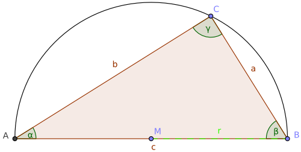

<!-- Pythagorean Triangles -->

# Rechtwinklige Dreiecke und `parallel_for`

Und wieder steht etwas Schulmathematik auf dem Programm, dieses Mal geht es um rechtwinklige Dreiecke.
Für derartige Dreiecke gibt es den Satz des Pythagoras,
er fällt eine Aussage zu den Seitenlängen solcher Dreiecke.
Wir wollen im Folgenden nur Dreiecke betrachten, deren Seitenlängen ganzzahlig sind.

Schreiben Sie ein C++&ndash;Programm, das für folgende Fragestellung eine Antwort findet:
Für welchen Umfang *p* mit *p* <= 2000 ist die Anzahl der verschiedenen rechwinkligen Dreiecke
mit ganzzahligen Seitenlängen *a*, *b* und *c* am größten?

*Hinweis*: Die Aufgabenstellung stammt aus dem Repository &bdquo;Project Euler&rdquo;:
[*Project Euler*](https://projecteuler.net/) ist eine englischsprachige Website, sie enthält eine Reihe von Problemstellungen,
die mit Hilfe von Mathematik und Programmierung gelöst werden können. Die Aufgabenstellung dieser Fallstudie
finden Sie unter &bdquo;Problem 39&rdquo; vor.

Welche Parallelisierungsansätze sind für diese Aufgabenstellung denkbar?
Implementieren Sie einen parallelen Algorithmus und vergleichen Sie die Laufzeiten der beiden Varianten.
Mit Hilfe der Klassen `std::thread`, `std::function`, `std::mutex` und `std::lock_guard` gehen
wir auf die Realisierung einer Funktion `parallel_for` ein.

<!--more-->

# Lernziele

  * Klassen `std::thread`, `std::function`, `std::mutex` und `std::lock_guard`
  * Container `std::vector`, `std::array`
  * `if`- und `for`-Anweisungen mit *Initializer*
  * Algorithmus `std::for_each`
  * Lambda-Funktionen mit Zugriffsklausel
  * Utility-Funktion `std::mem_fn`

# Einführung

Für rechtwinklige Dreiecke gibt es den *Satz des Pythagoras*. Dieser besagt, dass
für die drei Seiten *a*, *b* und *c* die Beziehung *a*<sup>2</sup> + *b*<sup>2</sup> = *c*<sup>2</sup> gilt.
Dabei steht *c* für die Hypotenuse, sie ist die längste Seite eines rechtwinkligen Dreiecks und liegt dem rechten Winkel gegenüber.
Als Kathete werden die beiden kürzeren Seiten in einem rechtwinkligen Dreieck bezeichnet.

###### {#abbildung_1_right_triangle}





RightTriangle.png

*Abbildung* 1: Rechtwinkliges Dreick mit Hypotenuse und Katheten.

Der Umfang *p* (engl: *perimeter* oder *circumference*) eines rechwinkligen Dreieckes
berechnet sich zu *p* = *a* + *b* + *c*. 
Das &bdquo;Problem 39&rdquo; aus dem *Project Euler* lautet nun:
Für welchen Umfang *p* mit *p* <= 2000 ist die Anzahl der verschiedenen rechwinkligen Dreiecke
mit ganzzahligen Seitenlängen *a*, *b* und *c* am größten?

*Beispiel*:
Betrachten wir den Umfang *p* = 120:
Die drei Tripel { 20, 48, 52 }, { 24, 45, 51 } und { 30, 40, 50 } sind die einzigen drei Tripel,
die mit ganzzahligen Werten ein rechtwinkliges Dreieck des Umfangs *p* = 120 beschreiben.

## Hinweis

Mit Hilfe der beiden Gleichungen *a*<sup>2</sup> + *b*<sup>2</sup> = *c*<sup>2</sup> und *p* = *a* + *b* + *c* lässt
sich auf recht einfache Weise eine Methode mit einigen wenigen geschachtelten Kontrollstrukturen entwerfen,
die alle in Frage kommenden Tripel { *a*, *b*, *c* } berechnet.


## Parallelisierung der Lösung

Die im letzen Abschnitt erwähnten Kontrollstrukturen &ndash; wir reden da offensichtlich von `for`-Wiederholungsschleifen &ndash; 
kann man auf Basis einer `parallel_for`-Kontrollstruktur parallelisieren.
Einziger Wehrmutstropfen dieser Idee: In der STL gibt es eine derartige Funktion nicht, 
aber es bereitet keine große Mühe, eine solche Funktion selber zu schreiben.

# Lösung

> Quellcode: Siehe auch [Github](https://github.com/pelocpp/cpp_case_studies.git).

Wir beginnen mit den Dreiecken. Da wir bei Bedarf die berechneten Dreiecke auch ausgeben wollen,
müssen wir diese in einer geeigneten Datenstruktur festhalten. Es kommen hier im Prinzip die beiden Möglichkeiten
eines `std::tuple`-Objekts oder einer Strukur in Betracht. Ich habe mich für die klassische Vorgehensweise
mit einer Struktur entschieden ([Listing 1]): 

###### {#listing_1_class_pythagorean_triple_decl}

```cpp
01: class PythagoreanTriple
02: {
03: private:
04:    std::array<size_t, 3> m_numbers;
05: 
06: public:
07:     PythagoreanTriple();
08:     PythagoreanTriple(size_t x, size_t y, size_t z);
09: 
10:     size_t circumference();
11:     std::string toString();
12: };
```

*Listing* 1: Klasse `PythagoreanTriple`: Schnittstelle.

Die Realisierung der Konstuktoren und der beiden Methoden `circumference` und `toString` ist trivial:


###### {#listing_2_class_pythagorean_triple_impl}

```cpp
01: PythagoreanTriple::PythagoreanTriple()
02:     : PythagoreanTriple{ 0, 0, 0 }
03: {}
04: 
05: PythagoreanTriple::PythagoreanTriple(size_t x, size_t y, size_t z)
06:     : m_numbers{ x, y, z }
07: {}
08: 
09: size_t PythagoreanTriple::circumference() {
10: 
11:     return m_numbers[0] + m_numbers[1] + m_numbers[2];
12: }
13: 
14: std::string PythagoreanTriple::toString() {
15: 
16:     return std::format("[{:02},{:02},{:02}]",
17:         m_numbers[0], m_numbers[1], m_numbers[2]);
18: }
```

*Listing* 2: Klasse `PythagoreanTriple`: Realisierung.


Damit sind wir schon bei der Berechnung der Dreiecke angekommen.
In einem sehr einfachen Ansatz ziehen wir mehrere geeignete `for`-Wiederholungsanweisungen auf,
um am Ende mit den beiden Bedingungen, die sich durch den &bdquo;Satz das Pythagoras&rdquo; und den &bdquo;Umfang des Dreiecks&rdquo; ergeben,
Treffer zu suchen. Eine grobe Skizze einer Klasse `PythagoreanTripleCalculator`
zeigt [Listing 3] auf:


###### {#listing_3_class_pythagorean_triple_calculator}


```cpp
01: template <typename TStore>
02: class PythagoreanTripleCalculator
03: {
04: private:
05:     TStore m_store;
06: 
07: public:
08:     // c'tor
09:     PythagoreanTripleCalculator() = default;
10: 
11:     // getter
12:     size_t triplesCount() { return m_store.size(); }
13: 
14:     // public sequential interface
15:     void calculateSeq(size_t max)
16:     {
17:         for (size_t circ{ 3 }; circ < max; ++circ) {
18:             calculate(circ);
19:         }
20:     }
21: 
22: private:
23:     void calculate(size_t circ)
24:     {
25:         for (size_t count{}, a{ 1 }; a <= circ; ++ a) {
26: 
27:             for (size_t b{ a }; b <= circ; ++ b) {
28: 
29:                 if (size_t c{ circ - a - b }; a * a + b * b == c * c) {
30: 
31:                     // found a pythagorean triple
32:                     count++;
33:                     m_store.add (count, a, b, c);
34:                 }
35:             }
36:         }
37:     }
38: };
```

*Listing* 3: Klasse `PythagoreanTripleCalculator`: Grobe Skizzierung.

In den Zeilen 25 bis 36 von [Listing 3] erkennen wir den *Brute-Force*&ndash;Ansatz in der Berechnung
der geeigneten Dreiecke. Wenngleich diese Vorgehensweise nicht recht elegant aussehen mag,
bietet sie jedoch Potential für den Einstieg in eine parallele Berechnung.

Die äußerste `for`-Wiederholungsanweisung nimmt sich dem Wert einer Dreiecksseite *a* an.
Diese Wiederholungen für alle möglichen Werte von *a* könnte man auch gleichzeitig (also *quasi*- oder *echt*-parallel) abarbeiten.
Damit sind wir bei der Realisierung einer `parallel_for`-Funktion angekommen.
Wenn wir im C++&ndash;Baukasten die Klasse `std::thread` als auch `std::function` herausgreifen,
lässt sich damit ein `parallel_for` vergleichweise einfach umsetzen ([Listing 4]):

###### {#listing_4_function_parallel_for}

```cpp
01: constexpr bool Verbose{ true };
02: 
03: void callableWrapper(Callable callable, size_t start, size_t end) {
04: 
05:     if (Verbose) {
06:         std::stringstream ss{};
07:         ss << "TID:  " << std::this_thread::get_id() << "\t[" << start << " - " << end << "]\n";
08:         std::cout << ss.str();
09:     }
10: 
11:     callable(start, end);
12: }
13: 
14: void parallel_for(
15:     size_t from,
16:     size_t to,
17:     Callable callable,
18:     bool useThreads)
19: {
20:     // calculate number of threads to use
21:     size_t numThreadsHint{ std::thread::hardware_concurrency() };
22:     size_t numThreads{ (numThreadsHint == 0) ? 8 : numThreadsHint };
23:     size_t numElements = to - from + 1;
24:     size_t batchSize{ numElements / numThreads };
25: 
26:     // allocate vector of uninitialized thread objects
27:     std::vector<std::thread> threads;
28:     threads.reserve(numThreads - 1);
29: 
30:     for (size_t i{}; i != numThreads - 1; ++i) {
31: 
32:         size_t start{ from + i * batchSize };
33: 
34:         if (useThreads) {
35: 
36:             // multi-threaded execution
37:             threads.push_back(
38:                 std::move(std::thread{
39:                     callableWrapper, callable, start, start + batchSize
40:                     }
41:                 )
42:             );
43:         }
44:         else {
45: 
46:             // single-threaded execution (for debugging purposes)
47:             callableWrapper(callable, start, start + batchSize);
48:         }
49:     }
50: 
51:     // take care of last element - calling 'callable' synchronously 
52:     size_t start{ from + (numThreads - 1) * batchSize };
53:     callableWrapper(callable, start, to);
54: 
55:     // wait for the other thread to finish their task
56:     if (useThreads)
57:     {
58:         std::for_each(
59:             threads.begin(),
60:             threads.end(),
61:             std::mem_fn(&std::thread::join)
62:         );
63:     }
64: }
```

*Listing* 4: Funktion `parallel_for`.

Auf einige markante Stellen von [Listing 4] sollten wir näher eingehen.
In den Zeilen 38 bis 40 wird ein Thread-Objekt erzeugt. Thread-Objekte sind nicht kopierbar, aber verschiebbar,
deshalb der Einsatz von `std::move`.
Um die Thread-Objekte in einem `std::vector<std::thread>`-Container aufbewahren zu können,
verschieben wir sie deshalb (mit `std::move`) in den Container `threads`. Sinn und Zweck dieser Vorgehensweise ist, dass wir am Ende
der `parallel_for`-Funktion auf das Ende aller erzeugten Threads warten wollen. Dies tun wir in
den Zeilen 58 bis 62. In Zeile 61 wird demonstriert, wie man bei Gebrauch des `std::for_each`-Algorithmus
auf alle Objekte des traversierten Containers einen Aufruf der `std::thread::join`-Methode anwenden kann
(mit Hilfe von `std::mem_fn`).

Die Threads innerhalb der `parallel_for`-Funktion werden im ersten Parameter des Konstruktors von `std::thread`
mit der `callableWrapper`-Funktion versorgt.
Diese Funktion finden wir in den Zeilen 3 bis 12 vor. Im Prinzip hätte man sich den Umweg über
diese Funktion auch sparen können. Ich wollte aber zu Testzwecken bestimmte Trace-Ausgaben
pro gestartetem Thread ergänzend hinzufügen. Etwas formaler betrachtet könnte man sagen,
dass hier das *Intercepting Filter Pattern* zum Zuge kommt. Dieses beschäftigt sich mit
der Vor- und Nachbearbeitung von Methodenaufrufen.

Die im wesentlichen parallel auszuführende Funktion wird an `parallel_for` im Parameter `callable` übergegeben.
Der Typ dieses Parameters ist so definiert:

```cpp
using Callable = std::function<void(size_t start, size_t end)>;
```

Damit kommt die Klasse `std::function` zum Vorschein. Sie dient dem Zweck, alles,
was man in C++ &bdquo;aufrufen&rdquo; kann, zu kapseln. `std::function`-Objekte sind also Allzweck-Hüllenobjekte
für Funktionen (Methoden) irgendeiner Art.

Die Schnittstelle des `std::function`-Objekts muss zwei Parameter `start` und `end`
des Typs `size_t` entgegennehmen können. Dahinter verbirgt sich die Idee,
dass bei einer `for`-Schleife mit beispielsweise 100.000 Wiederholungen nicht 100.000 Threads erzeugt werden können.
Die Vorgehensweise ist eine andere: Zunächst wird mit einem Aufruf von `std::thread::hardware_concurrency` eruiert (Zeile 21),
welche tatsächliche, maximale Anzahl von Threads sich ganz konkret auf dem aktuellen Rechner anbieten würde.
Hiervon ausgehend wird der Bereich der `for`-Schleife nun in Untergruppen von Wiederholungen aufgeteilt.
Jede Untergruppe soll dabei von einem Thread ausgeführt werden. Dies wiederum hat zur Folge,
dass der Parameter `callable` nicht nur die auszuführende Funktion an sich beschreibt,
sondern auch eine bestimmte Anzahl von Ausführungen in einem Teilbereich der gesamten `for`-Schleife durchführt.

Und noch ein letzter Hinweis zu den Zeilen 52 und 53 von [Listing 4]:
Für die letzte Untergruppe spendieren wir keinen eigenen Thread, die Funktion `callable` (bzw. `callableWrapper`)
wird synchron im aktuellen Thread ausgeführt. Dies kann man als eine minimale Optimierung ansehen,
um auch den Hauptthread der Anwendung mit in die zu erbringenden Rechenarbeiten einzubeziehen.

Damit kommen wir noch einmal auf die Skizzierung einer Funktion `calculate` zurück,
wie sie von `parallel_for` ausgeführt werden soll:

```cpp
01: void calculate(size_t circ)
02: {
03:     for (size_t count{}, a{ 1 }; a <= circ; ++ a) {
04: 
05:         for (size_t b{ a }; b <= circ; ++ b) {
06: 
07:             if (size_t c{ circ - a - b }; a * a + b * b == c * c) {
08: 
09:                 // found a pythagorean triple
10:                 count++;
11:                 m_store.add (count, circ, a, b, c);
12:             }
13:         }
14:     }
15: }
```

Der Parameter `circ` (Abkürzung von `circumference`) steht für einen konkreten Umfang des Dreiecks.
Die zwei geschachtelten `for`-Wiederholungsschleifen als auch die innerste `if`-Anweisung sind
selbsterklärend. Nur: Wie sieht es mit dem Abspeichern eines gefundenen Dreiecks in der Container-Variablen
`m_store` aus? Richtig erkannt: Die Funktion `calculate` kann bzw. soll im Kontext unterschiedlicher Threads
ausgeführt werden! Alle Parameter und lokalen Variablen (`circ`, `count`, `a`, `b`, `c`) liegen am Stack,
sie sind vor dem Zugriff unterschiedlicher Threads sicher!
Einzig und allein das Containerobjekt `m_store` wird von allen Threads gemeinsam genutzt.

Auf der anderen Seite möchte ich das ganze Programm auch mit nur einem Thread ausführen können,
jedwede Synchronisationsmechanismen wären damit überflüssig und würden die Laufzeit der Programms nur unnötigerweise
verschlechtern.

Ich habe diese Beobachtungen zum Anlass genommen, das *Policy-Based Design* Entwurfsmuster einzusetzen.
&bdquo;Policies&rdquo; stellen Schnittstellen für konfigurierbare Belange einer Klasse dar.
Die Konfigurierbarkeit der Klasse `PythagoreanTripleCalculator` wird so vorgenommen,
dass der Datenspeicher `m_store` über einen Template-Parameter (hier: `TStore`) eingebracht wird,
also nicht fest kodiert ist. Es werden zwei Realisierungen einer Datenspeicherklasse vorgenommen
(threadsicher und nicht threadsicher), um für alle Belange einer `PythagoreanTripleCalculator`-Klasse
laufzeitoptimal gerüstet zu sein:

###### {#listing_5_policy_based_design_classes}

```cpp
01: template <typename T>
02: class SimpleDataStore
03: {
04: private:
05:     size_t m_count;
06:     size_t m_circumference;
07:     std::stack<T> m_triples;
08: 
09: public:
10:     SimpleDataStore() : m_count{}, m_circumference{} {}
11: 
12:     size_t size() const { return m_triples.size(); }
13:     size_t count() const { return m_count; }
14:     size_t circumference() const { return m_circumference; }
15: 
16:     void add(size_t count, size_t a, size_t b, size_t c) {
17: 
18:         // store triple
19:         m_triples.emplace(a, b, c);
20: 
21:         // update search indices
22:         if (count > m_count)
23:         {
24:             m_count = count;
25:             m_circumference = a + b + c;
26:         }
27:     }
28: 
29:     std::stack<T> data() {
30:         return m_triples;
31:     }
32: };
33: 
34: template <typename T>
35: class ThreadsafeDataStore
36: {
37: private:
38:     size_t m_count;
39:     size_t m_circumference;
40:     std::stack<T> m_triples;
41: 
42:     mutable std::mutex m_mutex;
43: 
44: public:
45:     ThreadsafeDataStore() : m_count{}, m_circumference{} {}
46: 
47:     size_t size() const { return m_triples.size(); }
48:     size_t count() const { return m_count; }
49:     size_t circumference() const { return m_circumference; }
50: 
51:     void add (size_t count, size_t a, size_t b, size_t c) {
52: 
53:         const std::lock_guard<std::mutex> guard(m_mutex);
54: 
55:         // store triple
56:         m_triples.emplace(a, b, c);
57: 
58:         // update search indices
59:         if (count > m_count)
60:         {
61:             m_count = count;
62:             m_circumference = a + b + c;
63:         }
64:     }
65: 
66:     std::stack<T> data() {
67:         const std::lock_guard<std::mutex> guard(m_mutex);
68:         return m_triples;
69:     }
70: };
```

*Listing* 5: Zwei Klassen `SimpleDataStore` und `ThreadsafeDataStore`.

Klasse `SimpleDataStore` aus [Listing 5] besitzt eine Methode `add` zum Hinzufügen eines Dreiecks.
Neben den Seitenlängen des Dreiecks wird auch eine Zählervariable `count` an den Datenspeicher
mit übergeben, um die Anzahl der gefundenen Dreiecke eines bestimmten Umfangs festzuhalten.

Die Klasse `ThreadsafeDataStore` besitzt dieselbe öffentliche Schnittstelle wie Klasse `SimpleDataStore`,
nur mit dem Unterschied, dass ihre Methoden threadsicher sind! Zu diesem Zweck
werden ein `std::mutex`-Objekt und eine Hüllenklasse `std::lock_guard` eingesetzt (RAII Idiom).

Zum Abschluss dieser Erläuterungen stellen wir die Klasse `PythagoreanTripleCalculator` 
noch einmal im Ganzen vor. Beachten Sie beim Template-Parameter `TStore`:
Es findet eine Anwendung des *Policy-Based Design* Entwurfsmusters statt.
In der Voreinstellung wird der Kalkulator mit einer nicht-threadsicheren Datenspeicherklasse
(hier: `SimpleDataStore<PythagoreanTriple>`) ausgestattet.
Dies kann aber durch Verwendung der `ThreadsafeDataStore<PythagoreanTriple>`-Klasse geändert werden:

###### {#listing_6_class_pythagorean_triple_calculator}

```cpp
01: template <typename TStore = SimpleDataStore<PythagoreanTriple>>
02: class PythagoreanTripleCalculator
03: {
04: private:
05:     TStore m_store;
06: 
07: public:
08:     // c'tor
09:     PythagoreanTripleCalculator() = default;
10: 
11:     // getter
12:     size_t triplesCount() { return m_store.size(); }
13: 
14:     // public sequential interface
15:     void calculateSeq(size_t max)
16:     {
17:         for (size_t circ{ 3 }; circ < max; ++circ) {
18:             calculate(circ);
19:         }
20:     }
21: 
22:     // public concurrent interface
23:     void calculatePar(size_t maximum, bool useThreads = true)
24:     {
25:         parallel_for(
26:             3,
27:             maximum,
28:             [this](size_t start, size_t end) {
29:                 calculateRange(start, end);
30:             },
31:             useThreads
32:         );
33:     }
34: 
35: private:
36:     void calculateRange(size_t start, size_t end)
37:     {
38:         for (size_t i{ start }; i != end; ++i) {
39:             calculate(i);
40:         }
41:     }
42: 
43:     void calculate(size_t circ)
44:     {
45:         for (size_t count{}, a{ 1 }; a <= circ; ++ a) {
46: 
47:             for (size_t b{ a }; b <= circ; ++ b) {
48: 
49:                 if (size_t c{ circ - a - b }; a * a + b * b == c * c) {
50: 
51:                     // found a pythagorean triple
52:                     count++;
53:                     m_store.add(count, a, b, c);
54:                 }
55:             }
56:         }
57:     }
58: 
59: public:
60:     std::string toString()
61:     {
62:         std::stringstream ss{};
63:         ss << "Total: " << m_store.size() << " pythagorean triples\n";
64:         ss << "Found: " << m_store.count() 
65:             << " triangles at circumference " << m_store.circumference();
66:         return ss.str();
67:     }
68: };
```

*Listing* 6: Vollständige Realisierung der Klasse `PythagoreanTripleCalculator`.

Sicherlich sind Sie darauf gespannt zu erfahren, ob sich der Aufwand für eine Parallelisierung des *Project Euler Problems 39*
auch gelohnt hat. Wir testen unsere Realisierung am Beispiel mit einem maximalen Umfang von 2000.
Es liegt das Testprogramm aus [Listing 7] zu Grunde:


###### {#listing_7_test}

```cpp
01: static void test_pythagorean_triples()
02: {
03:     std::cout << "Main: " << std::this_thread::get_id() << std::endl;
04: 
05:     constexpr size_t Max = 2000;
06: 
07:     PythagoreanTripleCalculator seqCalc;
08:     {
09:         ScopedTimer watch{};
10:         seqCalc.calculateSeq(Max);
11:     }
12:     std::cout << seqCalc.toString() << std::endl;
13:     std::cout << "Done." << std::endl << std::endl;
14: 
15:     using ThreadsafeStack = ThreadsafeDataStore<PythagoreanTriple>;
16:     PythagoreanTripleCalculator<ThreadsafeStack> parCalc;
17:     {
18:         ScopedTimer watch{};
19:         parCalc.calculatePar(Max);
20:     }
21:     std::cout << parCalc.toString() << std::endl;
22:     std::cout << "Done." << std::endl;
23: }
```

*Listing* 7: Testrahmen für Klasse `PythagoreanTripleCalculator`.


*Ausgabe*:

```
Main: 17892
Elapsed time: 2740 [milliseconds]
Total: 743 pythagorean triples
Found: 10 triangles at circumference 1680
Done.

Elapsed time: 569 [milliseconds]
Total: 743 pythagorean triples
Found: 10 triangles at circumference 1680
Done.
```

Das gesuchte Dreieck besitzt den Umfang 1680, es kann auf 10 verschiedene Weisen
(unterschiedlich lange Hypotenuse bzw. Katheten)
dargestellt werden:

```
1680: [480, 504, 696]
1680: [455, 528, 697]
1680: [420, 560, 700]
1680: [336, 630, 714]
1680: [280, 672, 728]
1680: [240, 700, 740]
1680: [210, 720, 750]
1680: [112, 780, 788]
1680: [105, 784, 791]
1680: [80,  798, 802]
```

Werfen Sie einen Blick auf die Rechenzeiten:
Die sequentielle Ausführung benötigt 2740 Millisekunden, die parallele Variante hingegen nur 569 Millisekunden.
Der Aufwand in der Realisierung einer `parallel_for`-Funktion hat sich also gelohnt!


# There&lsquo;s more

In [Listing 6] haben wir Klasse `PythagoreanTripleCalculator` vorgestellt,
die Ablage der Daten ist auf Basis des *Policy-Based Design* Entwurfsmusters zu konfigurieren.
Wie immer diese Konfigurationsklasse auch aussieht, es wäre wünschenswert, dass die öffentliche Schnittstelle
fest vereinbar ist.

Zu diesem Zweck gibt es ab C++ 20 das Sprachfeature der *Concepts*:
Erstellen Sie ein Konzept, dass die beiden Methoden

```cpp
void add(size_t count, size_t a, size_t b, size_t c);
std::stack<T> data();
```

für einen Templateparamater `TStore` der Klasse `PythagoreanTripleCalculator` vorschreibt.


<br/>

<!-- Links Definitions -->

[Listing 1]: #listing_1_class_pythagorean_triple_decl
[Listing 2]: #listing_2_class_pythagorean_triple_impl
[Listing 3]: #listing_3_class_pythagorean_triple_calculator
[Listing 4]: #listing_4_function_parallel_for
[Listing 5]: #listing_5_policy_based_design_classes
[Listing 6]: #listing_6_class_pythagorean_triple_calculator
[Listing 7]: #listing_7_test


[Abbildung 1]: #abbildung_1_right_triangle

<!-- End-of-File -->
