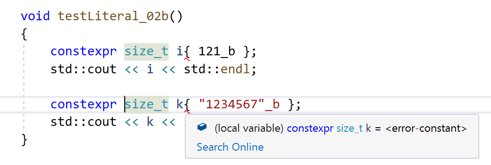

# Benutzerdefinierte Literale: Übersetzungszeit oder Laufzeit?

## Motivation

Durch Überladen des so genannten Literaloperators `operator""` lassen sich neue Formate 
für benutzerdefinierte Literale definieren.
Diese setzen sich aus einem Standard-Literal und einem benutzerdefinierten Suffix zusammen.
Damit kann man in einem C++&ndash;Programm beispielsweise schreiben:

```cpp
100.5_kg
0xFF00FF_rgb
10010101_b
```

Es ist offensichtlich, dass benutzerdefinierte Literale die Lesbarkeit des Quellcodes steigern.
Nicht ganz so offensichtlich ist die Fragestellung, wie mit möglichen Fehlern in benutzerdefinierten Literalen
umgegangen wird. Wenn das Suffix `b` für binäre Konstante und `rgb` für Farbliterale im RGB-Format steht,
dann sind die beiden Literale

```cpp
0xGG00HH_rgb
1002_b
```

offensichtlich falsch. Wir stellen mehrere Ansätze zur Implementierung benutzerdefinierter Literale vor
und gehen vertiefend auf den Aspekt der Fehlerbehandlung ein.

## Einführung

Wir wollen benutzerdefinierte Literale an Hand von zwei Beispielen betrachten.
Zum einen wären das natürliche Zahlen im Binärformat, also beispielsweise `1010101_b`,
zum anderen Farbliterale im RGB-Format, also etwa `0xFF00FF_rgb`.

*Bemerkung*: Natürliche Zahlen im Binärformat finden wir bereits in der Notation 

```cpp
int b = 0b101010; // C++ 14
```

im Sprachumfang von C++ vor &ndash; ab Version C++ 14. Nichtsdestotrotz sind sie ein guter Kandidat,
um zu lernen, wie man benutzerdefinierte Literale implementiert.

## Roh oder gekocht

Prinzipiell unterstützt C++ benutzerdefinierte Literale für natürliche Zahlen, Fließkommazahlen, Zeichen und C-Zeichenketten.
Die erste Variante wird als &ldquo;Cooked&rdquo;-Form, die zweite Variante als &ldquo;Raw&rdquo;-Form bezeichnet.
Bei Letzteren bildet der Wert des benutzerdefinierten Literals ein Paar, das aus der C-Zeichenkette und seiner Länge besteht.
Für natürliche Zahlen und Fließkommazahlen gilt indes eine Besonderheit.
Für sie können benutzerdefinierte Literale in den beiden Darstellungsarten &ldquo;Raw&rdquo; und &ldquo;Cooked&rdquo; spezifiziert werden.
In der &ldquo;Cooked&rdquo;-Form nimmt der Literal-Operator seine Argumente als `unsigned long long int` entgegen,
wenn es sich um eine natürliche Zahl handelt. Fließkommazahlen interpretiert er hingegen als `long double` Wert.

Im Gegensatz dazu steht der Wert &ldquo;Raw&rdquo; für `const char*` Argumente.
Ein &ldquo;Cooked&rdquo;-Literal-Operator `operator"" _km(long double)` besitzt im Rohzustand (&ldquo;Raw&rdquo;)
die Form `operator"" _km(const char*)`.
Stehen beide Varianten zur Verfügung, wird die &ldquo;Cooked&rdquo;-Form bevorzugt. 

In Tabelle 1 finden Sie einen Überblick vor:

###### {#tabelle_1_raw_versus_cooked}

| Beschreibung | Syntax | Beispiel | Signatur Literaloperator |
| :---- | :---- | :---- | :---- |
| Zeichen | *Zeichen*_Suffix | `'?'_unit`| `operator"" _unit (char)` |
| C-Zeichenkette | *Zeichenkette*_Suffix | `"ABCDEFGH"_unit`| `operator"" _unit (const char*, std::size_t)` |
| Natürliche Zahl (*Raw*-Form) | *Integer*_Suffix | `123_unit` | `operator"" _unit (const char*)` |
| Natürliche Zahl (*Cooked*-Form)| *Integer*_Suffix | `123_unit` | `operator"" _unit (unsigned long long int)` |
| Fließkommazahl (*Raw*-Form) | *Float*_Suffix | `123.456_unit` | `operator"" _unit (const char*)` |
| Fließkommazahl (*Cooked*-Form)| *Float*_Suffix | `123.456_unit` | `operator"" _unit (long double)` |

*Tabelle* 1: Möglichkeiten in der Definition des Literaloperators.

*Bemerkung*: Der Rückgabewert des Literaloperators ist in Tabelle 1 mit Absicht weggelassen worden. Es liegt ja gerade in 
der Entscheidung der Implementierung des Literaloperators, auf welchen C++ Standarddatentyp bzw. auf welchen benutzerdefinierten Datentyp
man das Literal abbilden möchte.

Es folgen einige Hinweise zu Tabelle 1. Der Literaloperator für den Datentyp `char` besitzt die Form &ldquo;*Zeichen*_Suffix&rdquo;.
Ein Beispiel dafür ist `'?'_unit`. In diesem Fall versucht der Übersetzer den Literaloperator für `operator"" _unit (char)` aufzurufen.
Das Zeichen ist in dem konkreten Fall vom Typ `char`, es könnte aber auch `wchar_t`, `char16_t` und `char32_t` zum Zuge kommen.

Die gleichen Datentypen können als auch Basis für C-Zeichenketten verwendet werden,
in der Tabelle kommt stellvertretend `char` zum Einsatz.
Die C-Zeichenkette `"ABCDEFGH"_unit` aus Tabelle 1 würde der Übersetzer auf den Aufruf

```cpp
operator"" _unit (ABCDEFGH, 8);
```

abbilden. Die 8 steht für die Länge der C-Zeichenkette. 

Natürliche Zahlen bzw. Fließkommazahlen kann der Compiler sowohl auf natürliche Zahlen (`unsigned long long int`) bzw. Fließkommazahlen (`long double`)
als auch auf C-Zeichenketten abbilden.
Der Compiler verwendet die &ldquo;Raw&rdquo;-Form genau dann, wenn der Literaloperator sein Argument als C-Zeichenkette erwartet.
Andernfalls verwendet er die &ldquo;Cooked&rdquo;-Form.

## Zur Praxis

Wir stellen einen ersten Ansatz
in der Realisierung eines benutzerdefinierten Literals für Binärformate in
Listing 1 vor:

```cpp
01: template <typename T>
02: constexpr size_t numberOfBits()
03: {
04:     return std::numeric_limits<T>::digits;
05: }
06: 
07: // literal operator - "raw" version
08: uint32_t operator"" _b(const char* str, size_t)
09: {
10:     if (strlen(str) > numberOfBits<uint32_t>()) {
11:         throw std::runtime_error("binary literal too long");
12:     }
13: 
14:     uint32_t literal{};
15:     for (size_t i{}; str[i] != '\0'; ++i) {
16: 
17:         char digit{ str[i] };
18:         if (digit != '0' and digit != '1') {
19:             throw std::runtime_error("wrong digit in binary literal!");
20:         }
21:         literal = 2 * literal + (digit - '0');
22:     }
23:     return literal;
24: }
25: 
26: // literal operator - "cooked" version
27: uint32_t operator"" _b(unsigned long long int value)
28: {
29:     uint32_t literal{};
30:     size_t count{};
31:     while (value != 0) {
32:         int digit{ value % 10 };
33:         if (digit != 0 and digit != 1) {
34:             throw std::runtime_error("wrong digit in binary literal!");
35:         }
36:         literal = 2 * literal + digit;
37:         value /= 10;
38:         ++count;
39:     }
40: 
41:     if (count > numberOfBits<uint32_t>()) {
42:         throw std::runtime_error("binary literal too long");
43:     }
44: 
45:     return literal;
46: }
```

*Listing* 1: &ldquo;Raw&rdquo;- und "Cooked" Version für das Suffix `_b`.

Beide Versionen aus Listing 1 analysieren ein binäres Literal.
Die so genannte &ldquo;Cooked&ldquo;-Version bekommt ein `unsigned long long`-Literal übergeben.
Dieses wird auf Korrektheit überprüft &ndash; nur die Ziffern 0 und 1 sind zulässig &ndash;
und eine Umwandlung vom binären in das dezimale Format erfolgt.
Die &ldquo;Raw&ldquo;-Version bekommt das binäre Literal als Zeichenkette übergeben.
Inwieweit diese Darstellung für binäre Literale sinnvoll ist, kann man diskutieren,
siehe dazu auch die nachfolgenden Beispiele.
Beide Realisierungen beachten auch die zulässige Länge binärer Literale, um dies nur abschließend zu erwähnen.

Damit sind nun folgende Anweisungen übersetzungsfähig:

```cpp
  void testLiteral_01a() try // note: function-try-block feature
  {
      size_t i{ 101_b };
      std::cout << i << std::endl;
  
      size_t j{ 1111111_b };
      std::cout << j << std::endl;
  
      size_t k{ "1010101"_b };
      std::cout << k << std::endl;
  }
  catch (std::exception const& e) {
      std::cerr << e.what() << std::endl;
  }
```

*Ausgabe*: 

```
5
127
85
```

Auf den ersten Blick sieht alles recht gut aus, das Beispielprogramm ist übersetzungsfähig
und die Resultate sind korrekt. Bei näherer Betrachtung tuen sich allerdings 2 Merkwürdigkeiten &ndash;
oder um es direkter zu sagen &ndash; Fehlerquellen auf:

*Beobachtung* 1:

Das folgende Code-Fragment ist übersetzungsfähig, sollte es aber nicht sein:

```
size_t i{ 121_b };
size_t j{ "1234567"_b };
```

Falsche Ziffern in den Literalen werden vom Übersetzer nicht erkannt.

*Beobachtung* 2:

Das folgende Code-Fragment ist nicht übersetzungsfähig, sollte es aber sein:

```
constexpr size_t i = 11011_b;             // Error - doesn't compile
static_assert(101_b == 5, "!");           // Error - doesn't compile
int classic_array[11011_b];               // Error - doesn't compile
std::array<int, 11011_b> modern_array{};  // Error - doesn't compile
```

Es wäre ja geradezu wünschenswert, das auch benutzerdefinierte Literale den Status von *Konstanten* haben, 
das ist ja gerade der Sinn dieser Übung. Wir müssen aus diesem Grund die in Listing 1 vorgestelle Realisierung
umstellen, das C++ Schlüsselwort `constexpr` ist die Lösung unseres Problems.
Wenn wir ganz auf die Schnelle beide Operator-Implementierungen um das Schlüsselwort `constexpr` ergänzen,
erhalten wir für die &ldquo;Raw&rdquo;-Version folgende Fehlermeldung:
*Failure was caused by call of undefined function or one not declared 'constexpr': see usage of 'strlen'*.

Im Prinzip genommen ist diese Fehlermeldung nicht ganz überraschend:
Nahezu alle Bibliotheksfunktionen bzw. die Methoden aus der STL sind eben nicht `constexpr` definiert,
nur mit den reinen Sprachmitteln von C++ &ndash; `if`, `for`, `while`, ..., also Kontrollstrukturen und arithmetische Ausdrücke &ndash;
lassen sich `constexpr`-taugliche Funktionen realisieren.
Wir müssen deshalb in der in Listing 1 vorgestellen Realisierung die Bibliotheksfunktion `strlen`
mit einer selbst geschriebenen Funktion `length` austauschen:

```cpp
01: template <typename T>
02: constexpr size_t numberOfBits()
03: {
04:     return std::numeric_limits<T>::digits;
05: }
06: 
07: constexpr size_t length(const char* str)
08: {
09:     int len{};
10:     while (*str++ != '\0') {
11:         ++len;
12:     }
13:     return len;
14: }
15: 
16: // literal operator - "raw" version
17: constexpr uint32_t operator"" _b(const char* str, size_t)
18: {
19:     if (length(str) > numberOfBits<uint32_t>()) {
20:         throw std::runtime_error("binary literal too long");
21:     }
22: 
23:     uint32_t literal{};
24:     for (size_t i{}; str[i] != '\0'; ++i) {
25: 
26:         char digit{ str[i] };
27:         if (digit != '0' and digit != '1') {
28:             throw std::runtime_error("wrong digit in binary literal!");
29:         }
30:         literal = 2 * literal + (digit - '0');
31:     }
32:     return literal;
33: }
34: 
35: // literal operator - "cooked" version
36: constexpr uint32_t operator"" _b(unsigned long long int value)
37: {
38:     uint32_t literal{};
39:     size_t count{};
40:     while (value != 0) {
41:         int digit{ value % 10 };
42:         if (digit != 0 and digit != 1) {
43:             throw std::runtime_error("wrong digit in binary literal!");
44:         }
45:         literal = 2 * literal + digit;
46:         value /= 10;
47:         ++count;
48:     }
49: 
50:     if (count > numberOfBits<uint32_t>()) {
51:         throw std::runtime_error("binary literal too long");
52:     }
53: 
54:     return literal;
55: }
```

*Listing* 2: &ldquo;Raw&rdquo;- und &ldquo;Cooked&rdquo;-Version für das Suffix `_b` als `constexpr` Variante.

Wollen wir uns davon überzeugen, dass die Varianten aus *Listing* 2 zur Übersetzungszeit ausgeführt werden,
müssen wir zunächst den Testrahmen anpassen! Es genügt nicht einfach, ein benutzerdefiniertes Literal gemaß der neuen 
Implementierung zu verwenden. Die beteiligte Variable muss ebenfall als `constexpr` gekennzeichnet sein:

```cpp
constexpr size_t i{ 101_b };
std::cout << i << std::endl;

constexpr size_t j{ 1111111_b };
std::cout << j << std::endl;

constexpr size_t k{ "1010101"_b };
std::cout << k << std::endl;
```

Die Resultate stimmen mit denen von Listing 1 überein, nur: Wie könnnen wir erkennen oder nachweisen,
dass die Auswertung der benutzerdefinierten Literale dieses Mal zur Übersetzungszeit erfolgte?
Werfen wir deshalb einen Blick auf den Maschinencode: 
Wenn wir im letzten Codefragment das Schlüsselwort  `constexpr` (drei Mal) weglassen,
erhalten wir folgende Anweisungen:

```
        size_t i{ 101_b };
00007FF6CD8302CB  mov         ecx,65h  
00007FF6CD8302D0  call        LiteralsAndConstExpr_02::operator "" _b (07FF6CD810AB8h)  
00007FF6CD8302D5  mov         dword ptr [rbp+134h],eax  
00007FF6CD8302DB  mov         eax,dword ptr [rbp+134h]  
00007FF6CD8302E1  mov         qword ptr [rbp+8],rax  

        size_t j{ 1111111_b };
00007FF6CD8302E5  mov         ecx,10F447h  
00007FF6CD8302EA  call        LiteralsAndConstExpr_02::operator "" _b (07FF6CD810AB8h)  
00007FF6CD8302EF  mov         dword ptr [rbp+134h],eax  
00007FF6CD8302F5  mov         eax,dword ptr [rbp+134h]  
00007FF6CD8302FB  mov         qword ptr [rbp+28h],rax  

        size_t k{ "1010101"_b };
00007FF6CD8302FF  mov         edx,7  
00007FF6CD830304  lea         rcx,[string "1010101" (07FF6CD852C28h)]  
00007FF6CD83030B  call        LiteralsAndConstExpr_02::operator "" _b (07FF6CD810AB3h)  
00007FF6CD830310  mov         dword ptr [rbp+134h],eax  
00007FF6CD830316  mov         eax,dword ptr [rbp+134h]  
00007FF6CD83031C  mov         qword ptr [rbp+48h],rax  
00007FF6CD830320  jmp         $LN7 (07FF6CD830322h)  
```

Wir sehen in den Zeilen, in denen der `call`-OpCode auftritt, dass der Übersetzer explizit einen Aufruf des Operators 
im Maschinencode absetzt. Wenn wir hingegen die Definitionen
der Variablen `i`, `j` und `k` um das Schlüsselwort `constexpr` ergänzen,
erhalten wir das folgende Compilat:

```
        constexpr size_t i{ 101_b };
00007FF6D4D90E5B  mov         qword ptr [rbp+8],5  

        constexpr size_t j{ 1111111_b };
00007FF6D4D90E63  mov         qword ptr [rbp+28h],7Fh  

        constexpr size_t k{ "1010101"_b };
00007FF6D4D90E6B  mov         qword ptr [rbp+48h],55h  
00007FF6D4D90E73  jmp         $LN7 (07FF6D4D90E75h)  
```

Okay, wer ganz auf Nummer sicher gehen möchte, kann nun noch den Taschenrechner anschmeißen:
`7Fh` ist gleich `127` und `55h` ist gleich `85`. Man kann also deutlich erkennen, dass in der letzten Betrachtung
der Übersetzer die benutzerdefinierten Literale zur Übersetzungszeit berechnet hat! Im Maschinencode sind keine `call`-OpCodes mehr vorhanden,
an deren Stelle sind `mov`-Operatoren getreten, die als Operand den jeweiligen konstanten Wert haben.
Wie sieht es nun mit den beiden Beobachtungen aus, die uns in der ersten Realisierung aufgestoßen sind? Das Fragment 

```cpp
constexpr size_t i{ 121_b };
constexpr size_t k{ "1234567"_b };
```

wird nun vom Übersetzer abgewiesen, die Fehlermeldungen lauten *Expression did not evaluate to a constant: failure was caused by evaluating a throw sub-expression*.
Falsche Literale werden jetzt zur Übersetzungszeit mit entsprechenden Fehlermeldungen erkannt &ndash; siehe dazu
auch das IntelliSense-Feature der Visual Studio IDE:



Abbildung 1: Auswertung benutzerdefinierter Literale zur Übersetzungszeit.

Die folgenden Anweisungen nun ebenfalls übersetzungsfähig:

```
constexpr size_t i = 11011_b;             // compiles
static_assert(101_b == 5, "!");           // compiles
int classic_array[11011_b] = {};          // compiles
std::array<int, 11011_b> modern_array{};  // compiles
```

C++-Ausdrücke oder Variablendeklarationen, die konstante Literale erwarten, sind übersetzungsfähig!


## Noch eine Variante: *Literal Operator Templates*

Für die Freunde der Template-Programmierung, und in diesem Themenbereich wiederum vor allem für diejenigen,
die *variadische Templates* zu schätzen (oder fürchten) wissen,
kommt eine Rettung in Sicht: Mit den so genannten *Literal Operator Templates* gibt es eine zweite Möglichkeit,
benutzerdefinierte Literale zur Übersetzungszeit zu verarbeiten.
Worum geht es hierbei? Die Definition des *Literal Operator Templates* sieht so aus:

```
template <char ...>
constexpr size_t operator "" _b();
```

Wir haben es also mit einem variadischen Template zu tun. Die Notation `char ...` bedeutet, dass das Template
mit 0, 1, 2 oder mehreren Parametern des Typs `char` spezialisiert werden kann. Außer `char`
gibt es in diesem Zusammenhang keine andere Möglichkeit, also Datentypen wie etwas `int` oder `short` sind
hier nicht zulässig.
Um es an einem Beispiel festzumachen: Das Literal `11011_b` ist gleichbedeutend mit einem Funktionsaufruf

```
operator "" _b<'1', '1', '0', '1', '1'>();
```

Das Literal `11011_b` wird sprichwörtlich zerhackt,
seine einzelnen Bestandteile (ohne das Suffix `_b`) werden zur Spezialisierung des Templates herangezogen.
Dies wiederum ermöglicht die Analyse der einzelnen Bestandteile zur Übersetzungszeit,
da die Templatespezialisierung mit den Templateparametern eben zur Übersetzungszeit vollzogen wird.

Damit kommen wir in Listing 3 zur Möglichkeit, ein benutzerdefiniertes Literal als variadisches Template zu definieren:

```cpp
01: template <typename T>
02: constexpr size_t numberOfBits()
03: {
04:     return std::numeric_limits<T>::digits;
05: }
06: 
07: constexpr bool isBinary(char ch)
08: {
09:     return ch == '0' or ch == '1';
10: }
11: 
12: // end of recursion
13: template <size_t VALUE>                             
14: constexpr size_t evalBinaryLiteral()
15: {
16:     return VALUE;
17: }
18: 
19: // recursive function template definition
20: template <size_t VALUE, char DIGIT, char... REST>
21: constexpr size_t evalBinaryLiteral()
22: {
23:     if (! isBinary(DIGIT)) {
24:         throw std::runtime_error("wrong digit in binary literal!");
25:     }
26:     return evalBinaryLiteral<(2 * VALUE + DIGIT - '0'), REST...>();
27: }
28: 
29: template <char... STR>
30: constexpr size_t operator"" _b()
31: {
32:     if (sizeof...(STR) > numberOfBits<uint32_t>()) {
33:         throw std::runtime_error("binary literal too long");
34:     }
35:     return evalBinaryLiteral<0, STR...>();
36: }
```

*Listing* 3: Realisierung eines *Literal Operator Templates* für binäre Literale.

Am Beispiel der Wertzuweisung

```cpp
constexpr size_t n = 11011_b;
```

können wir mit Hilfe des Tools [Cpp Insights](https://cppinsights.io/) die Spezialisierungen
der beiden Funktionstemplates `_b` und `evalBinaryLiteral`  näher betrachten:

```cpp
template<>
constexpr size_t evalBinaryLiteral<27>()
{
  return 27UL;
}

template<>
constexpr size_t evalBinaryLiteral<0, '1', '1', '0', '1', '1'>()
{
  return evalBinaryLiteral<(((2 * 0) + 1)), '1', '0', '1', '1'>();
}

template<>
constexpr size_t evalBinaryLiteral<1, '1', '0', '1', '1'>()
{
  return evalBinaryLiteral<(((2 * 1) + 1)), '0', '1', '1'>();
}

template<>
constexpr size_t evalBinaryLiteral<3, '0', '1', '1'>()
{
  return evalBinaryLiteral<(((2 * 3))), '1', '1'>();
}

template<>
constexpr size_t evalBinaryLiteral<6, '1', '1'>()
{
  return evalBinaryLiteral<(((2 * 6) + 1)), '1'>();
}

template<>
constexpr size_t evalBinaryLiteral<13, '1'>()
{
  return evalBinaryLiteral<(((2 * 13) + 1))>();
}

template <char... STR>
constexpr size_t operator"" _b()
{
    if (sizeof...(STR) > numberOfBits<uint32_t>()) {
        throw std::runtime_error("binary literal too long");
    }
    return evalBinaryLiteral<0, STR...>();
}

constexpr size_t operator""_b<'1', '1', '0', '1', '1'>()
{
  if(5 > numberOfBits<uint32_t>()) {
    throw std::runtime_error(std::runtime_error("binary literal too long"));
  } 
  
  return evalBinaryLiteral<0, '1', '1', '0', '1', '1'>();
}

void test()
{
  constexpr const size_t n = operator""_b<'1', '1', '0', '1', '1'>();
}
```

## Der Literal Operator für eine benutzerdefinierte Klasse

Das bislang betrachtete Beispiel eines benutzerdefinierten Literals beschränkte sich auf die Darstellung
des elementaren Datentyps `size_t`. In einem zweiten Beispiel wenden wir die vermittelte Materie
auf einen benutzerdefinierten Datentyp `Color` für RGB-Farben an (Listing 4):

```cpp
01: class Color {
02:     friend std::ostream& operator<< (std::ostream&, const Color&);
03: 
04: private:
05:     uint8_t m_r;
06:     uint8_t m_g;
07:     uint8_t m_b;
08: 
09: public:
10:     constexpr Color() : m_r{}, m_g{}, m_b{} {}
11: 
12:     constexpr Color(uint8_t r, uint8_t g, uint8_t b)
13:         : m_r{ r }, m_g{ g }, m_b{ b } {}
14: };
15: 
16: std::ostream& operator<< (std::ostream& os, const Color& col) {
17: 
18:     os << std::uppercase
19:         << std::hex << std::setw(2) << std::setfill('0') << (int) col.m_r << ":"
20:         << std::hex << std::setw(2) << std::setfill('0') << (int) col.m_g << ":"
21:         << std::hex << std::setw(2) << std::setfill('0') << (int) col.m_b;
22: 
23:     return os;
24: }
```

*Listing* 4: Klasse `Color` für RGB-Farbwerte.

Bevor man sich Gedanken zur Realisierung des Literaloperators macht, ist zunächst der syntaktische Aufbau des Literals zu klären.
Im Sinne einer Bottom-Up Betrachtung kann man die folgenden Beispiele quasi als &ldquo;Use Cases&rdquo; heranziehen:

```cpp
constexpr Color red = 0xFF0000_rgb;
std::cout << red << std::endl;
constexpr Color magenta = 0xFF00FF_rgb;
std::cout << magenta << std::endl;
constexpr Color yellow = 0xFFFF00_rgb;
std::cout << yellow << std::endl;
constexpr Color unknown = 12345_rgb;
std::cout << unknown << std::endl;
constexpr Color white = 16777215_rgb;
std::cout << white << std::endl;
constexpr Color anotherWhite = "0xFFFFFF"_rgb;
std::cout << anotherWhite << std::endl;
constexpr Color black = "0x000000"_rgb;
std::cout << black << std::endl;
```

Nun gilt es Randfälle zu diskutieren: Sollen Schreibweisen wie `0xFF_rgb` oder `0b0101_rgb` ebenfalls erlaubt sein?
Diese wenigen Beispiele zeigen bereits, dass eine umfassende Definition samt Realisierung von Farbwertliteralen
nicht ganz trivial ist. Der nachfolgende Lösungsvorschlag deckt daher nur die &ldquo;naheliegenden&rdquo; Fälle ab (Listing 5).
Es ist natürlich Ihrer Kreativität überlassen, diese Lösung zu verfeinern und damit zu vervollständigen!

```cpp
01: constexpr Color operator"" _rgb(unsigned long long int value) {
02: 
03:     if (value > 0xFFFFFF) {
04:         throw std::runtime_error("literal too large");
05:     }
06: 
07:     uint8_t r{ (uint8_t)((value & 0xFF0000) >> 16) };
08:     uint8_t g{ (uint8_t)((value & 0x00FF00) >>  8) };
09:     uint8_t b{ (uint8_t)((value & 0x0000FF) >>  0) };
10: 
11:     return Color{ r, g, b };
12: }
13: 
14: constexpr size_t length(const char* str)
15: {
16:     int len{};
17:     while (*str++ != '\0') {
18:         ++len;
19:     }
20:     return len;
21: }
22: 
23: constexpr uint8_t hex2int(char ch)
24: {
25:     // transform hex character to 4-bit equivalent number
26:     uint8_t byte = ch;
27:     if (byte >= '0' and byte <= '9') {
28:         // byte = byte - '0';
29:         byte -= '0';
30:     }
31:     else if (byte >= 'a' and byte <= 'f') {
32:         // byte = byte - 'a' + 10;
33:         byte -= ('a' - 10);
34:     }
35:     else if (byte >= 'A' and byte <= 'F') {
36:         //byte = byte - 'A' + 10;
37:         byte -= ('A' - 10);
38:     }
39:     return byte;
40: }
41: 
42: constexpr size_t hexstoi(const char* str)
43: {
44:     int value{};
45:     while (*str != '\0') {
46:         // get current character, then increment
47:         uint8_t byte = hex2int(*str);
48:         ++str;
49: 
50:         // shift 4 to make space for new digit, and add the 4 bits of the new digit 
51:         value = (value << 4) | (byte & 0xF);
52:     }
53:     return value;
54: }
55: 
56: // literal operator ("raw" version)
57: constexpr Color operator"" _rgb(const char* literal, size_t) {
58: 
59:     // tiny implementation - just parsing hexadecimal format
60:     size_t len{ length(literal) };
61:     if (len == 2 /* 0x */ + 6 /* FF FF FF */) {
62: 
63:         char ar[3] = {};
64:         char ag[3] = {};
65:         char ab[3] = {};
66: 
67:         ar[0] = literal[2];
68:         ar[1] = literal[3];
69:         ag[0] = literal[4];
70:         ag[1] = literal[5];
71:         ab[0] = literal[6];
72:         ab[1] = literal[7];
73: 
74:         uint8_t r = static_cast<uint8_t>(hexstoi(ar));
75:         uint8_t g = static_cast<uint8_t>(hexstoi(ag));
76:         uint8_t b = static_cast<uint8_t>(hexstoi(ab));
77: 
78:         return { r, g, b };
79:     }
80: 
81:     return {};
82: }
```

*Listing* 5: Implementierung eines benutzerdefinierten Literals für RGB-Farbwerte.

Beachten Sie in Listing 5: Das C++ Feature von `constexpr` wurde hier recht ausgiebig angewendet!
Alle beteiligten Funktionen `length`, `hex2int` und `hexstoi` werden zur Übersetzungszeit ausgeführt!

## There's much more

Möchte man die Implementierung eines benutzerdefinierten Literals ganz pefekt gestalten,
muss man sich mit dem Zahlentrennzeichen (`'`) beschäftigen. Für die &ldquo;Cooked&rdquo;-Version ist nichts weiter
zu berücksichtigen, der Übersetzer verarbeitet das Zahlentrennzeichen selbst:

```cpp
constexpr size_t n{ 11'111'11_b };   // compiles
```

Anders sieht es bei der &ldquo;Raw&rdquo;-Version aus: Hier muss der `const char*`-Parameter
des Literaloperators das Zahlentrennzeichen explizit behandeln &ndash; und damit ignorieren.
Zum Abschluss finden Sie in Listing 6 entsprechende Modifikationen in Bezug auf die Realisierung aus Listing 2 vor:

```cpp
01: template <typename T>
02: constexpr size_t numberOfBits()
03: {
04:     return std::numeric_limits<T>::digits;
05: }
06: 
07: constexpr bool isValid(char ch)
08: {
09:     return ch == '0' or ch == '1' or ch == '\'';
10: }
11: 
12: constexpr size_t length(const char* str)
13: {
14:     int len{};
15:     while (*str++ != '\0') {
16:         if (*str == '\'') 
17:             continue;
18:         ++len;
19:     }
20:     return len;
21: }
22: 
23: // literal operator - "raw" version
24: constexpr uint32_t operator"" _b(const char* str, size_t)
25: {
26:     if (length(str) > numberOfBits<uint32_t>()) {
27:         throw std::runtime_error("binary literal too long");
28:     }
29: 
30:     uint32_t literal{};
31:     for (size_t i{}; str[i] != '\0'; ++i) {
32: 
33:         char digit{ str[i] };
34:         if (! isValid(digit)) {
35:             throw std::runtime_error("wrong digit in binary literal!");
36:         }
37: 
38:         if (digit != '\'') {
39:             literal = 2 * literal + (digit - '0');
40:         }
41:     }
42:     return literal;
43: }
```

*Listing* 6: Realisierung eines *Literal Operator Templates* für binäre Literale inklusive Zahlentrennzeichen.

## Literatur

// https://akrzemi1.wordpress.com/2012/10/23/user-defined-literals-part-ii/

// https://stackoverflow.com/questions/537303/binary-literals/538101#538101

// https://stackoverflow.com/questions/66813961/c-constexpr-constructor-for-colours
